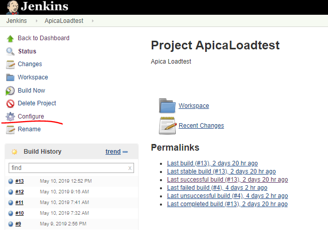
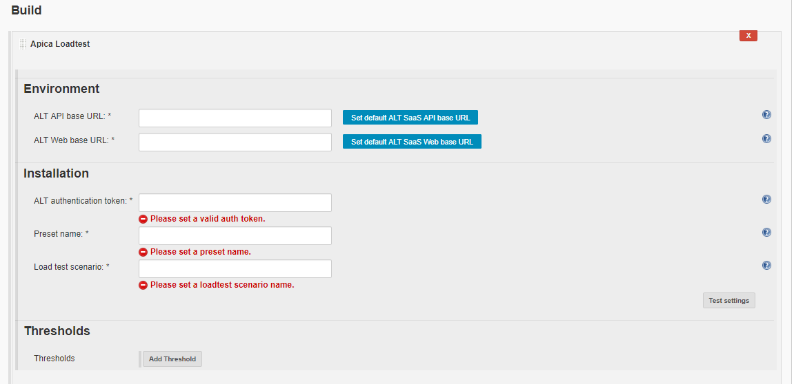
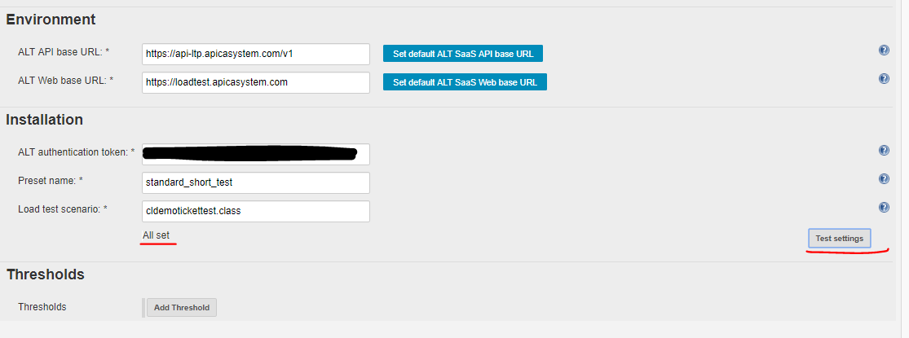
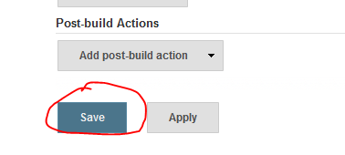
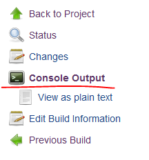
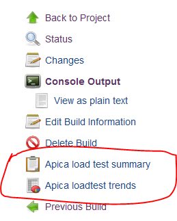
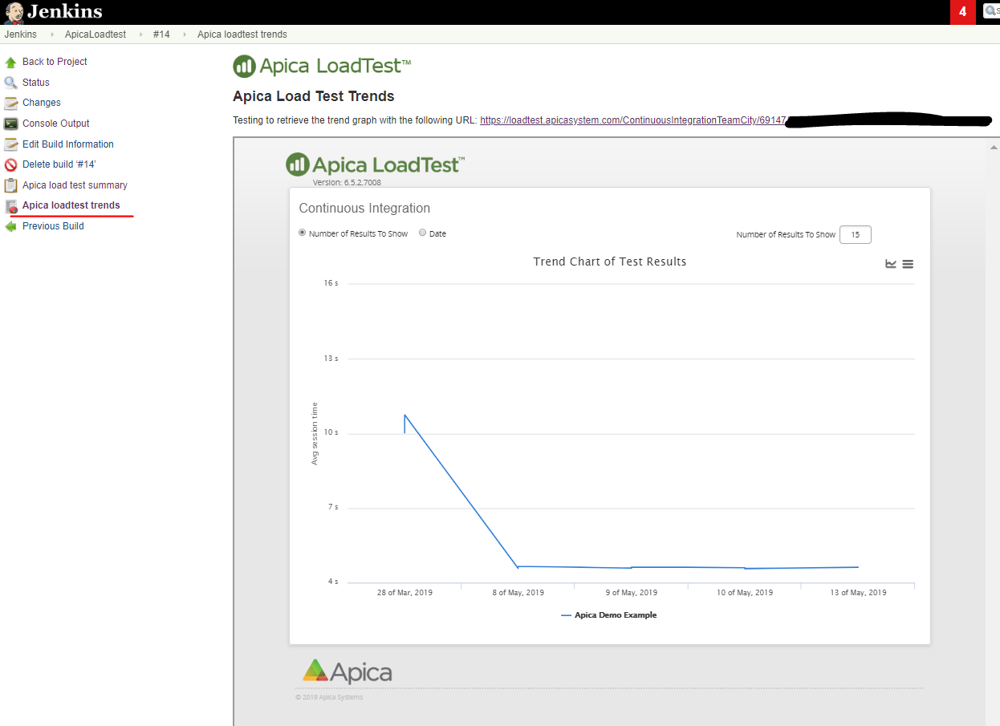

The plugin enables [Apica](https://www.apicasystem.com/) Loadtest
customers to run automatic load tests as part of a Jenkins build
process.  
**Build runner setup**

The plugin is a build runner and can be added to a project on the
project's configuration page:

The Apica load test plugin is a build step and can be selected from the
Build plugins list:

  

You'll then see the build runner options:

  

Set your ALT environment endpoints, the ALT API authentication token,
the preset name and the load test scenario file name. You can use the
Test settings button to test your inputs.

You can use the buttons next to the API and Web base URL text fields to
fill in the default product SaaS endpoints. Otherwise you can provide
your on-premise environment endpoints.

If all properties are correct then you'll see a confirmation:

  
Here are some example error messages in case some property is not
correct:

-   Exception while checking preset: The authentication ticket is not
    well formatted.
-   No such preset found: short test2
-   Load test file name must be either a .class or .zip file.
-   No such load test file found: cldemo\_start2.class
-   Invalid ALT API base URL: unknown protocol: dgdfg
-   Invalid ALT Web base URL: no protocol: /loadtesapicasystemcom

Note that Jenkins won't block the user from saving a build runner
despite validation errors. The settings are additionally rechecked
before a test starts.

**Thresholds**

It's possible to add thresholds to the test. If the threshold is broken
then the test can be marked as "failed":

  
  
Save your setup:

**Running the Apica build runner**

You can start the build runner like you would start any other runner in
Jenkins. The simplest way is to start a build on the UI:

{height="250"}  
You can monitor the build progress by clicking on the build number and
opening the Console output link:

  
You can check the detailed build log for messages. They are similar to
what people see in the live stats window of ALT:

  
The runner checks the job status every 10 seconds at present.

At the end of the job the log shows some basic statistics and the
thresholds are evaluated:

**Result presentation**

Refresh the build page after a successful job if it doesn't refresh
itself automatically. You'll see two links on the left hand panel:

  
Apica load test summary presents the key statistics in tabular format:

The Apica load test trends tab shows a custom CI page in an iframe:

