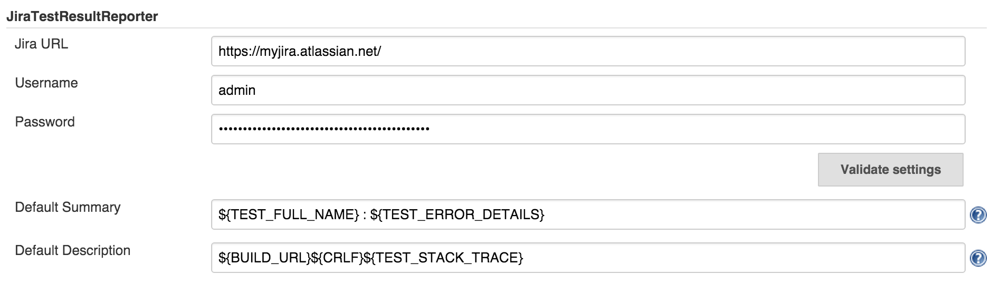
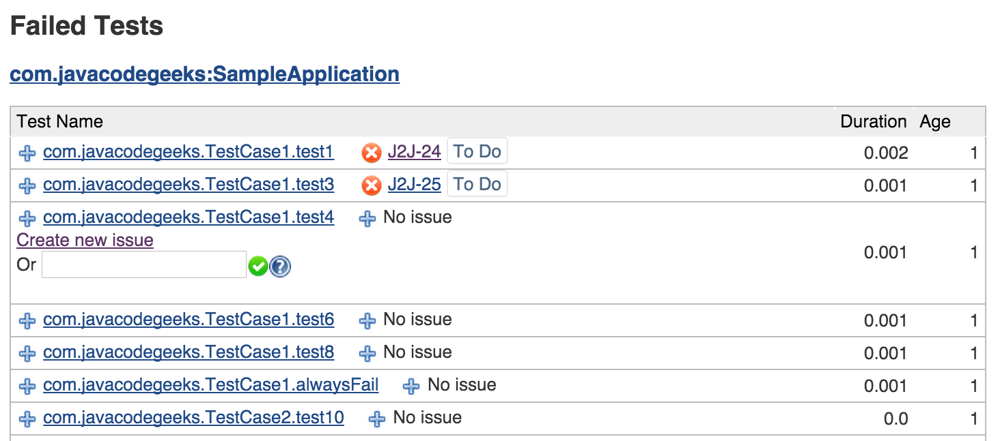
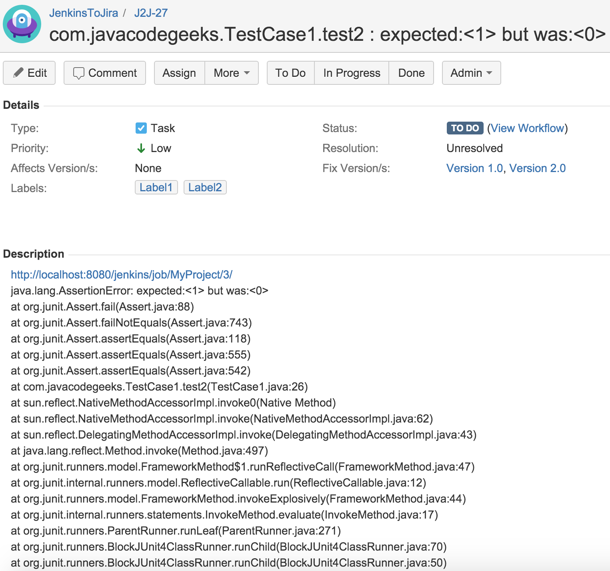
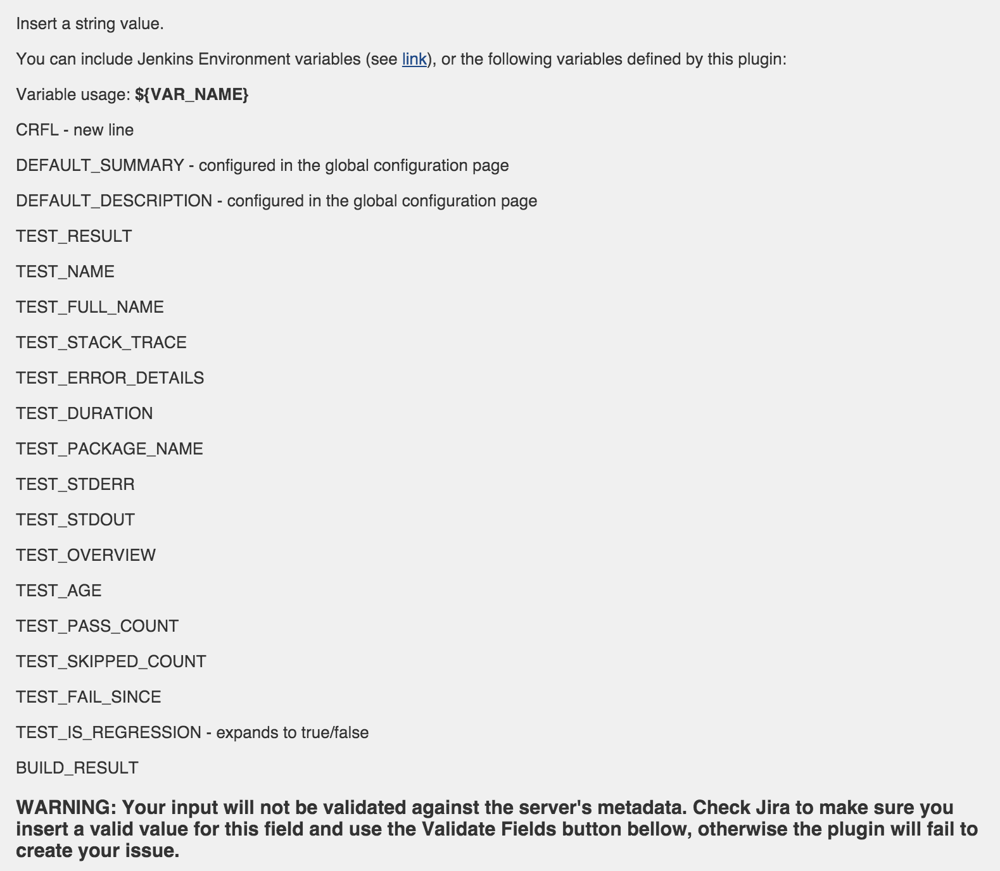
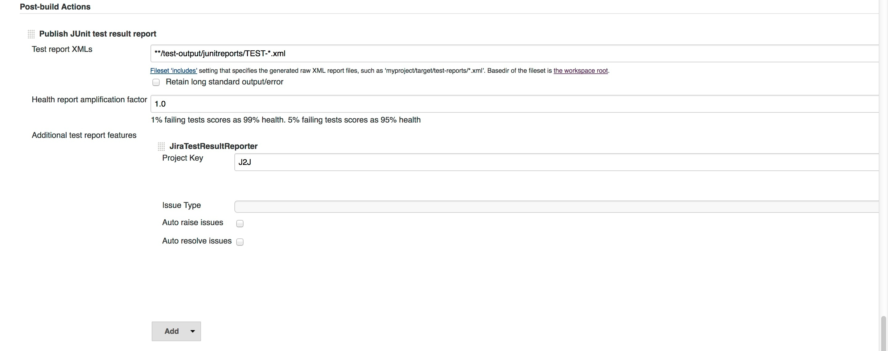
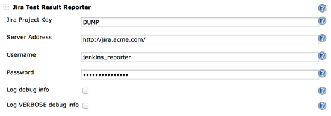

Creates issues in Jira for failed unit tests.

## 2.x Versions

## WARNING: 2.x versions of this plugin are not compatible with the previous 1.x versions. What this means is that your configurations related to this plugin will not be imported from previous versions when you do an upgrade.

For details about previous versions usage and configuration, please see
the **1.x Versions** section.

### What it does

This plugin allows you to create and/or link issues from Jira to failed
tests in Jenkins. The creation/linking is done directly in the Jenkins
interface. For the creation of the issues you can supply a template for
what is going to be added in most of the issue's fields.

### Global Configuration

Before doing anything else, the global configurations must be done. In
order to do these go to **Manage Jenkins -\> Configure System -\>
JiraTestResultReporter** and enter here the JIRA server url the username
and password. It is highly recommended that you click the Validate
Settings button every time you make any changes here. Also from here you
can configure the global templates for Summary and Description, by
clicking on the Advanced button. These templates will be used to create
issues if they are not overridden in the job configuration.

Use a dedicated Jira user

From a security and usage perspective, it's recommended to create a
dedicated Jira user for the reporting.

{width="700"}

### Job Configuration

#### Pipeline Style Jobs

You can see below and example of a pipeline usage.

The thing to keep in mind is that you need to use the field keys and the
values as they are defined in the REST API. For example, for the
'issueType', the API expects the ID for the issue type, in this case
'1', instead of 'Bug'.

``` syntaxhighlighter-pre
junit (
 testResults: '**/surefire-reports/*.xml',
 testDataPublishers: [
   jiraTestResultReporter(
     configs: [
       jiraStringField(fieldKey: 'summary', value: '${DEFAULT_SUMMARY}'),
       jiraStringField(fieldKey: 'description', value: '${DEFAULT_DESCRIPTION}'),
       jiraStringArrayField(fieldKey: 'labels', values: [jiraArrayEntry(value: 'Jenkins'), jiraArrayEntry(value:'Integration')])
     ],
     projectKey: 'J2J',
     issueType: '1',
     autoRaiseIssue: false,
     autoResolveIssue: false,
     autoUnlinkIssue: false,
   )
 ]
)
```

####  Classic Jobs

The first thing we need to do here is enabling the plugin:

-   **Freestyle projects** and **Multi-configuration projects**  
    First, JUnit test reports need to be enabled by going to **Add
    post-build action -\> Publish JUnit test report**. Then check the
    box next to **JiraTestResultReporter** in the **Additional test
    report features section**.
-   **Maven Project**  
    **Add post-build action -\> Additional test report features** -\>
    check the box next to **JiraTestResultReporter**.

**Configuration:**

Insert the **Project key** in the respective field. Again, highly
recommended to push the Validate Settings.

After setting the project key the **Issue type** select will be
populated with the available issue types for that specific project.

If you check the **Auto raise issue** check box, this plugin will create
and link issues for all the failing tests in new builds that don't
already have linked issues.

Checking **Auto resolve issue** check box will enable an experimental
feature. Basically, if you had a test that was failing and you had a
linked Jira issue to it, the plugin will try to resolve your issue. What
this means is that it will look for available transitions from the
current state and it will try to find one that in the name has the word
"resolve". If such a transition is found it will apply it, otherwise it
will just log a message. In future releases this will be configurable.

{width="700"}

Only after configuring the fields above, if you want you can override
the **Summary** and **Description** values by clicking
the**Advanced** button. If you want, here you can configure all
available fields for that specific issue type. Due to Jenkins interface
development limitations, you have to search for the desired field from
the four available types of fields, after clicking the Add Field
Configuration.

**Important: Do not leave empty values for fields, if you didn't find
the desired field in the current chosen option, delete it before trying
the next one.**

Finally, I cannot say that this is recommended ( although it is (smile)
), **read the help tag for the Validate Fields** and if the warning
there is not a problem for you click the button.

{width="700"}

{width="700"}

### Usage

After building the project, go to the test results page. Next to the
test cases you will see a **blue plus button**, next to a **No
issue** message. If you want to **create an issue**, or **link an
existing one**, click the blue plus button and choose the desired
option. For **unlinking** an issue, click the **red x button**.

**When creating, linking and unlinking issues, you it is recommended
that wait for the page to reload, before doing something else for
another test.** Errors will be shown inline, if any.

{width="700"}

Finally, your issues are created and you can see them by clicking the
links directly from the Jenkins interface.

{width="700"}

### Variables

For text fields in the Job Configuration and Global Confinguration
(Summary and Description only) you can use variables that will expand to
the appropriate value when the issue is created in JIRA. You can use all
the environment variables defined by Jenkins
(see [link](https://wiki.jenkins-ci.org/display/JENKINS/Building+a+software+project#Buildingasoftwareproject-JenkinsSetEnvironmentVariables)).
Additionaly, this plugin can expand a set of predefined variables that
expose information about the test.

{width="700"}

### Integrations

**TestNG**

TestNG will automatically generate JUnit test reports that can be found
by default in *\<project-folder\>/test-output/junitreports.*
Unfortunately, you cannot use the published results by the Jenkins
TestNG plugin with our plugin. In order to use the link functionality
you must configure a JUnit publisher (**Post Build Actions -\> Publish
JUnit test result report**) as follows:

{width="700"}

**xUnit**

You can use the functionality of the JiraTestResultReporter with all the
testing standards that are supported by the xUnit plugin (see their
[wiki](https://wiki.jenkins-ci.org/display/JENKINS/xUnit+Plugin) page
for supported formats). The workflow would be as follows:

1.  Run your testing tool that creates result files in a testing
    standard
2.  Configure the xUnit plugin to convert said testing standard into
    JUnit
3.  Configure the JUnit publisher (**Post Build Actions -\> Publish
    JUnit test result report**)
4.  Enable **Additional test report features** and configure
    **JiraTestResultRepoter** as explained in the **Job Configuration**
    section above

### JSON API endpoint

You can view the test to issue mappings in JSON format by sending a
request to the following url:
<http://my.jenkins.com/plugin/JiraTestResultReporter/testToIssueMapping/api/json?job=$JobName>.
For Freestyle and Maven jobs you simply query the url: 
<http://my.jenkins.com/plugin/JiraTestResultReporter/testToIssueMapping/api/json?job=MyJob>. For
Matrix Projects sending a request as before will return you a JSON with
mappings for all axis and if you want a specific axis you do as
following: <http://my.jenkins.com/plugin/JiraTestResultReporter/testToIssueMapping/api/json?job=MyJob/MyAxisName=MyAxisValue>.
It is recommended that you use url encoded characters.

# 1.x Versions

# What it does

This plugin examines the build job for failed unit tests. It work by
using the Jenkins internal test result management for detecting failed
tests. Just let Jenkins run and report your unit tests e.g. by adding
the “Publish xUnit test results report” to your build job.

If JiraTestResultReporter detects new failed tests, it will create an
issue for every test case in Jira:


### Usage



-   In the build job add JiraTestResultReporter as a post-build action.
-   Configure the plugin for this job. See the help boxes for details.
-   Build your job. If there are failed tests, the plugin will create
    issues for them. This will (should!) happen only once for every new
    failed tests; new in this case means tests that have an age of
    exactly 1.

Use a dedicated Jira user

From a security and usage perspective, it's recommended to create a
dedicated Jira user for the reporting. This helps to identify (e.g.
filter) issues created by the plugin.

### Version history

[TABLE]
