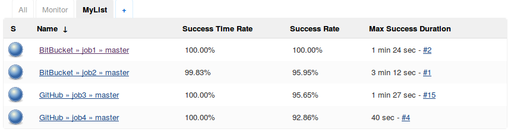

Provides additional metrics for List Views:  

-   Minimum, Maximum, and Average build times for all, or only
    successful builds.
-   Minimum, Maximum, and Average checkout times for Pipeline builds.
-   Success and Failure rates.
-   Success and Failure time rates (ie Uptime and Downtime).

  

## Requirements

Jenkins 1.651.3 or later.

## Release Notes

Available on
[GitHub](https://github.com/jenkinsci/additional-metrics-plugin/blob/master/RELEASE.md).
