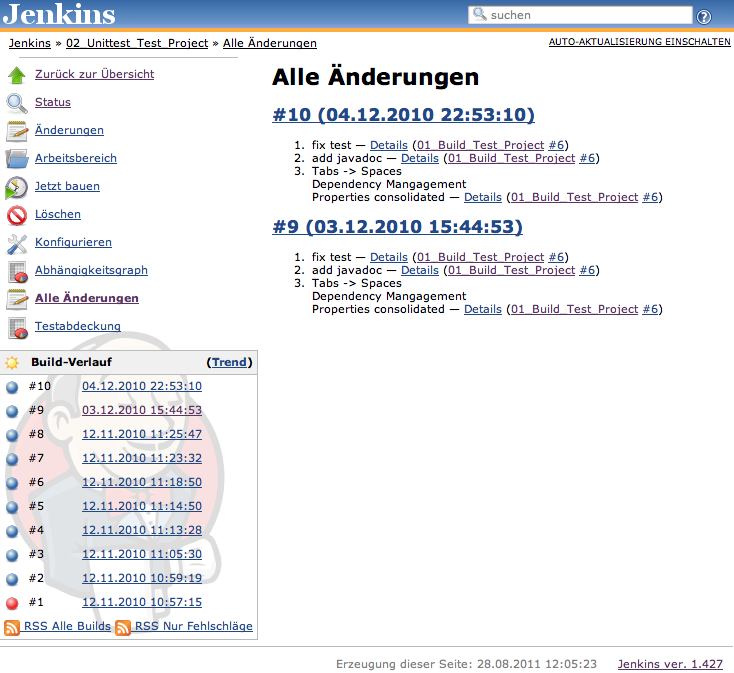

Shows all changes which influenced the builds of a project.

### Features

-   Shows changes by dependent builds (via fingerprinting)
-   Shows changes by subprojects added via a BuildStep from the
    parameterized-trigger-plugin

### Screen

### Changelog

#### Version 1.5 (Apr 23, 2017)

-   Added support for Pipeline job.

#### Version 1.4 (Jun 06, 2016)

-   Added version number in display.
-   Added all-changes portlet for Dashboard View.

#### Version 1.3 (Sep 18, 2011)

-   Add support for permalinks in request parameters from & to to all
    changes page.

#### Version 1.2 (Aug 30, 2011)

-   Make plugin work with parameterized trigger \>= 2.10

#### Version 1.1 (Aug 28, 2011)

-   Do not escape annotated message from changelog

#### Version 1.0 (Aug 22, 2011)

-   Initial Release
