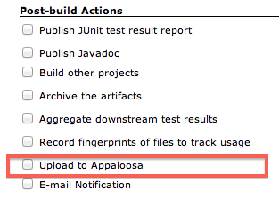
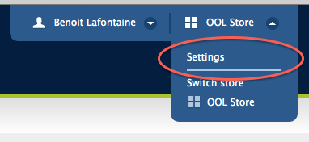

Publish your mobile applications (Android, iOS, ...) to
the [appaloosa-store.com](http://www.appaloosa-store.com/) platform.

#### Features

[Appaloosa](http://www.appaloosa-store.com/) is a service that simplify
the distribution of your private mobile apps. This Jenkins plugin allow
you to automatically or manually publish binaries from a Jenkins build
into your Appaloosa store.

#### Documentation

##### Installation guide

Just like any plugin, search "appaloosa" in the available plugins on
your Jenkins instance and install it.

##### Usage guide

###### Setting up a post build step

In your job configuration, check the post-build action "Upload to
appaloosa"  

Add your store token and customize the pattern if needed.  

You can find your store token on the 'settings page':
  
 (you have to be an administrator to see this page).  
The default pattern will upload all .IPA and .APK files in your
workspace. Builds usually generate only one artifact, the default
pattern will suit theses cases.

###### Appaloosa plugin configuration parameters

| Parameter        | Since version | Description                                                                                                                                                                                                                                        |
|------------------|---------------|----------------------------------------------------------------------------------------------------------------------------------------------------------------------------------------------------------------------------------------------------|
| Token            | 1.0           | Appaloosa token dedicated for your store.                                                                                                                                                                                                          |
| Filename Pattern | 1.0           | The list of files to upload. The base directory is the workspace of the current build. Can use wildcards like 'module/dist/\***/**.zip'. See [the @includes of Ant fileset](http://ant.apache.org/manual/Types/fileset.html) for the exact format. |
| Description      | 1.4.0         | (optional) description used for published updates                                                                                                                                                                                                  |
| Groups           | 1.4.0         | (optional) group names, separated by "\|", on which updates will be published                                                                                                                                                                      |
| Changelog        | 1.4.3         | (optional) changelog for the update that will be published                                                                                                                                                                                         |
| Proxy Host       | 1.0.2         | (optional) proxy host name                                                                                                                                                                                                                         |
| Proxy Port       | 1.0.2         | (optional) proxy port (ex: 3128)                                                                                                                                                                                                                   |
| Proxy user       | 1.0.2         | (optional) username for proxy (ex: johnsmith)                                                                                                                                                                                                      |
| Proxy password   | 1.0.2         | (optional) password for proxy (ex: secret)                                                                                                                                                                                                         |

#### Known issues

type

key

summary

assignee

reporter

priority

status

resolution

created

updated

due

Data cannot be retrieved due to an unexpected error.

[View these issues in
Jira](http://issues.jenkins-ci.org/secure/IssueNavigator.jspa?reset=true&jqlQuery=component%20=%20appaloosa-plugin%20AND%20project%20=%20JENKINS%20AND%20resolution%20=%20Unresolved%20ORDER%20BY%20updated%20DESC&tempMax=1000&src=confmacro)

#### Changelog

##### Version 1.4.11 (12th July 2019)

-   Deal with errors with missing httpcore Apache library and update
    Apache libraries for Jenkins Plugin

##### Version 1.4.10 (11th July 2019)

-   Deal with errors with missing httpcore Apache library and update
    Apache libraries for Appaloosa Plugin

##### Version 1.4.9 (9th January 2019)

-   Update org.apache.httpcomponents dependency including security
    patches

##### Version 1.4.8 (22th June 2018)

-   Use correct port https calls.

##### Version 1.4.7 (29th May 2018)

-   Change log output format

##### Version 1.4.6 (18th May 2018)

-   Print stacktrace in case of errors for easier debugging.

##### Version 1.4.5 (20th July 2017)

-   You can now use a text file for description and support fields.

##### Version 1.4.4 (23rd June 2017)

-   Fix security issues.

##### Version 1.4.3 (7th October 2016)

-   Add multiline and special characters support for description field.
-   Add support for a changelog field.

##### Version 1.4.2 (29th October 2014)

-   Added the option to use Jenkins environment variables in description
    and groups fields
-   Corrected description and groups help boxes.

##### Version 1.4.0 (19th June 2013)

-   Add publishing groups support
-   Add description support

##### Version 1.3.2 (14th June 2013)

-   Fix another proxy problem
-   Fix security problem: token should not be visible (like passwords)

##### Version 1.3.1 (1st August 2012)

-   Fix proxy problem

##### Version 1.3.0 (5th May 2012)

-   Refactor plugin content: appaloosa-client is now an external
    dependency
-   Better error message on wrong token.

##### Version 1.2.1 (13th April 2012)

-   Trim tokens to avoid cut/paste errors

##### Version 1.2 (3rd April 2012)

-   Fix error when Appaloosa server does't respond.

##### Version 1.1 (29th March 2012)

-   Add compatibility for the promotion-build plugin. You can now deploy
    binaries from a previous build and not only the latest one. *take
    care that appaloosa won't allow you to deploy an older version of an
    application already deployed.*
    ([JENKINS-11723](https://issues.jenkins-ci.org/browse/JENKINS-11723))

##### Version 1.0.2 (21 february 2012)

-   Add proxy support 

##### Version 1.0.1 (23rd November 2011)

-   Fix error when uploading apks

##### Version 1.0 (14th November 2011)

-   Initial version
