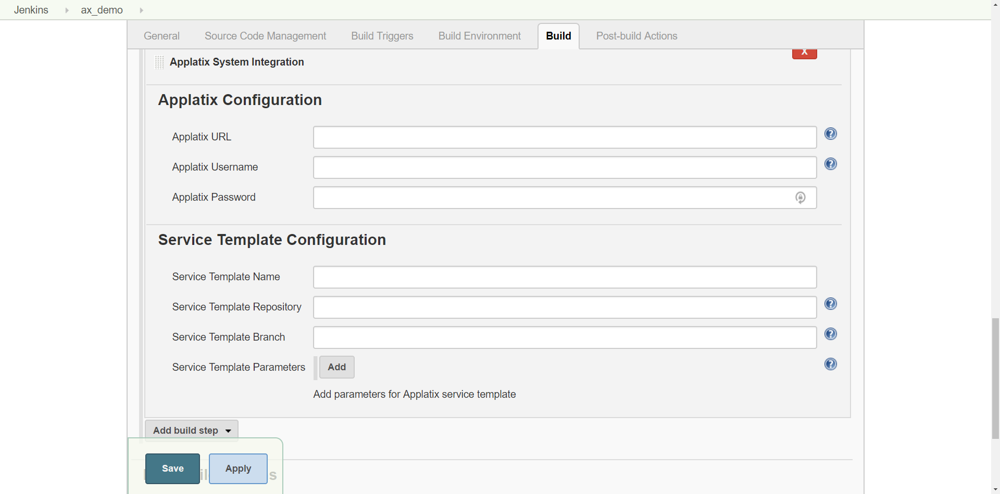

    {jenkins-plugin-info:applatix}

Enables Jenkins to run a parent workflow that triggers a child
workflow in your already deployed Applatix Kubernetes cluster (for
continuous integration or deploying a containerized application), To
enable this capability in Jenkins, you'll need to install and configure
the Applatix plugin for Jenkins.

NOTE: Before you install the plugin, make sure you have already created
a Workflow template for the child CI workflow, specifying the necessary
parameters for the workflow. In Applatix, workflows are driven by YAML
templates that are written in the Applatix Domain Specific Language
(DSL). You create templates in YAML to define workflows and deployments.
In the Applatix plugin for Jenkins, you'll also specify your SCM repo,
YAML template name, and input parameters to launch your workflows. Since
Applatix runs container-native workflows, you can run thousands of jobs
in parallel. For details, see *Applatix YAML Tutorial and Reference* for
details about creating a workflow template.

Here's the procedure to install the Applatix plugin for Jenkins:

1.  From your Jenkins dashboard, click **Manage Jenkins**.  
      
    {height="250"}  
      
2.  Click **Manage Plugins**.  
      
    {height="250"}  
      
3.  Click; **Available**.  
      
4.  Search for **Applatix**.  
      
    {width="505"}  
      
5.  Check **Applatix** and click **Install without restart**.

Here's the procedure to configure the build to run the child workflow on
Applatix:

1.  From a Jenkins Project view, click **Configure**.  
      
    {height="250"}  
      
2.  Click **Build Environment** tab and click **Add a build step**.  
      
    {height="250"}  
      
3.  Select **Applatix System Integration**.  
      
    {height="250"}  
      
4.  Enter the following information for Applatix configuration:  
      
    -   **Applatix URL** - The URL of your installed Applatix Cluster.
    -   **Applatix Username** - The username for logging into your
        Cluster.
    -   **Applatix Password** - The password for logging into your
        Cluster.  
          
5.  Enter the following information for the Service Template
    Configuration:  
      
    -   **Service Template Name** - Name of the YAML template in your
        repository.
    -   **Service Template Repository**- The URL to the repository that
        the YAML template exists.
    -   **Service Template Branch** - The branch in your repository
        where the YAML template exists.
    -   (Optional) Click **Add** to specify parameters for a workflow.
        These are key-value pairs that your workflow needs to
        successfully complete the build.  
          
6.  Click **SAVE**.

At this point, you are ready to launch the child workflow on Applatix
from the main workflow running on Jenkins.

 
