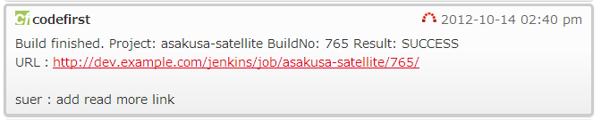
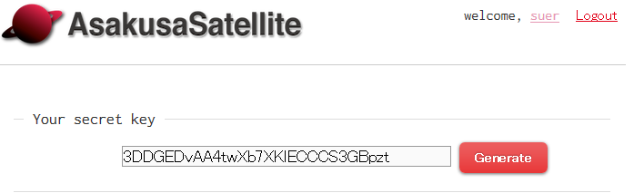

This plugin notifies
[AsakusaSatellite](https://github.com/codefirst/AsakusaSatellite) of
build results.

## **Features**

-   Notify
    [AsakusaSatellite](https://github.com/codefirst/AsakusaSatellite) of
    build results

{width="547"
height="111"}

## **Setup**

At (your project) \> Configure \> AsakusaSatellite, set room information
at your AsakusaSatellite.

-   **appkey**: secret key of your AsakusaSatellite acount. You can get
    this key at your acount page at AsakusaSatellite.

         
{width="462"
height="142"}

-   **baseUrl**: a Base URL of AsakusaSatellite
-   **roomNumber**: a room id. Typically, URL of rooms are such as
    **baseUrl**/chat/room/**roomNumber**
-   **message**: a message template. You can use following variables
    -   ${project}: a project name
    -   ${number}: a build number
    -   ${result}: a build result
    -   ${url}: a url of build result
    -   ${changeset}: change set of this build

## Version History

### **Version 0.1 (22** **October****, 2012)**

-   Initial release
