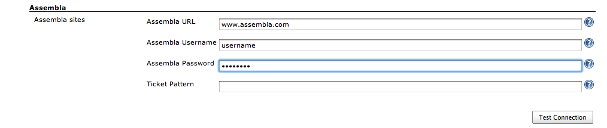
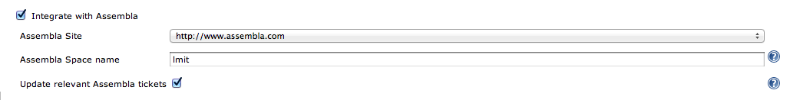
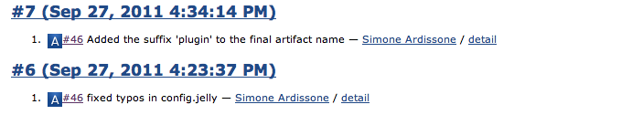

The current version of this plugin may not be safe to use. Please review
the following warnings before use:

-   [Credentials stored in plain
    text](https://jenkins.io/security/advisory/2019-09-25/#SECURITY-1543)

  

This plugin integrates [Assembla](http://www.assembla.com/) to Jenkins.

  
  
  
Into the Jenkins global configuration screen configure the Assembla site
url and the authentication credentials. You can optionally set a custom
pattern to detect Assembla tickets in commit messages

Hit Test Connection to check if the configured site and credentials
works
  
  
  
You have now to configure the jobs you want to enable Assembla plugin:
this configuration is available only if at least an Assembla site has
been configured in the global Jenkins configuration

Check the Update relevant Assembla tickets if you want Jenkins to
back-track the build URL as an Assembla ticket comment

  
  
  
Now Assembla keys in changelogs are hyperlinked to the corresponding
Assembla tickets pages (with tooltips)

  
  
The following image shows how the added comment looks like in Assembla
  
  
  

# History

#### Version 1.1

-   The first released version to jenkins-ci repositories
