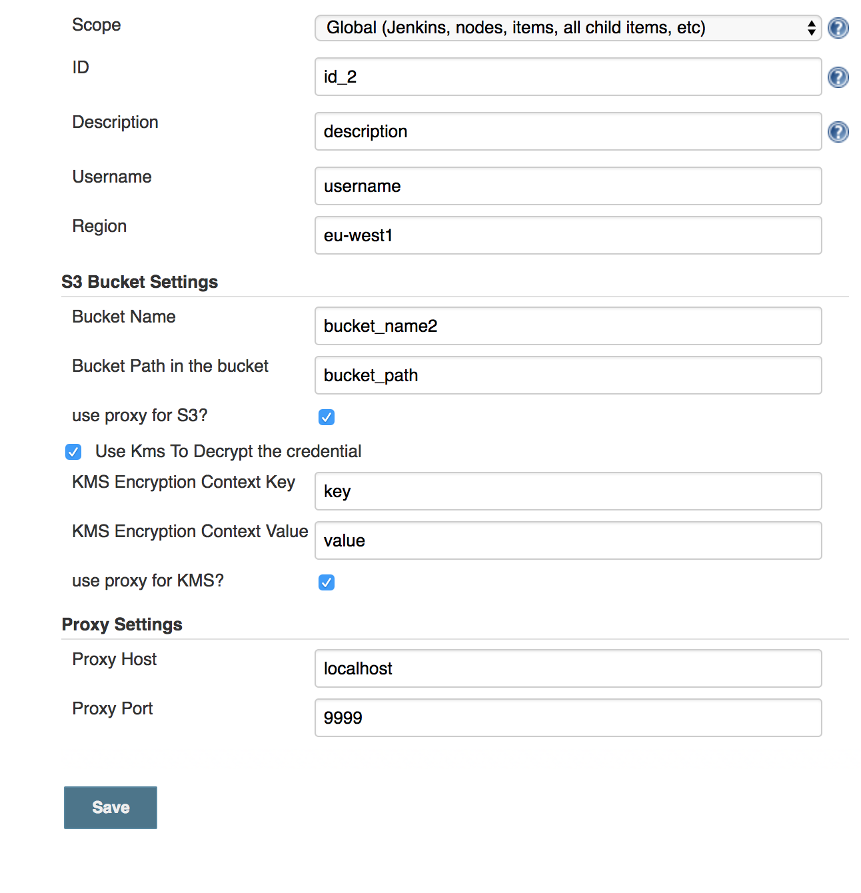

Allows the retrieval of kms encrypted credentials from an s3 bucket
using Amazon Web Services

Allows the retrieval of kms encrypted credentials from an s3 bucket
using Amazon Web Services

## Allows you to store a secret in s3, either encrypted with KMS or a straight get from bucket (you should use SSE in this case)

Usage:

Create a Credential by going to Jenkins/credentials in the normal way
and create Add your credential in the normal way. With this plugin
installed, you should see the option in the Kind dropdown called "AWS
Bucket Credential".

  

Now enter your information in the normal way. Note valid regions are
given in the [AWS
Documentation](https://docs.aws.amazon.com/AWSEC2/latest/UserGuide/using-regions-availability-zones.html#concepts-available-regions)
(note casing and hyphens!)

  

Just given the bucket name you have stored your credential in. There is
no need to prefix with s3:// etc. then the full object path to the
credential must be provided. If you need to use a proxy to get to the s3
bucket (may be required in some enterprise environments), you check
that. If not required, then leave as is. If your credential is KMS
encrypted then it can be KMS decrypted by checking the box. If you
provide a KMS encryption context, then support is provided for one
key/value pair. Again you can use a proxy if required.

  

Finally just specify your proxy host **and** port if required. eg:

You can use the bindings in the pipeline in the normal way, e.g

    pipeline {
      stages{
        stage("cmd") {
          steps{
             withCredentials([usernamePassword(credentialsId: 'id-2', usernameVariable: 'USERNAME', passwordVariable: 'PASSWORD')]) {
               // available as an env variable, but will be masked if you try to print it out any which way
               sh 'echo $PASSWORD'
               // also available as a Groovy variable—note double quotes for string interpolation
               echo "$USERNAME"
             }
          }
        }
      }
    }

## History 

### Version 1.0.0

  

### Version 0.2.3

If the kms context for encryption is empty then it'll not try to use it.
Note I'm going to change the kms encryption section in version 1.0 -
this will be a non-backwardly compatible release. This should fix the ui
issue when viewing an the credential data.

### Version 0.2.2

  

-   Kms Encryption is now optional, but the preferred choice. To not use
    kms encryption you need to check the checkbox to use a raw get from
    s3. Use this **only** if you know you have encrypted the secret in
    the bucket using SSE
-   Kms Encryption context is the kms is a string key pair that must be
    matched if it is set when encrypted. If an encrypted key/pair is
    used during encryption, it **must** match (case sensitive) and be
    provided when requesting decryption. The actual kms key used to
    decrypt is not required as that meta-data is included with the
    object once encrypted.  
      

Once installed navigate to the credentials section and add a new
AWS-Bucket-Credentials. You'll see the screen below. There are also
binding available for the credentials pipelines

  

  

##### Know Issues:

-   does not currently work on jenkins slaves unless the slave has full
    access to master. This is because the bucket secret is obtained as
    late as possible.
    -   If you want the slave to have access to the secret at runtime
        you must explicitly allow the slave unrestricted access to
        master. Only do this with due diligence as specified in the
        caveats surrounding slaves. You must fully trust the slave
        before relaxing the security measures.
-   There is an issue with the ui not showing properly if the you are
    getting your secret straight from s3 without using kms and you chose
    to view the credential with the update functionality. It does not
    show that you are avoiding kms, but shows as if you are using kms.
    Functionality is not effected, but if you click save ensure you
    re-check the option to avoid kms

### ~~Version 0.2.1~~

-   ~~do not use~~

### ~~Version 0.2.0~~

-   ~~KMS encryption is now optional. If you leave the kms secret name
    null, then you'll get the result from the s3 bucket. This is useful
    for server side encryption on the s3 bucket side~~

#### Version 0.1.1

-   Fixes NPE when jenkins used a credential set before a restart caused
    by serialization

#### Version 0.1 

-   Initial working upload

## Setup

Simply define the username for these credentials. Then, to obtain the
password

1.  Define the Region ("eu-west-1" style casing)

Define how to use S3

1.  the bucket name and 
2.  object id
3.  are you needing to use a proxy to connect to the s3 bucket

then the kms details 

1.  the kms secret name
2.  the (optional) extra details Name/Value pair - this is has to match
    what was used to encrypt the password originally
3.  are you needing to use a proxy to connect to kms

Finally there is a section on the proxy setup (only important if you
need to use a proxy in either of the steps above)

1.  Proxy host
2.  Proxy port

The password will now be obtained when the "getPassword" as called.

These credentials can be used anywhere a username/password credentials
are allowed in a plugin.

Credential binding is also provided using the class
AwsBucketCredentialsBinding and the username can be linked to the
"usernameVariable" and the password can be linked to the
"passwordVariable"
