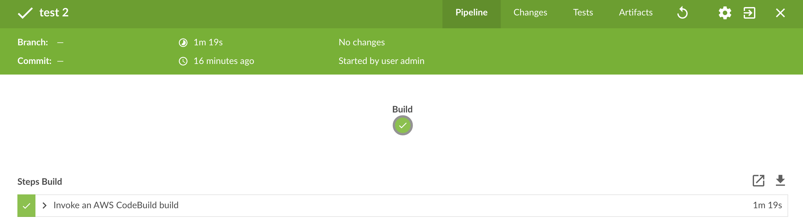

[AWS CodeBuild](https://aws.amazon.com/codebuild/) is a fully managed
build service that compiles source code, runs tests, and produces
software packages that are ready to deploy. With CodeBuild, you don’t
need to provision, manage, and scale your own build servers. CodeBuild
scales continuously and processes multiple builds concurrently, so your
builds are not left waiting in a queue. You can get started quickly by
using prepackaged build environments, or you can create custom build
environments that use your own build tools. With CodeBuild, you are
charged by the minute for the compute resources you use.

This is the official plugin for AWS CodeBuild that's managed by
CodeBuild engineering team. You can reach out to us for submitting
feedback or feature requests at codebuild-feedback@amazon.com.

  
The AWS CodeBuild plugin for Jenkins provides a build step for your
Jenkins project.

[](https://camo.githubusercontent.com/1478dbc9a6202d2157e8f370fe97b6f33acbf8cf/68747470733a2f2f636f64656275696c642e75732d776573742d322e616d617a6f6e6177732e636f6d2f6261646765733f757569643d65794a6c626d4e79655842305a57524559585268496a6f694b30684b5547564764466c4c53305a6d57545933546e70496169744663485a79646c673154486c734b3164594e474e346445747853485a50517a426e61304577576b777a59334a514d556447614746335448566b64334e53596d464b54324e6d4f4652614e6d4654616b394d6131565a6430787a50534973496d6c32554746795957316c644756795533426c59794936496c56765a30467063334e766447784c59303032556a49694c434a745958526c636d6c6862464e6c64464e6c636d6c68624349364d5830253344266272616e63683d6d6173746572)  

## Setup Jenkins

We have written a blog post for setting up Jenkins with AWS CodeBuild
plugin pre-installed. Learn more:
<https://aws.amazon.com/blogs/devops/simplify-your-jenkins-builds-with-aws-codebuild/>.

## Plugin Installation *(Optional)*

If you already have a Jenkins setup and would like to only install the
AWS CodeBuild plugin, then the recommended approach would be to search
for "`AWS CodeBuild Plugin for Jenkins"` in the Plugin Manager on your
Jenkins instance.

## Plugin Usage

### Using the AWS CodeBuild plugin with the Jenkins Pipeline plugin

Your CodeBuild project can be configured in a Jenkins Pipeline. as shown
below. You can use the snippet generator (click "Pipeline Syntax" on
your pipeline project page) to generate the pipeline script that adds
CodeBuild as a step in your pipeline. It should generate something like:

`awsCodeBuild  projectName: 'project', credentialsType: 'keys', region:  'us-west-2', sourceControlType: 'jenkins'`

  

View without Jenkins Blue Ocean plugin:

{height="250"}

***(Recommended)*** View with Jenkins Blue Ocean plugin:

{height="250"}

  

### Using AWS CodeBuild with Jenkins

1.  [Create
    Project](http://docs.aws.amazon.com/console/codebuild/create-project) on
    the AWS CodeBuild console.
    -   Switch to the region you would prefer to run the build in.
    -   You can optionally set the Amazon VPC configuration to allow
        CodeBuild build container to access resources within your VPC.
    -   Make sure to write down the project's name.
    -   (Optional) If your source repository is not natively supported
        by CodeBuild, you can set the input source type for your project
        as S3 for the CodeBuild project.
2.  Create AWS IAM user to be used by the Jenkins plugin.
    -   [Create a
        policy](https://console.aws.amazon.com/iam/home?region=us-east-1#/policies$new) similar
        to the one following this section.
    -   Go to the [IAM
        console](https://console.aws.amazon.com/iam/home?region=us-east-1#/users$new?step=details),
        and create a new user.
        -   Access type should be: Programmatic Access.
        -   Attach policy to user that you created previously.
3.  Create a freestyle project in Jenkins.
    -   On the Configure page, choose Add build step \> Run build on AWS
        AWS CodeBuild.
    -   Configure your build step.
        -   Enter Region, Credentials from the user created previously,
            and ProjectName.
        -   Select Use Project source.
        -   Save the configuration and run a build from Jenkins.

-   For the Source Code Management make sure to select how you would
    like to retrieve your source. You may need to install the [GitHub
    Plugin](https://wiki.jenkins-ci.org/display/JENKINS/GitHub+Plugin) (or
    the relevant source repository provider's Jenkins plugin) to your
    Jenkins server.
-   On the Configure page, choose Add build step \> Run build on AWS
    CodeBuild.
-   Configure the build step.
    -   Enter Region, Credentials from the user created previously,
        and Project name.
    -   Select Use Jenkins source.
    -   Save the configuration and run a build from Jenkins.

Policy sample for IAM user:

    {
        "Version": "2012-10-17",
        "Statement": [
            {
                "Effect": "Allow",
                "Resource": ["arn:aws:logs:{{region}}:{{awsAccountId}}:log-group:/aws/codebuild/{{projectName}}:*"],
                "Action": ["logs:GetLogEvents"]
            },
            {
                "Effect": "Allow",
                "Resource": ["arn:aws:s3:::{{inputBucket}}"],
                "Action": ["s3:GetBucketVersioning"]
            },
            {
                "Effect": "Allow",
                "Resource": ["arn:aws:s3:::{{inputBucket}}/{{inputObject}}"],
                "Action": ["s3:PutObject"]
            },
            {
                "Effect": "Allow",
                "Resource": ["arn:aws:s3:::{{outputBucket}}/*"],
                "Action": ["s3:GetObject"]
            },
            {
                "Effect": "Allow",
                "Resource": ["arn:aws:codebuild:{{region}}:{{awsAccountId}}:project/{{projectName}}"],
                "Action": ["codebuild:StartBuild",
                           "codebuild:BatchGetBuilds",
                           "codebuild:BatchGetProjects"]
            }
        ]
    } 

### Using the AWS CodeBuild plugin with the Jenkins Pipeline plugin

Use the snippet generator (click "Pipeline Syntax" on your pipeline
project page) to generate the pipeline script that adds CodeBuild as a
step in your pipeline. It should generate something like

    awsCodeBuild projectName: 'project', credentialsType: 'keys', region: 'us-west-2', sourceControlType: 'jenkins'

Additionally, this returns a result object which exposes the following
methods which can be useful to later steps:

-   `getBuildId()`: returns the build ID of the build (similar
    to `codebuild-project-name:12346789-ffff-0000-aaaa-bbbbccccdddd`)
-   `getArn()`: returns the ARN of the build (similar
    to `arn:aws:codebuild:AWS_REGION:AWS_ACCOUNT_ID:build/CODEBUILD_BUILD_ID`,
    where `CODEBUILD_BUILD_ID` is the same information returned in
    getBuildId)
-   `getArtifactsLocation()`: returns the S3 ARN of the artifacts
    location (similar
    to `arn:aws:s3:::s3-bucket-name/path/to/my/artifacts`)

### [AWS Credentials in Jenkins](https://github.com/awslabs/aws-codebuild-jenkins-plugin#aws-credentials-in-jenkins)

It's recommended to use the Jenkins credentials store for your AWS
credentials. Your Jenkins credentials must be of type
`CodeBuild Credentials` to be compatible with the CodeBuild plugin. When
creating new `CodeBuild Credentials`, the plugin will attempt to use
the [default credentials provider
chain](https://docs.aws.amazon.com/AWSJavaSDK/latest/javadoc/com/amazonaws/auth/DefaultAWSCredentialsProviderChain.html)
if AWS access and secret keys are not defined.  
  
You can also specify your AWS access and secret keys in the CodeBuild
configuration when using `credentialsType: 'keys'`. If the access and
secret keys are not specified, the plugin will attempt to use the
default credentials provider chain. When running a Jenkins pipeline
build, the plugin will attempt to use credentials from the
[pipeline-aws](https://plugins.jenkins.io/pipeline-aws) plugin before
falling back to the default credentials provider chain. If you are
running Jenkins on an EC2 instance, leave the access and secret key
fields blank and specify `credentialsType: 'keys'` to use credentials
from your EC2 instance profile, which is in the default credentials
provider chain.

  
