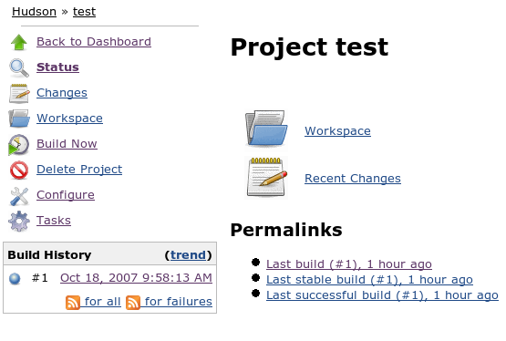

This plugin adds batch tasks that are not regularly executed to
projects, such as releases, integration, archiving, etc. In this way,
anyone in the project team can execute them in a way that leaves a
record.

# Usage

When you install this plugin, your project configuration page gets
additional "batch tasks" option as illustrated below:

A batch task consists of a shell script and a name. When you execute a
build, the shell script gets run on the workspace, just like a build.
Batch tasks and builds "lock" the workspace, so when one of those
activities is in progress, all the others will block in the queue.

Once a task is configured, the project top page gets "task(s)" link, as
illustrated below:

If you click that, you can see the status of all the tasks. You can
schedule the execution of a task from here, too. Task executions are
numbered like "123-456" where 123 portion refers to the latest build and
456 portion refers to the sequential number (so that you can execute a
task multiple times with the same build.) The build number portion is
significant because when a batch task runs, it sees the workspace as of
the result of this build.

The details of the task execution and its console output are available
by further clicking a task of the interest, as below:

# Change Log

#### Version 1.19 (Jul. 1, 2016)

-   Fix
    [JENKINS-36184](https://issues.jenkins-ci.org/browse/JENKINS-36184) -
    Batch task console is empty

#### Version 1.18 (Jun. 7, 2016)

-   Fix
    [JENKINS-35411](https://issues.jenkins-ci.org/browse/JENKINS-35411) -
    Migrate to pom-plugin
-   Fix
    [JENKINS-35188](https://issues.jenkins-ci.org/browse/JENKINS-35188) -
    Improve User Experience

#### Version 1.17 (Fev. 24, 2013)

-   Fix reopened
    [JENKINS-13647](https://issues.jenkins-ci.org/browse/JENKINS-13647) -
    Environment variables from EnvInject plugin are not inherited/parsed
    by batch tasks

#### Version 1.16 (May 1, 2012)

-   Fix
    [JENKINS-13647](https://issues.jenkins-ci.org/browse/JENKINS-13647) -
    Environment variables from EnvInject plugin are not inherited/parsed
    by batch tasks

#### Version 1.15 (Apr 5, 2012)

-   Refactored internally to [support hierarchical
    project](http://localhost:8085/display/JENKINS/Hierarchical+projects+support)

#### Version 1.14 (Nov 11, 2010) - *requires Hudson 1.383+*

-   Fixed an AbstractMethodError when running with Hudson 1.383+ ([issue
    \#8033](http://issues.jenkins-ci.org/browse/JENKINS-8033))

#### Version 1.13 (Feb 10, 2010)

-   Use resizable text area for task script.
    ([JENKINS-5578](https://issues.jenkins-ci.org/browse/JENKINS-5578))
-   Apply environment settings from
    [setenv](http://localhost:8085/display/JENKINS/Setenv+Plugin) plugin
    when running tasks.
    ([JENKINS-5580](https://issues.jenkins-ci.org/browse/JENKINS-5580))
-   Show links to downstream tasks on project page.
    ([JENKINS-5582](https://issues.jenkins-ci.org/browse/JENKINS-5582))

#### Version 1.12 (Feb 5, 2010)

-   Lock workspace during task run to prevent owner project or other
    tasks from using the same workspace.
    ([JENKINS-5285](https://issues.jenkins-ci.org/browse/JENKINS-5285))
-   Show animated ball icon for Tasks link in sidepanel when a task is
    running.
    ([JENKINS-3372](https://issues.jenkins-ci.org/browse/JENKINS-3372))

#### Version 1.11 (Jan 3, 2010)

-   Environment variable bug fix and enhancements
    ([JENKINS-5039](https://issues.jenkins-ci.org/browse/JENKINS-5039),
    [JENKINS-1628](https://issues.jenkins-ci.org/browse/JENKINS-1628),
    [JENKINS-1316](https://issues.jenkins-ci.org/browse/JENKINS-1316))

#### Version 1.10 (Dec 7, 2009)

-   A few minor bug fixes.

#### Version 1.9 (Nov 5, 2009)

-   Add "trigger even if build is unstable" selector for invoking tasks
    as a post-build action. Previously the tasks were always invoked
    (even for failed builds); now they will only run if the build result
    meets the required threshold (and never for failed builds).
-   Fix build number written to job log when task is invoked as a
    post-build action (was off by one)
-   Fix broken image for aborted task (grey ball)
-   On task page, show only builds for this task in Build History
    (instead of all tasks)
-   Avoid error if try to run a task when there are no builds for the
    project

#### Version 1.8 (Aug 28, 2009)

-   Improved the error diagnosis and recovery when a build no longer has
    a workspace
    ([report](http://www.nabble.com/NPE-with-batch-task-plugin-and-1.321-td25194567.html))
    – requires Hudson 1.319 or higher.

#### Version 1.7 (Mar 31, 2009)

-   Allow non-admin users ability to manage and execute tasks
    ([JENKINS-1198](https://issues.jenkins-ci.org/browse/JENKINS-1198))

#### Version 1.6 (Feb 27, 2009)

-   Updated to work with recent versions of Hudson
    ([JENKINS-3173](https://issues.jenkins-ci.org/browse/JENKINS-3173))

#### Version 1.5 (Jan 27, 2009)

-   Fixed a bug "batchtask in queue causes NPE at startup"
    ([JENKINS-2925](https://issues.jenkins-ci.org/browse/JENKINS-2925))

#### Version 1.3 (Jan 29, 2008)

-   Updated to work with the latest version of Hudson, so that it won't
    cause `AbstractMethodError`
    ([report](http://www.nabble.com/Hudson---Problems-with-white-spaces-in-URLs-pointing-to-build-artifacts--td15088015.html#a15088729))
-   Last successful/failed builds were computed incorrectly
    ([JENKINS-1012](https://issues.jenkins-ci.org/browse/JENKINS-1012))
-   Icon size in task list is now configurable
    ([JENKINS-1010](https://issues.jenkins-ci.org/browse/JENKINS-1010))

#### Version 1.2 (Nov 16, 2007)

-   Task can be now individually deleted from the left menu
-   Build number should start from 1
    ([JENKINS-991](https://issues.jenkins-ci.org/browse/JENKINS-991))
-   Tasks now work on Windows
    ([JENKINS-985](https://issues.jenkins-ci.org/browse/JENKINS-985))
-   Build icon in task list is not larger than the other icons
    ([JENKINS-1010](https://issues.jenkins-ci.org/browse/JENKINS-1010))

#### Version 1.0 (Oct 18, 2007)

-   initial version
