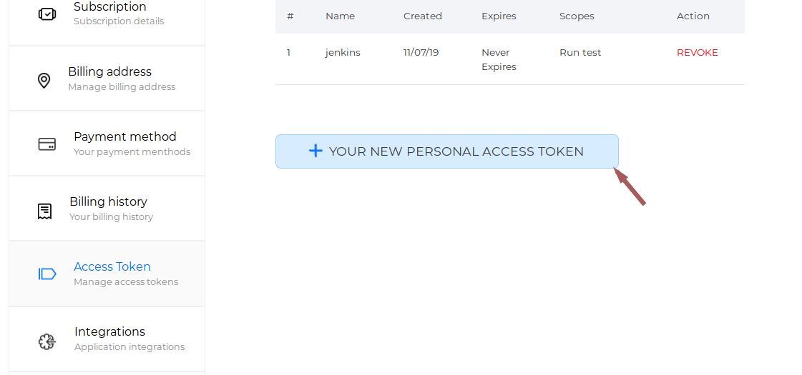

This plugin can be used to trigger beagle penetration testing from
jenkins

## What is Beagle?

Beagle is an intelligent and holistic platform to make your applications
hack-proof. The platform provides continuous and automated Penetration
Testing (under human supervision) for organizations, so that they can
always stay on top of the cyber threats.

In short, Beagle finds out how deep your system can be penetrated. Know
it before the hackers do!

\* \[Beagle Security\](<https://beaglesecurity.com/>) - Visit for more
Details!

## Prerequisites

Obtain application token and user token from Beagle. So you need a valid
Beagle account.

### To get User Token

-   Go to <https://beaglesecurity.com/>
-   Generate your user token from Beagle user settings
-   Settings -\> Access Token -\> Generate your new personal access
    token

{height="250"}

  

### To Get the Application Token

-   Go to <https://beaglesecurity.com/>
-   Get your application's token from Beagle application settings page
-   Home -\> Applications -\> Select your application -\> Settings -\>
    Application token

{height="250"}

## Authors

Beagle Security

## License

This project is licensed under the MIT License - see [this
file](https://github.com/jenkinsci/beagle-security-plugin/blob/master/LICENSE)
for details
