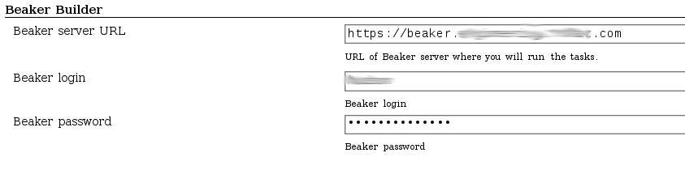
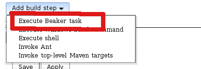
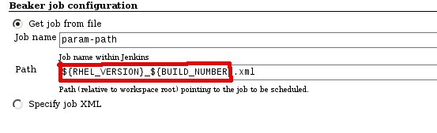
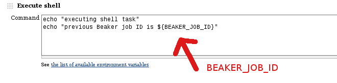
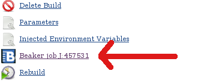
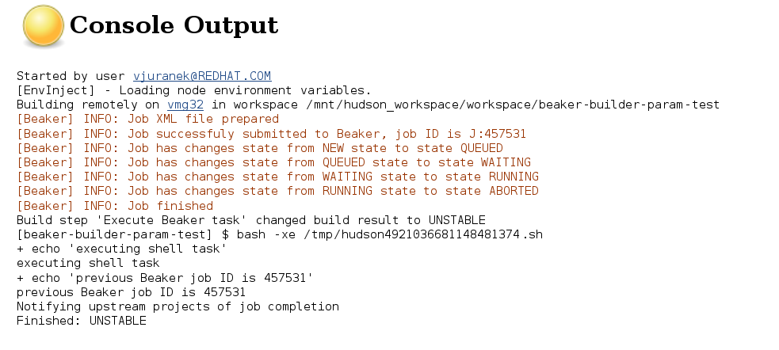
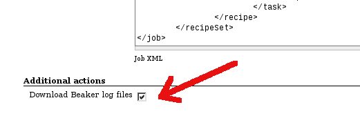

Older versions of this plugin may not be safe to use. Please review the
following warnings before using an older version:

-   [Credentials stored in plain
    text](https://jenkins.io/security/advisory/2019-09-12/#SECURITY-1545)

This plugin ingrates Jenkins with [Beaker](http://beaker-project.org/).

  

Beaker is open-source software for managing and automating labs of test
computers. Plugin allows you to submit a job definition to Beaker and
get back the result.

Current plugin capabilities are

-   schedule a job (includeing matrix job) in Beaker based on provided
    job XML definition, job definition can be provided   
    -   directly in Jenkins job configuration
    -   as a path to a file in workspace (e.g. previously checked out
        from SCM)
-   expand parameters in job XML definition based on Jenkins job
    parameters or environment variables
-   monitor the Beaker job and sets the job status according to Beaker
    job result
-   add link to Beaker job on build page
-   export job ID as an environment variable for further usage (e.g. in
    subsequent shell build step)
-   download job files from Beaker into workspace

# Configuration

In the main Jenkins configuration page you have to setup URL to Beaker
and also credential (login/password) under which Jenkins logs-in into
the Beaker. Kerberos authentication is currently not supported (will be
hopefully in next versions).


### Dealing with certificate and keystore

Usually XML-RPC calls which this plugin uses for communication with
Beaker are sent over https protocol. If you use **https protocol**, make
sure you have set up java **keystore with valid certificate**, it means
you have added Beaker certificate into you java keystore and provide
path and password of the keystore to webserver. To add certificate into
java keystore, save the certificate (e.g. export the certificate from
your web browser) and run

``` syntaxhighlighter-pre
keytool -import -keystore my_java_keystore.jks -file beaker_cert.pem -alias beaker-server
```

To verify that the certificate was imported you can run following
command which will list all entries in the keystore

``` syntaxhighlighter-pre
keytool -list -keystore my_java_keystore.jks
```

Now add following java options to your Jenkins java options (or server
JVM options when running on different container than Winstone)

``` syntaxhighlighter-pre
-Djavax.net.ssl.trustStore=/path/to/keystore.jks -Djavax.net.ssl.trustStorePassword=<passwd>
```

### Configuration issues

When you use Java 7, you may observe following issue in the log:

``` syntaxhighlighter-pre
Jul 31, 2013 12:21:59 AM org.apache.commons.httpclient.HttpMethodDirector executeWithRetry
INFO: I/O exception (javax.net.ssl.SSLProtocolException) caught when processing request: handshake alert:  unrecognized_name
Jul 31, 2013 12:21:59 AM org.apache.commons.httpclient.HttpMethodDirector executeWithRetry
INFO: Retrying request
```

To avoid it, turn off
[SNI](http://en.wikipedia.org/wiki/Server_Name_Indication) by adding
java option *-Djsse.enableSNIExtension=false* so that java options which
needs to be add to Jenkins cofing are following:

``` syntaxhighlighter-pre
-Djavax.net.ssl.trustStore=/path/to/keystore.jks -Djavax.net.ssl.trustStorePassword=<passwd> -Djsse.enableSNIExtension=false
```

# Usage

Add "Beaker buidler"  build step:


Define job XML or provide path to job XML definition file. Job XML
definition can contain parameters which will be expanded before
submitting job XML to Beaker:  


You can also specify path to job XML, which can include job parameters
or env. variables. This is useful e.g. in cases when you job definition
is different for various architectures or OS distributions. This is
especially useful in case of matrix jobs, when values of matrix axes are
exported as env. variables, so you can take advantage of matrix jobs
even if you job definition is different for each matrix combination.



In subsequent tasks you can use BEAKER\_JOB\_ID parameter which will
contain submitted job ID in Beaker:  
  
   
 Once you schedule a build and job is successfully submitted to the
Beaker server, new link pointing to the job will appear in build menu:  


Plugin will monitor th execution of Beaker job periodically, will send
notification to the Jenkins build console and will set the job result
according to Beaker job result:  


### Additional actions

You can also configure additional actions, currently only downloading
job files from Beaker:



The files are downloaded into $WORKSPACE/beaker/J\_$BEAKER\_JOB\_ID:  


# TODO

-   Kerberos support for authentication on Beaker server 

# Changelog

### Upcoming changes 

### Release 1.8 (2015-05-30)

-   Tmp files with Beaker recipes are not created any more
    ([pull3](https://github.com/jenkinsci/beaker-builder-plugin/pull/3))
-   Improved test coverage
    ([pull2](https://github.com/jenkinsci/beaker-builder-plugin/pull/2))
-   Beaker client and identity are now created only when need, not
    during saving global configuration
    ([pull1](https://github.com/jenkinsci/beaker-builder-plugin/pull/1))
-   Removed unused `Job name` field

### Release 1.7 (2015-01-18)

-   Fixed NPE when resolving variables
    ([JENKINS-27003](https://issues.jenkins-ci.org/browse/JENKINS-27003))
-   Improved logging

### Release 1.6 (2014-11-24)

-   XML escaping when substituting variables into Beaker job XML
    ([pull1](https://github.com/vjuranek/beaker-builder-plugin/pull/1))

### Release 1.5 (2013-11-13)

-   Fixed inconsistent authentication behavior (e.g. misleading message
    return by "Test connection" button in global configuration)

### Release 1.4 and 1.4.1 (2013-10-23)

-   Added possibility download job files from Beaker
-   Release 1.4.1 fixes possible NPE when downloading files

### Release 1.3 (2013-10-08)

-   Added possibility to use build parameters and build env. variables
    in path to job XML definition

### Release 1.2 (2013-10-04)

-   Fixed NPE during first startup and allow to change Beaker URL
    without restart

### Release 1.1.1 (2013-08-16)

-   Fixed problem with expired Beaker client credentials

### Release 1.0 (2013-07-26)

-   Initial release
