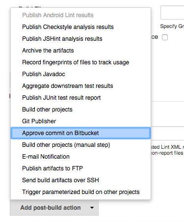
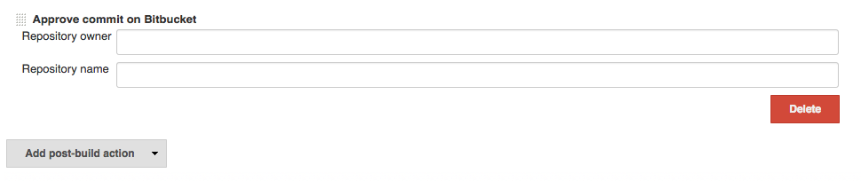

This Plugin enables Jenkins to approve commits on Bitbucket after
successful builds.

## Changelog

### 1.0.3 - 2015-04-03

-   Allow approval of unstable builds via checkbox \#3
-   Support variable substitution for repo owner and name - \#2

### 1.0.2 - 2015-03-23

-   Skip approval for unstable builds

### 1.0.1 - 2015-01-27

-   Initial release

## Global Configuration

This plugin needs a Bitbucket user account that has write access to your
repository. you can configure that user in the global Jenkins
configuration page:

## Job Configuration

Make sure your job uses a Bitbucket repository in the SCM section (you
may need to install the Git Client plugin to do that):

Now, add the post-build action called **Approve commit on Bitbucket**:

Configure that action to use the correct repository owner and repository
name:

