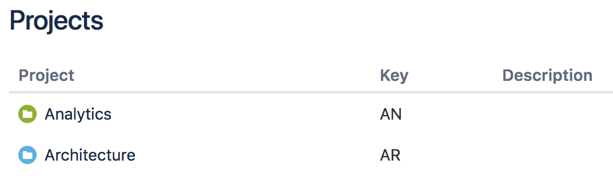
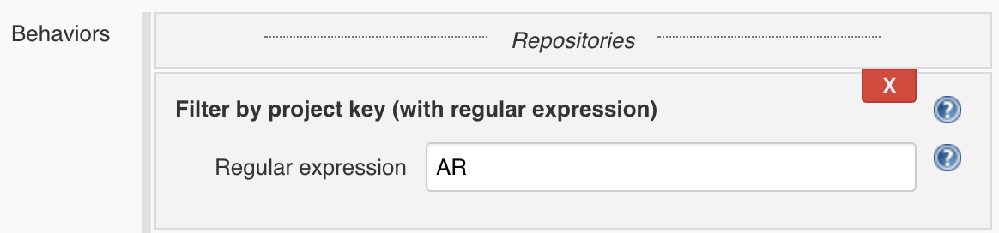

  

  
Adds project filter traits to Bitbucket Branch Source plugin. Bitbucket
Cloud & Server users can now filter by project key or name using a
regular expression.

## Features

This plugin adds two new filters to jobs with type Bitbucket
Team/Project:

-   Filter by Bitbucket project key using a regular expression
-   Filter by Bitbucket project name using a regular expression

With the use of the filters you can scan your whole organisation on
Bitbucket Cloud, but only create jobs for repositories that match a
particular project.

## Requirements

### Bitbucket Branch Source Plugin

Bitbucket Branch Source
Plugin [2.2.13](https://github.com/jenkinsci/bitbucket-branch-source-plugin/releases/tag/cloudbees-bitbucket-branch-source-2.2.13)
or newer is required.

## Usage

After installing the plugin, when creation jobs of type Bitbucket
Team/Project:

{width="600"}

There will be two new "Behaviors" to be selected:

{height="150"}

"Filter by project key" and "Filter by project name".

Both of this allow filtering using a regular expression.

They match your Bitbucket Cloud project as following:

{height="150"}

"Filter by project key" will match "AN" and "AR" on the example above.

"Filter by project name" will match "Analytics" and "Architecture" on
the example above.

You can choose to filter by key or name.

Once you add one of the filters, you can write a regular expression to
filter by that project:

{width="600"}

In the example filter above, repositories belonging to "Architecture
(AR)" will be scanned.

Repositories belonging to other projects will be filtered out.

## Version history

### Version 1.0 (November 5, 2018)

-   Initial release with filter traits for project by key and by name

  
