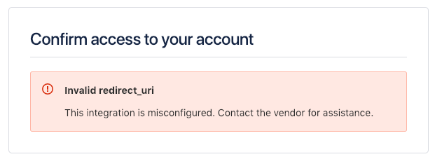
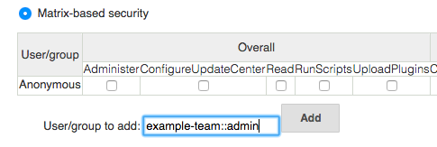

| Plugin Information                                                                                          |
|-------------------------------------------------------------------------------------------------------------|
| View Bitbucket OAuth [on the plugin site](https://plugins.jenkins.io/bitbucket-oauth) for more information. |

Older versions of this plugin may not be safe to use. Please review the
following warnings before using an older version:

-   [Credentials stored in plain
    text](https://jenkins.io/security/advisory/2019-10-23/#SECURITY-1546)

This Jenkins plugin enables OAuth authentication for
[Bitbucket](https://bitbucket.org/) users.

## **Upgrading 0.7 to 0.8**

bitbucket-oauth-plugin changed using OAuth version 1.0 to 2.0.

If you got **invalid redirect\_uri** error in login, you hove to specify
Callback URL in Bitbucket OAuth setting page.

{height="227"}

{width="621"}

  

bitbucket-oauth-plugin changed using Bitbucket API endpoint v1 to v2.

You have to change permissions: **Account \> Read** and **Team
membership \> Read**

**{height="181"}  
**

## **Setup**

First you need to get consumer key/secret from Bitbucket.

1.  Log into your Bitbucket account.
2.  Click on your account avatar in the top right corner and select
    **Bitbucket Settings**.
3.  If your are a member of an organization, ensure you are on Team
    settings, not Account settings, from the drop down.
4.  Under ACCESS MANAGEMENT select **OAuth**.
5.  Under OAuth consumers, click **Add consumer**.
6.  The system requests the following information: **Name** is required.
    Others are optional.  
    -   **Name** is required.
    -   **Callback URL** is required.
        input https://your.jenkins.root/securityRealm/finishLogin .
    -   Others are optional.
7.  Under Permissions, select **Account \> Read** and **Team
    membership \> Read**(optional).
8.  Click **Save**. The system generates a key and a secret for you.
    Toggle the consumer name to see the generated Key and Secret value
    for your consumer.

Second, you need to configure your Jenkins.

1.  Open Jenkins **Configure System** page.
2.  Set correct URL to **Jenkins URL.**
3.  Click **Save** button.
4.  Open Jenkins **Configure Global Security** page.
5.  Check **Enable security**.
6.  Select **Bitbucket OAuth Plugin** in **Security Realm**.
7.  Input your Consumer Key to **Client ID**.
8.  Input your Consumer Secret to **Client Secret**.
9.  Click **Save** button.

# Bitbucket Team access Support

Based on the teams that user has access to, this plugin automatically
creates groups of the form

**team::role**

Supported roles are **admin**, **contributor** and **member**

Examples

-   team1::admin
-   team2::contributor
-   team3::member

These group names can be used in *Jenkins Matrix-based* security to give
fine grained access control based on the users team access in Bitbucket.



# Configure plugin via Groovy script

Either automatically upon [Jenkins
post-initialization](https://wiki.jenkins.io/display/JENKINS/Post-initialization+script) or
through [Jenkins script
console](https://wiki.jenkins.io/display/JENKINS/Jenkins+Script+Console),
example:

``` syntaxhighlighter-pre
import hudson.security.AuthorizationStrategy
import hudson.security.SecurityRealm
import jenkins.model.Jenkins
import org.jenkinsci.plugins.BitbucketSecurityRealm

// parameters
def bitbucketSecurityRealmParameters = [
  clientID:     '012345678901234567',
  clientSecret: '012345678901234567012345678901'
]

// security realm configuration
SecurityRealm bitbucketSecurityRealm = new BitbucketSecurityRealm(
  bitbucketSecurityRealmParameters.clientID,
  bitbucketSecurityRealmParameters.clientSecret
)

// authorization strategy - full control when logged in
AuthorizationStrategy authorizationStrategy = new hudson.security.FullControlOnceLoggedInAuthorizationStrategy()

// authorization strategy - set anonymous read to false
authorizationStrategy.setAllowAnonymousRead(false)

// get Jenkins instance
Jenkins jenkins = Jenkins.getInstance()

// add configurations to Jenkins
jenkins.setSecurityRealm(bitbucketSecurityRealm)
jenkins.setAuthorizationStrategy(authorizationStrategy)

// save current Jenkins state to disk
jenkins.save()
```

## **Version History**

### Version 0.10 (14 Oct, 2019)

-   \[SECURITY-1546\] Fixed client secret is saved in plain text
    (Notice: I recommend that you re-save Jenkins security
    configuration.)

### Version 0.9 (19 Jan, 2019)

-   Fixed infinite redirect loop on Jenkins 2.150.2
    (related:  [JENKINS-55668](https://issues.jenkins-ci.org/browse/JENKINS-55668)
    )

### Version 0.8 (3 Jan, 2019)

-   Changed Bitbucket OAuth 1.0 to OAuth 2.0 (Notice: **You have to
    specify the Callback URL in Bitbucket OAuth setting page**)
-   Changed Bitbucket API v1 to v2 (Notice: **You have to add Account
    Read permission in Bitbucket OAuth setting page**)
-   Changed secret key input field to password 

### Version 0.7 (1 May, 2018)

-   Fixed Groovy example did not work

### Version 0.6 (25 Feb, 2018)

-   Added Bitbucket API 2.0 support (Pluign requires **Account Read**
    Permission only)
-   Added spport for adding user authorities based on bitbucket
    team/role (related: [Pull Request
    \#11](https://github.com/mallowlabs/bitbucket-oauth-plugin/pull/11))

### Version 0.5 (5 Jun, 2016)

-   Fixed ClassCastException
    (related: [JENKINS-34792](https://issues.jenkins-ci.org/browse/JENKINS-34792) )

### Version 0.4 (14 May, 2014)

-   Fixed broken api token access
    (related: [JENKINS-21882](https://issues.jenkins-ci.org/browse/JENKINS-21882) )

### Version 0.3 (31 Jul, 2013)

-   Works on reverse proxy environments ( Use Jenkins URL configuration
    instead of request URL )

### **Version 0.1 (29 May, 2013)**

-   Initial release
