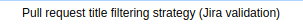

# Summary

## Description

This plugin extends the filtering abilities of the [Bitbucket Branch
Source
Plugin](https://wiki.jenkins.io/display/JENKINS/Bitbucket+Branch+Source+Plugin).

These filters will ignore pull requests if its title doesn't contain a
single valid and open Jira ticket.

## Usage

When defining a new Bitbucket Team/Project job, include an additional
behaviour (placed under the additional separator). 

This behaviour is configurable, being mandatory to select a previously
(globally) configured Jira server:

{height="250"}

In case of not selecting a Jira server, the form won't validate:

{height="250"}

In case of not selecting a Jira server, the form won't validate:

