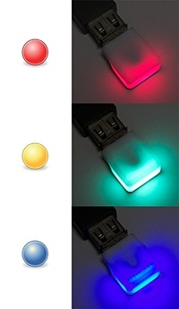

This plugin shows build results with
[blink(1)](http://thingm.com/products/blink-1.html), a tiny full-color
status light.

This plugin uses the Local Web API of blink(1). Please input the URL of
the server including port number. For further information, please
read [the documentation of blink(1) Local Web
API](https://github.com/todbot/blink1/tree/master/docs).
