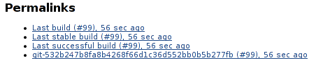

## Using plugin

Plugin allows user to create build *aliases*. Build aliases will be
displayed together with job permalinks at the job page and, more
importantly, the alias can be used in url to identify the build.

### Token macro

User can declare an alias template as a token macro expression. New
builds will have aliases attached with the expanded value. Given the
configuration from the picture, the build can then be reached at url
like `/job/<job-name>/git-532b247b8fa8b4268f66d1c36d552bb0b5b277fb`.

## Extending plugin

Plugin exposes
[`AliasProvider`](https://github.com/jenkinsci/build-alias-setter-plugin/blob/master/src/main/java/org/jenkinsci/plugins/buildaliassetter/AliasProvider.java)
extension points to be used by other plugins. Developers can create
configurable providers of custom aliases.
[`TokenMacroAliasProvider`](https://github.com/jenkinsci/build-alias-setter-plugin/blob/master/src/main/java/org/jenkinsci/plugins/buildaliassetter/TokenMacroAliasProvider.java)
can be seen as an example implementation.
