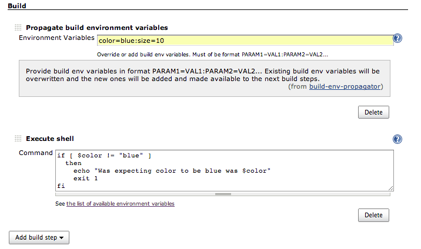

This plugin lets you add new build environment variables, override a
pre-defined and existing variables at each build   
step. Set of variables defined at a build step is carried over to the
sub-sequent build steps. Any subsequent build step  
 can override any variable defined by the previous build step.

## Usage

Click on Build-\>Add Build Step-\>Propagate build environment variables,
and then enter environment variables (key value pairs) to be accessible
in your next build step. You can also override previously define
environment variable key, this includes Jenkins defined build
environment keys as well.  


Any successive Propagate build environment variables step will override
previously defined environment variable values.



You can also add environment variable using Jenkins CLI:

``` syntaxhighlighter-pre
 $ java -jar cli.jar set-env-variables -m key1=val1 -m key2=val2
```
