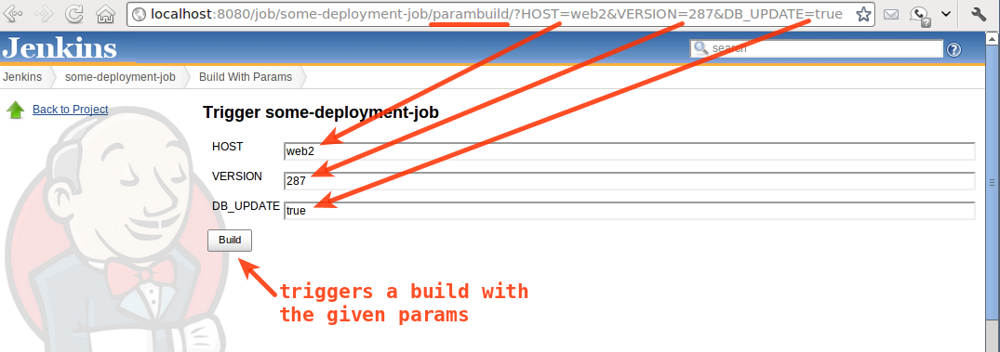

Older versions of this plugin may not be safe to use. Please review the
following warnings before using an older version:

-   [CSRF
    vulnerability](https://www.jenkins.io/security/advisory/2021-03-30/#SECURITY-2257)
-   [Stored XSS
    vulnerability](https://www.jenkins.io/security/advisory/2021-03-30/#SECURITY-2231)

Allows the user to provide parameters for a build in the url, prompting
for confirmation before triggering the job.

The plugin exposes `$JENKINS/job/$JOB/parambuild` url to trigger the
build with parameter. Unlike `$JENKINS/job/$JOB/buildWithParameters`,
human must confirm that the parameters are correct before the build is
triggered. This is useful if you want to create a list of jobs with
parameters to trigger ahead of time, and execute it at some future date
(e.g. a deployment plan).

An example triggering of a job with the plugin:  

## Changelog

### 1.4

-   Fixed 404 error for not logged user
    ([JENKINS-25534](https://issues.jenkins-ci.org/browse/JENKINS-25534))

-   Support for pipelines
    ([JENKINS-35378](https://issues.jenkins-ci.org/browse/JENKINS-35378))

### 1.3

-   Hide job action from UI to avoid confusion
    ([JENKINS-25413](https://issues.jenkins-ci.org/browse/JENKINS-25413))
