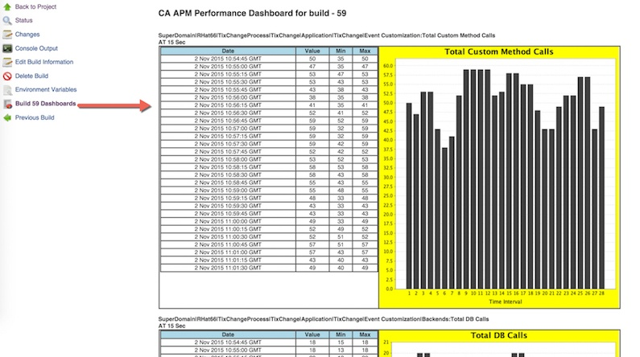
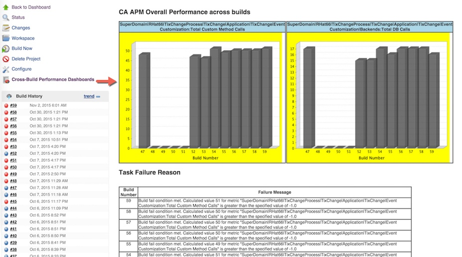
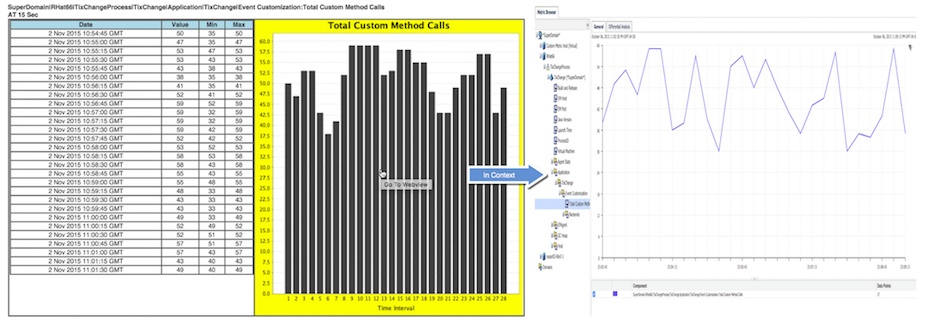
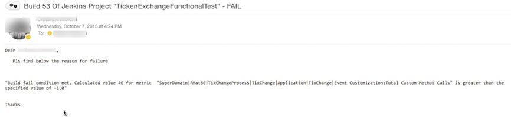

# CA APM Plugin 1.x

## Features

-   Ability to fetch multiple metrics using regex as KPI for tracking
-   Ability to configure multiple fail conditions
    -   Metric A less than or greater than a constant value OR
    -   Metric A in comparison to Metric B
-   Ability to send notification via Email (if smtp server is
    configured)
-   Ability to view KPI's per build or cross build dashboard in
    Jenkins&nbsp
-   Ability to decorate APM Team Center 10.1 nodes using custom
    attributes like build status, number and date
-   Ability to just notify via email: If "justEmail" is checked the
    build will NOT be marked as fail even if the conditions are met but
    only a notification will be sent
-   Ability Jump to Webview in context (for both metric and time range)
    from build or x-build dashboard

## Setup

#### Install plugin

Install this plugin via the Jenkins plugin manager.

#### Configure plugin

Configure various items as required (the help button on the right of
each text box below has detail explanation of what they are)

#### Output

You can see per build dashboard as below

OR across the build dashboard along with the reason for failure

   

You can also jump from Jenkins dashboard to CA APM Web View in context

If Configured you can also get an email notifying you of build status

Again if configured the same will be published on APM Team Center ( APM
10+)

