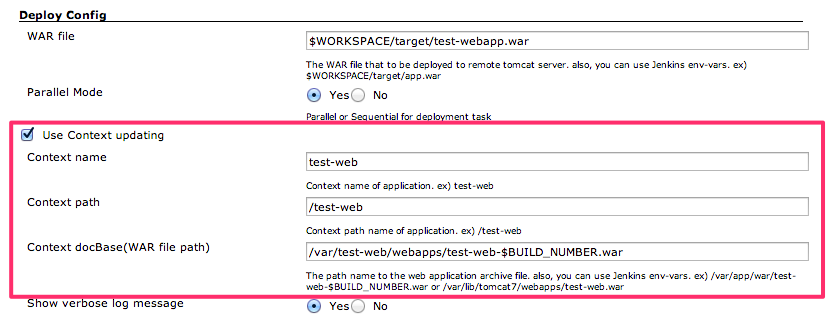
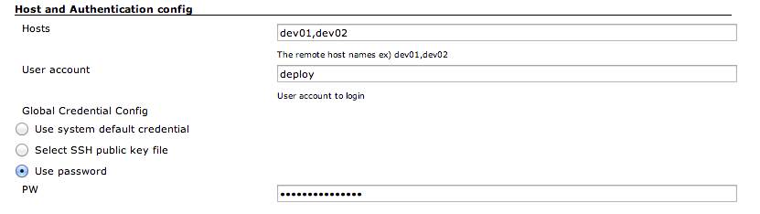
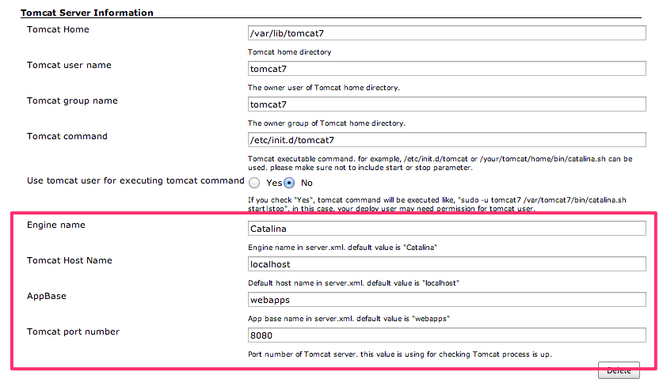

## Capitomcat is

Capitomcat plugin deploy the WAR file to multiple remote Tomcat servers
using Capitomcat which is Capistrano 3 recipe and library for Tomcat
deployment.

See also
: [Capitomcat](http://sunggun-yu.github.io/capitomcat/) homepage

### And also, You don't need to install Ruby and Capistrano 3 on your Jenkins box. Capitomcat and Capistrano 3 are running on the Jenkins Ruby runtime.

## Tested OS list

Please check the link in below. Capitomcat is tested on a lot of Linux
environment. 

<https://github.com/sunggun-yu/capitomcat-test-vagrant>

## Capitomcat plugin supports 2 way deployment.

### Basic

Basic deployment is usual way for Tomcat deployment. Capitomcat will
upload the WAR file under your $TOMCAT\_HOME/webapps directy.

Basic deployment is the default for Capitomcat deployment.

### With updating Context file

Also, Capitomcat supports deploment with updating contex.xml file. if
you want keep the old release WAR file or give some build number for WAR
file, this will be very helpful.

  

## Authentication & Authorisation

Basically, Capitomcat supports password input. by the way, that password
will be saved as plain text in your config file. I'm trying to use
certification plugin. but, for security, please consider using public
key authentication.

And also, Capitomcat is following Authentication & Authorisation guide
line of Capistrano.

please refer to [Authentication &
Authorisation](http://capistranorb.com/documentation/getting-started/authentication-and-authorisation/) page
on the Capistrano home page for more detail about Authentication &
Authorisation.

## NOPASSWD Setting

At least of following NOPASSWD setting is required to use Capitomcat.

%your\_deploy\_user\_name ALL=NOPASSWD:/etc/init.d/tomcat7 \<Your tomcat
command\>  
%your\_deploy\_user\_name ALL=(\<your\_tomcat\_user\> :
\<your\_tomcat\_user\_group\>) NOPASSWD: ALL

## Advanced Setting : Tomcat Virtual Host setting

Capitomcat Jenkins plugin is following virtual hosting setting
convention of Tomcat.

[Virtual Hosting and
Tomcat](http://tomcat.apache.org/tomcat-7.0-doc/virtual-hosting-howto.html)  

## Open Issues

[Open
Issues](https://github.com/sunggun-yu/jenkins-capitomcat-plugin/issues?page=1&state=open)

## Change logs

### v0.1.0

-   Updating Capitomcat library version - 1.2.1
    -   Updating Capistrano dependency version - 3.3.5
-   Can choose the way how to execute the remote tomcat command to apply
    pty option correctly. you can select the option in advanced menu :
    \`Use background execution for Tomcat command\`.
    -   No - Using Normal script(Default) : It follows the global pty
        option.
    -   Yes - Using Background script : It makes pty false in some OS
        even though global pty is true. for example, RHEL 5.6

for more details, please refer
to <https://github.com/jenkinsci/capitomcat-plugin/releases/tag/capitomcat-0.1.0>

### V0.0.11

<https://github.com/jenkinsci/capitomcat-plugin/releases/tag/capitomcat-0.0.11>

Bug fix : Upgrading issue on ssh port default value.

-   ssh port value is null after upgrade to 0.0.10
-   adding null check and invalid number value on ssh port.
-   ssh port value will be ignored if it is invalid.

### V0.0.10

<https://github.com/jenkinsci/capitomcat-plugin/releases/tag/capitomcat-0.0.10>

-   Fix default value issue. default value was disappeared.
-   Adding configurable SSH port option.\*\* It supports custom ssh port
    host. such like Vagrant port forwarding.
-   Adding Jenkins Builder.\*\* The Capitomcat deployment can be added
    in pre and post build step.\*\* It supports multiple Tomcat hosts
    that has different server setting in each other.

### V0.0.9

<https://github.com/jenkinsci/capitomcat-plugin/releases/tag/capitomcat-0.0.9>

-   Bug fix : Potential fix to allow updating the advanced configuration
    fields.

### v0.0.8

<https://github.com/jenkinsci/capitomcat-plugin/releases/tag/capitomcat-0.0.8>

-   Support custom variable injection : please refer to release note in
    Github (with screenshot)

### v0.0.7

<https://github.com/jenkinsci/capitomcat-plugin/releases/tag/capitomcat-0.0.7>

-   BUG-FIX : Config reload - property tomcat port number take default.

### v0.0.6

<https://github.com/jenkinsci/capitomcat-plugin/releases/tag/capitomcat-0.0.6>

-   Unpacked WAR directory is not refreshed. eventually, Tomcat doesn't
    provide latest changes in new WAR file by this issue.
-   Thanks to [@jwcarman](https://github.com/jwcarman)

### v0.0.5

<https://github.com/sunggun-yu/jenkins-capitomcat-plugin/releases/tag/capitomcat-0.0.5>

-   Add functionality to select PTY options for global SSH setting : it
    fix deployment problem of some particular OS environment. ex) CentOS
    6.5 
    
-   Bug Fix for white space on host name section

### v0.0.4.1

Apply the Capitomcat v1.1.3 changes
: <https://github.com/sunggun-yu/capitomcat/blob/master/CHANGES.md>

-   Bug Fix : There was space between "-" and "u" at Tomcat work
    directory cleaning task.

### v0.0.3

Apply the Capitomcat v1.1.1 and v1.1.2 changes
: <https://github.com/sunggun-yu/capitomcat/blob/master/CHANGES.md>

-   Bug Fix : Some Tomcat startup script need to be executed in
    background \#6
    (<https://github.com/sunggun-yu/capitomcat/issues/6>)\*\* Start/stop
    command has modified to be executed in the background.\*\* Adding
    sleep time after command is executed.
-   Bug Fix : SSHKIT test and within not properly working at CentOS5.x
    \#7 (<https://github.com/sunggun-yu/capitomcat/issues/7>)\*\*
    Removing within method\*\* Adding checking method for remote
    directory and file existing.

### v0.0.2

-   Bug Fix : \[v0.0.1\]Config information not refreshed after built.

### v0.0.1

-   First Release of Capitomcat Jenkins plugin
