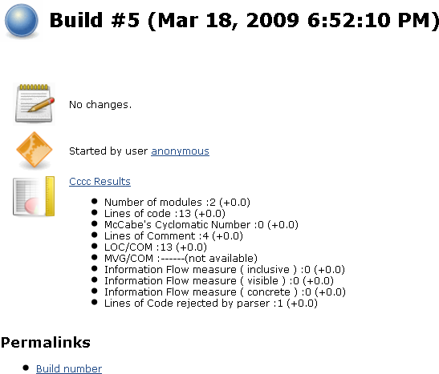
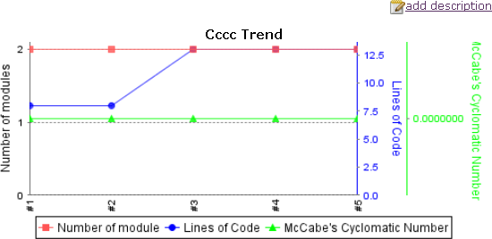

This plugin generates the trend report for
[CCCC](http://cccc.sourceforge.net/) (C and C++ Code Counter).  
CCCC is a tool which analyzes C++ and Java files and generates a report
on various metrics of the code. Metrics supported include lines of code,
McCabe's complexity and metrics proposed by Chidamber&Kemerer and
Henry&Kafura.  
  

# Project Configuration

  
  

# Reporting

  
  
  

# Other - Pmccabe

Unfortunately, CCCC is an abandoned and unmaintained project.
[Pmccabe](http://parisc-linux.org/~bame/pmccabe/) by contrast is a new
and maintained McCabe-style complexity evaluator and sloc counter.  
There is no Jenkins plugin at the moment but feel free to create it (I
can give you some input guidelines).

# Changelog

## Release 0.6 (November 24. 2011)

\* Fixed
[JENKINS-10769](https://issues.jenkins-ci.org/browse/JENKINS-10769) -
NullPointerException on creating Cccc trend graph

## Release 0.5 (August 13, 2011)

\* Fixed
[JENKINS-10584](https://issues.jenkins-ci.org/browse/JENKINS-10584) -
CCCC Plugin doesn't appear to run for failed builds

## Release 0.4 (May 17, 2011)

\* Fixed
[JENKINS-4584](https://issues.jenkins-ci.org/browse/JENKINS-4584) - CCCC
plugin fails on non-default root directory

## Release 0.3 (May 09, 2010)

\* Technical Upgrade to new Hudson API

## Release 0.2 (April 15, 2009)

\* Adding ability to run remote build

## Release 0.1 (April 11, 2009)

\* Initial release
