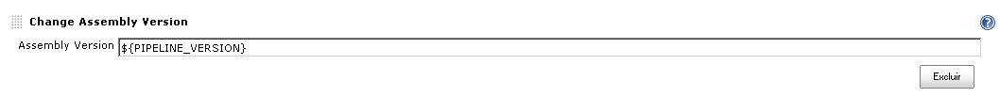

This plug-in change the \[AssemblyVersion\] and \[AssemblyFileVersion\]
from AssemblyInfo.cs sources.

# Description

The plugin will change the AssemblyVersion of all files named
AssemblyInfo.cs (or other inserted) under the workspace folder.  
It's recommended use the plugin with the default templates that are
generated with visual studio.

# Usage

Specify the version you want to change adding the Change assembly
version in build step, and putting the version you want in the Assembly
version input, like the image below

You can insert a hardcoded version like "1.0.5", but the plugin don't
support syntax like 1.0.%someVariable% yet.

If you are attempting to use a version number with variable or regex or
other combinations: 

-   %s in "ReplacementPattern" field will be replaced by "Assembly
    Version" field (uses java format string variables)
-   You can use regex grouping also: 
    -   RegexPattern:
            Assembly(\w*)Version\("[0-9\*\.]+"\)

    -   ReplacementPattern:
            Assembly$1Version("%s")

This will find both AssemblyVersion and AssemblyFileVersion and replace
with the version specified in "Assembly Version" field.

## Changelog

##### Release 1.4

Support to set the regex to change the version,

Thanks to **[pjangam](https://github.com/pjangam)**

##### Release 1.3

Now it can receive various assemblies files, separeted by comma, like:

AssemblyInfo.cs, AssembliSomeThingInfo.cs

##### Release 1.2

Add a field to specify the name of the AssemblyInfo file instead of only
the AssemblyInfo.cs

##### Release 1.1

Initial Release of the plugin.

## Sponsors

## 
