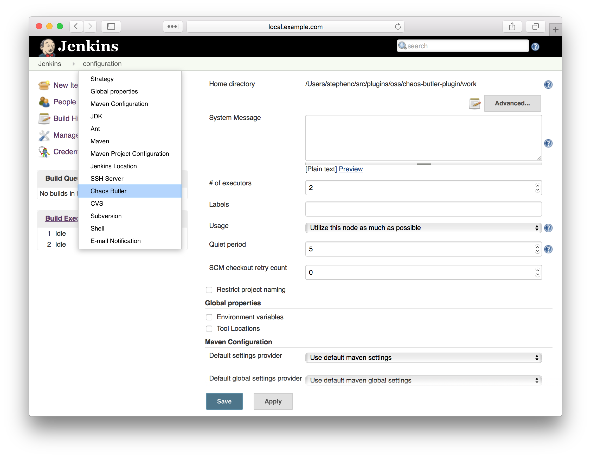
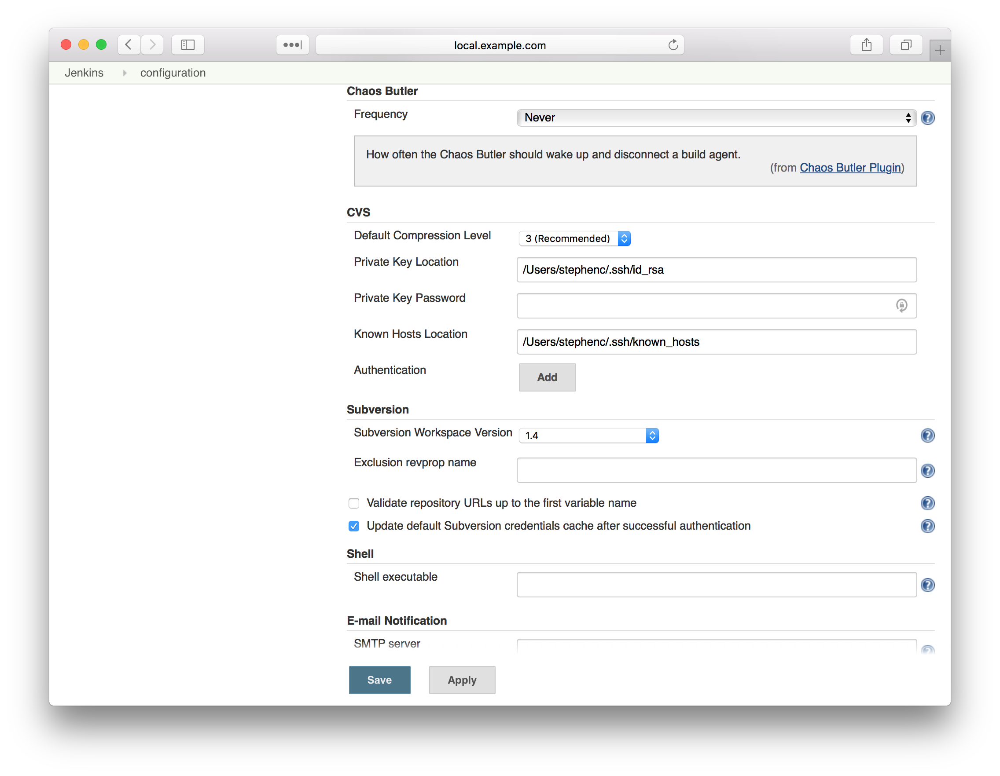
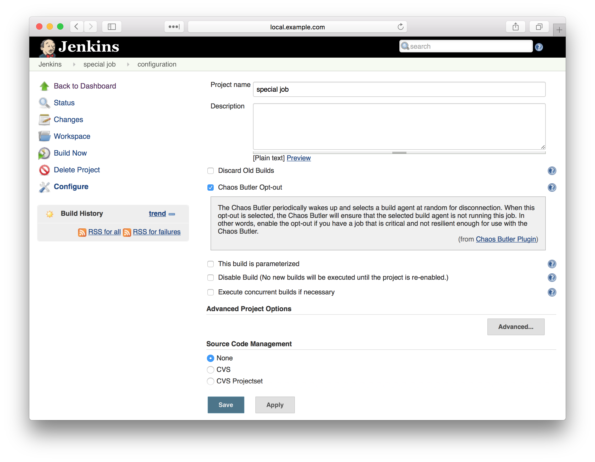
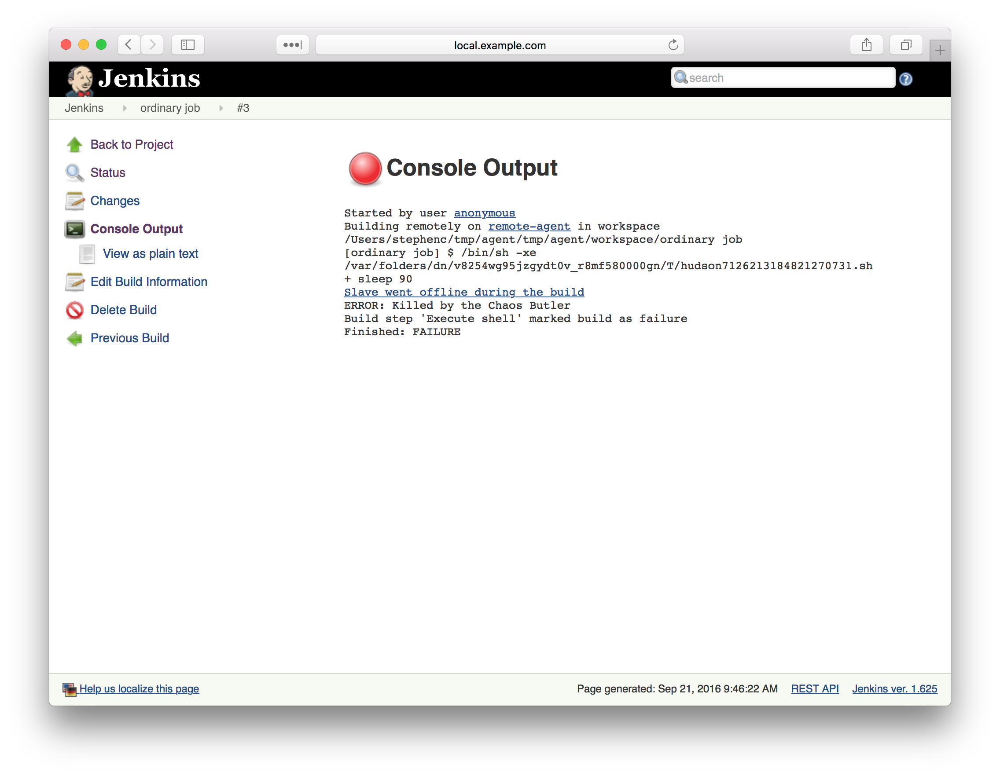
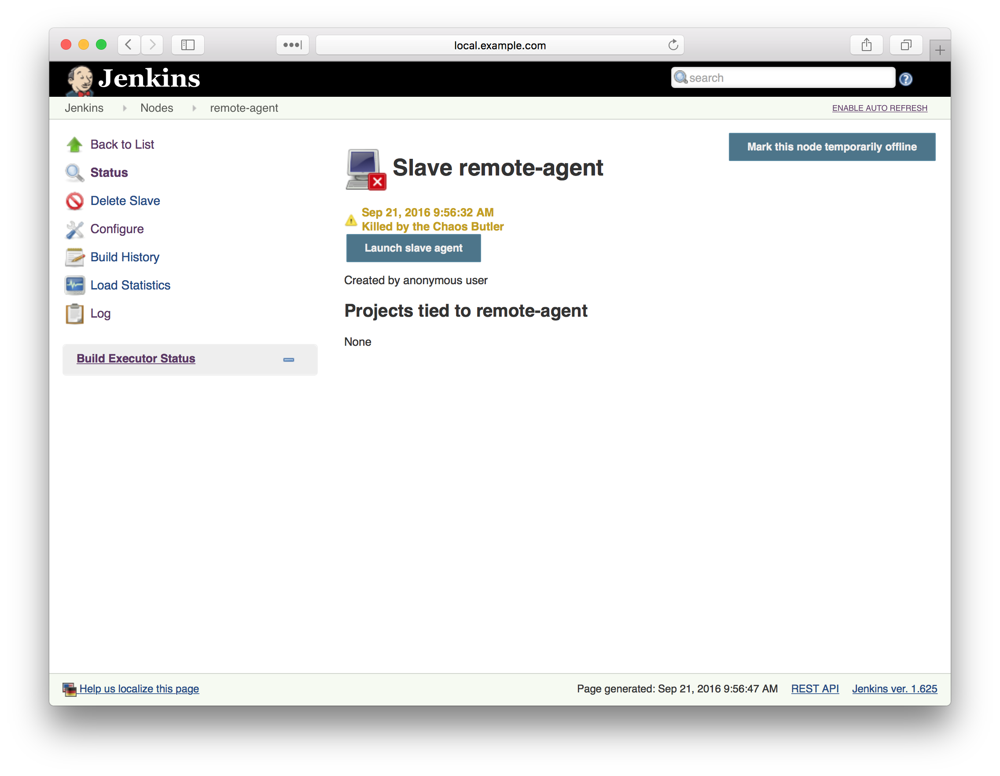

# Chaos Butler Plugin

A plugin that periodically wakes up and disconnects build agents in
order to prove that your infrastructure is fault resilient.

It all started with a thought... "Are Jenkins Jobs actually
microservices?"... they meet a lot of the definitions of
microservices... so maybe the answer is yes.

When we look at the best in class management tools for microservices,
one tool that shows up a lot is [Netflix's Chaos
Monkey](http://techblog.netflix.com/2012/07/chaos-monkey-released-into-wild.html).
Chaos Monkey is a tool that will wake up periodically and kill one of
your microservices at random in order to prove that your system as a
whole can handle transient failures.

If Jenkins is critical to you, you want your use of Jenkins to be able
to handle the transient failures that any reasonably sized distributed
system will face. The Chaos Butler brings Chaos Monkey's brand of proof
to Jenkins:

-   Chaos Monkey does nothing until you enable it
-   You enable Chaos Monkey by configuring the frequency at which it
    injects chaos
-   All jobs are opted in by default (as is the case with Chaos
    Monkey)... any special snowflake jobs can be opted out of the Chaos
    Butler

## Configuring the Chaos Butler

The Chaos Butler is enabled from the Manage Jenkins » Configure System
screen:

{width="300"}
{width="300"}  
There is only one option to configure, the frequency at which the Chaos
Butler will run. The available options are:

-   Never **(default)** - the Chaos Butler is disabled
-   Every minute
-   Every 15 minutes
-   Every hour
-   Every 8 hours
-   Once per day
-   Once per week

When the Chaos Butler is enabled, it will take each time period and pick
a random time within that period for injecting chaos. For example, if
you enable the Chaos Butler to run once every hour, it could pick 57
minutes into the first hour after it was enabled as its initial wake up
time, and it could pick 5 minutes into the second hour as its second
wake up time... this would mean that the Chaos Butler ran twice in 8
minutes, but over a long term average it will only run once every hour.

## Configuring Jobs

By default, all jobs are opted into the Chaos Butler.

Some jobs may not be ready for the Chaos Butler and need protection. You
can protect these jobs from the Chaos Butler by opting them out

{width="300"}

## Configuring Agents

By default, all agents are opted into the Chaos Butler.

Some agents may not be ready for the Chaos Butler and need protection.
You can protect these agents from the Chaos Butler by opting them out

{width="300"}

## Monitoring the Chaos Butler

When enabled, the Chaos Butler provides a top level information page
that provides information on:

-   The next scheduled chaos injection
-   The nodes that have recently been the subject of chaos injection

  
{width="300"}

The Chaos Butler also logs its actions to the main log:

    Sep 21, 2016 9:08:57 AM org.jenkinsci.plugins.chaosbutler.ChaosButlerGlobalConfiguration wake
    INFO: The Chaos Butler is looking for a victim...
    Sep 21, 2016 9:08:57 AM org.jenkinsci.plugins.chaosbutler.ChaosButlerGlobalConfiguration wake
    INFO: The Chaos Butler has selected Jenkins as a victim...
    Sep 21, 2016 9:08:57 AM org.jenkinsci.plugins.chaosbutler.ChaosButlerGlobalConfiguration wake
    INFO: The Chaos Butler has killed Jenkins. Chaos reigns once more!

    ...

    Sep 21, 2016 9:10:47 AM org.jenkinsci.plugins.chaosbutler.ChaosButlerGlobalConfiguration wake
    INFO: The Chaos Butler is looking for a victim...
    Sep 21, 2016 9:10:47 AM org.jenkinsci.plugins.chaosbutler.ChaosButlerGlobalConfiguration wake
    INFO: The Chaos Butler cannot find a victim!

The first set of log messages above represents the case where the Chaos
Butler was able to select a node.

The second set of logs messages correspond to the case where all the
available build agents were executing jobs that have opted out of the
Chaos Butler. In such cases the Chaos Butler has no choice but to do
nothing until next time.

## Console logs of jobs

When a job is running on an agent that has been attacked by the Chaos
Butler, the console log will typically show the build as failed because
the agent went offline during the build. In general the offline reason
should be "Killed by the Chaos Butler"

{width="300"}

When a job is running on the master, however, we cannot "disconnect" the
master. In those cases the Chaos Butler will instead interrupt the job,
the console log will typically show the build as aborted with the
attribution "Killed by the Chaos Butler"

{width="300"}

## Offline reason of agents

When a agent is disconnected by the Chaos Butler, the Chaos Butler will
set the reason for the node being off-line to "Killed by the Chaos
Butler".

{width="300"}

As long as the agent is configured to reconnect automatically (i.e. this
is the case for agents with the default retention strategy, also JNLP
agents typically will attempt to reconnect every 10 seconds after a
disconnect) the agent will be reconnected.

It is recommended that agents which cannot reconnect automatically be
opted out of the Chaos Butler.

## Version History

### Version 1.0 (2016-09-13)

-   Initial release
