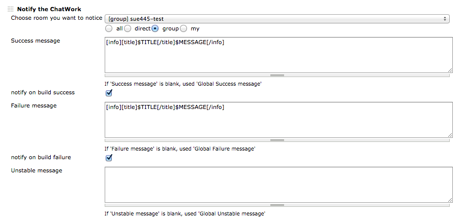

# Summary

This Plugin will notify the ChatWork any message.

#### Table of content

# Usage

### Global Configuration

### Job Configuration

-   **Success message** , **Failure message** , **Unstable message** ,
    **Not built message** , **Aborted message**
    -   If message is empty, used Global message
    -   emoticon
    -   chatwork tags

&nbsp;

-   **Default message** is supported some variables.

example

-   build variables (ex. *$JOB\_NAME* , *$BUILD\_URL* )
-   environment variables (ex. *$PATH* , *$JAVA\_HOME* )
-   *$BUILD\_RESULT* (ex. *SUCCESS*, *FAILED* )

# Changelog

Details
<https://github.com/jenkinsci/chatwork-plugin/blob/master/CHANGELOG.md>

### Version 1.0.9 (Sep 14, 2019)

-   \[Security\] Save apiKey to Secret field instead of String field
    -   Plain apiKey is automatically encrypted and stored when Global
        Configuration saving

### Version 1.0.8 (Jan 27, 2017)

-   Update API version (v2)

### Version 1.0.6 (Dec 1, 2016)

-   Fix NullPointerException when contains canceled user

### Version 1.0.5 (Mar 23, 2016)

-   Sanitize special char in room name

### Version 1.0.4 (Nov 11, 2015)

-   Bugfix causing null value exception when received Github *payload*
    json (neither PullRequest nor compare)

### Version 1.0.3 (Oct 8, 2015)

-   Bugfix multibyte garbled

### Version 1.0.2 (Sep 25, 2015)

-   Remove legacy help

### Version 1.0.1 (Sep 25, 2015)

-   Add room selection pulldown instead of textbox

### Version 1.0.0 (Mar 8, 2015)

-   Add build result pattern messages
-   Add global messages

##### NOTE

**Default message** (below v0.6.2) is removed. If upgrade from v0.x to
1.0.0+, **Default message** is copied to **Success message**, **Failure
message**, **Unstable message**, **Not built message** and **Aborted
message**

### Version 0.6.2 (Jan 22, 2015)

-   Support variable to room id

### Version 0.6.1 (Jan 14, 2015)

-   Bugfix: Failed to serialize
