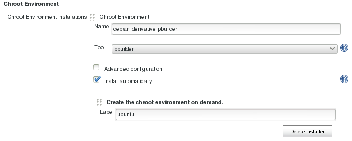
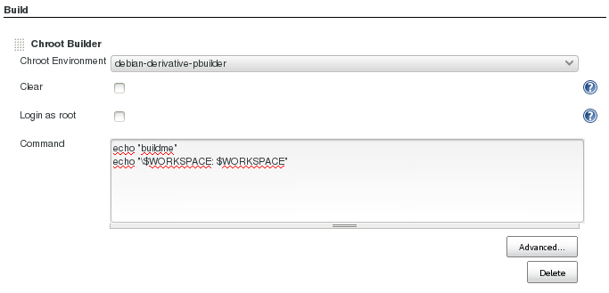
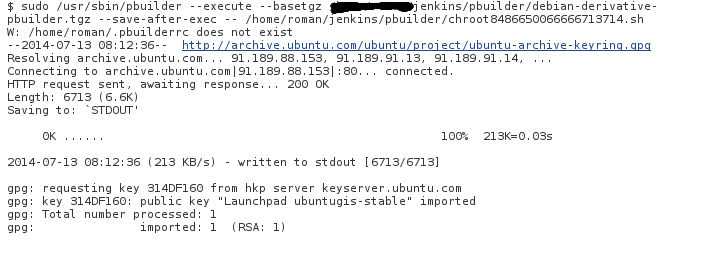

Support for disposable chroot environments (pbuilder), which can be very
useful for C and C++ projects

# Node Setup

On every node, where you want to run the plugin, you have to

1.  install pbuiler:
    ``` syntaxhighlighter-pre
     apt-get install pbuilder 
    ```

2.  Allow jenkins to use *pbuilder:*
    ``` syntaxhighlighter-pre
    jenkins_user ALL=(ALL) NOPASSWD: /usr/sbin/pbuilder
    ```

# Setup a Chroot Environment

## Minimal Setup

Create chroot environments in *Manage Jenkins* \> *Chroot Environments*:



**Make sure that "Install Automatically" is selected, and is configured
to use the "Create the chroot environment on demand" installer!**

## Advanced Setup


### Adding repositories

You can add **ppa's** and standard repositories like **universe**. The
plugin distinguishes between the two types by the **Repository URL**
prefix. If it starts with *deb*, the repository is just added to
*/etc/apt/sources.list.d/* and the key is imported. If the URL starts
with *ppa*, the repository is added via *add-apt-repository* (no keyfile
is required).

#### Adding the universe repository

**Name**: universe

**Repository URL**: deb <http://archive.ubuntu.com/ubuntu> **DISTRO**
universe

**Keyfile URL**:
<http://archive.ubuntu.com/ubuntu/project/ubuntu-archive-keyring.gpg>

Make sure to select the correct distro of the chroot environment. By
default a chroot environment similar to the host system where the node
is running is created.

In the screenshot at the end of this section i have used **lucid**.

#### Adding ubuntugis ppa

**Name**: ubuntugis

**Repository URL**: ppa:ubuntugis/ubuntugis-unstable

The resulting repositories section should now look like this:


# Using a Chroot Environment

## Minimal Setup

After you have configured a Chroot-Environment, it can be used in the
Chroot Buildstep in every job.

Make sure, that you restrict the job to nodes where pbuilder is
configured.  
  
Add a Chroot  Buildstep:

  
Select the chroot environment and add the build instructions:



**Chroot Environment**: A list of the predefined chroot environments

**Clear**: The chroot environment (of the job) will be reset to the
state of the predefined environment before every build ( better
reproducability, slower build)

**Login as root**: The build comands will be run via the root unser
inside of the environment (**although it is inside the environment, be
carefull what you do!**)

**Command**: the build commands (uses bash per default)

**Note, that all the jenkins specific environment varaibles are
available!**

## Advanced Configuration


**Requirement Files**: Files which contain package dependencies
(comparable to requirements.txt in the python world)

**Requirements**: Additional package dependencies, not listed in any
requirement file

**Ignore exit code**: The build will always succeed, no mather if the
build step fails or not.

**Do not update repository indices**: speeds up the build, but will not
fetch and install the newest versions of the packages

**Force installation of packages**: allows the installation of unsigned
packages (can be dangerous)

# Run the job

After configuring a new chroot instance it will be built along with the
first job which uses this environment. When launching the build, you
will encounter something like this:


Here the two previously configured repositories (ubuntugis and universe)
are added:



These steps are part of the initial creation of the environment, which
can take a few minutes. They are only excuted once, if you add a
completely new environment, or if you change the existing configuration
in the Jenkins System configuration.

This is what we actually wanted to do in the build (as stated before,
the $WORKSPACE variable was available inside the chroot environment):


# Roadmap

-   mock support is next

# Changelog

### Version 0.1.4

-   add support for Ubuntu \> 12.04
-   better detection if the chroot binary is correctly set up for
    Jenkins
-   correctly process additional chroot arguments with quotes

### Version 0.1.2

-   fixes a null pointer exception when building on a slave node
-   uses 'local' copying of chroot image FilePaths, no more network
    involved
-   removes useless tarBall field from ChrootToolsetProperty
-   detects aborted/failed chroot environment initializations

### Version 0.1.1

-   adding description and wiki page to pom

### Version 0.1

-   initial release
-   pbuilder support (mock not usable at the moment)
