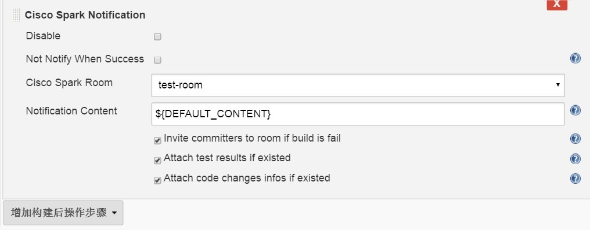
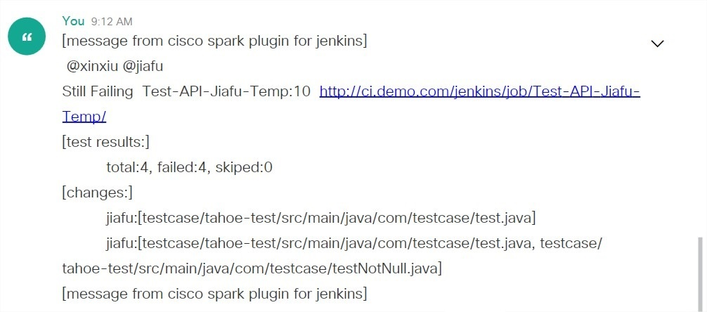

This plugin allow you to post customized message to Cisco spark
room.**Introduce**

The content which be published to Cisco spark room can contain
customized content which supports environment vars and some customized
vars, such as BUILD\_STATUS. if the content contain DEFAULT\_CONTENT,,
it will be replaced with BUILD\_STATUS-JOB\_NAME:BUILD\_NUMBER-JOB\_URL.

Any issues you can contact with author: fujian1115@gmail.com or [Sina
microblog](http://www.weibo.com/fujianthinking).

All versions can check the [Maven
Repo](http://maven.jenkins-ci.org:8081/content/repositories/releases/org/jenkins-ci/plugins/cisco-spark).

**Setup**

The Cisco spark plugin depends on
the [Token-Macro-Plugin](https://wiki.jenkins-ci.org/display/JENKINS/Token+Macro+Plugin),you
should setup the plugin before using Cisco spark plugin.

**Usage**  
  

**FAQ**:

**1  How to get room ID:**

1.1  Login Into:  <https://web.ciscospark.com/>

1.2 Click the room you wanted to post message, then you will see the
room ID on URL.

2 _Spark_-_Google_Chrome.jpg)

**2 How to get token:**

    use one robot:
    1. access https://developer.ciscospark.com/add-bot.html# to add one robot and use its "Access token"

    2. invite the robot to your room
    the token will always be valid.

    or:
    use your token:
    1. login https://developer.ciscospark.com
    2. click right top position for owner's image to copy "My Access Token"

     

 

 

**3 Snapshots**

 

 

# **Version History**

 

## Version 1.1.1 (September 16, 2017)

1 add new method to get token: add one robot.

    1.1 access https://developer.ciscospark.com/add-bot.html# to add one robot and use its "Access token".
    1.2 invite the robot to your room
    the token will always be valid.

 

## Version 1.1.0 (September 16, 2017)

1 add pipeline support. (Thanks to <https://github.com/asherlporetz>)

2 fix the issue:  <https://github.com/jiafu1115/spark-plugin/issues/1>. 
can custome notify content's prefix message

3 add help document for how to get room id

Version 1.0.0-SNAPSHOT (May19, 2016)

-   Initial release
