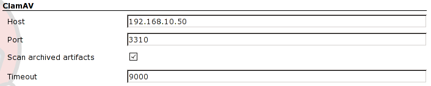
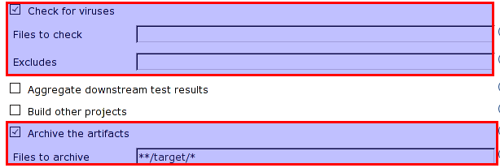
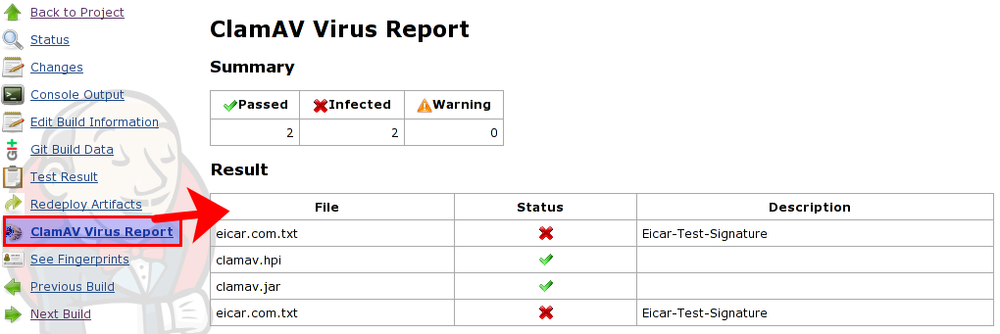

## Overview

This plugin allows you to check the artifacts with
[ClamAV](http://www.clamav.net/lang/en/), which is an open source (GPL)
antivirus engine designed for detecting Trojans, viruses, malware and
other malicious threats.

  

  

The artifacts are sent to ClamAV Host and are scaned. So you have to
configure your ClamAV to enable TCP port in clamd.conf as follows.

**clamd.conf**

``` syntaxhighlighter-pre
:
# TCP port address.
# Default: no
TCPSocket 3310

# TCP address.
# By default we bind to INADDR_ANY, probably not wise.
# Enable the following to provide some degree of protection
# from the outside world.
# Default: no
#TCPAddr 127.0.0.1

# Close the connection when the data size limit is exceeded.
# The value should match your MTA's limit for a maximum attachment size.
# Default: 25M
StreamMaxLength 100M

:
```

Be Careful

If you get "Broken Pipe", check "StreammaxLength" parameter.

## System configuration

  



When "Scan arhived artifacts" checkbox is selected, the artifacts of job
will be scaned if "Archive the artifacts" option is configured in job
configuration page.

## Job Configuration

  

  
  

To scan a workspace, you may specify "Files to check" option such as
"\***/**". But it will take a long time.  
you may specify "Excludes" such as ".git/\***/**".

  

## Job page and Virus report page

  

  



## TODO

-   add BuildStep to check files.

## History

### 0.3 (11 May, 2015)

-   ensure file is closed.
    ([JENKINS-27954](https://issues.jenkins-ci.org/browse/JENKINS-27954)).
-   skipping of PASSED in console ([pull request
    1](http://jenkins-ci.org/pull/1)).

### 0.2 (16 Oct, 2011)

-   validate "includes" option, which should be mandatory if "Scan
    archived artifacts" option is not checked.
-   honor "Scan archived artifacts" option.
-   show full path in the virus check list.

### 0.1.1 (26 Jun, 2011)

-   failed to check artifacts due to ArrayIndexexception
    ([JENKINS-10103](https://issues.jenkins-ci.org/browse/JENKINS-10103)).
-   timeout should be longer.
-   added the help file of timeout.

### 0.1 (26 Jun, 2011)

-   First release.
