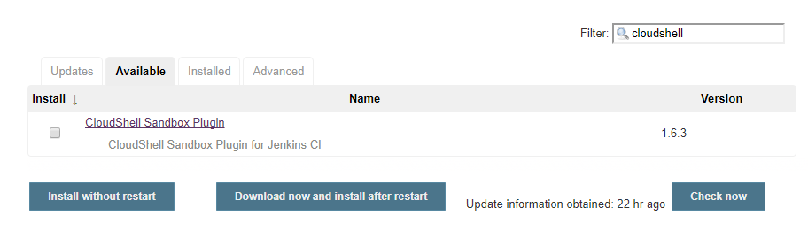
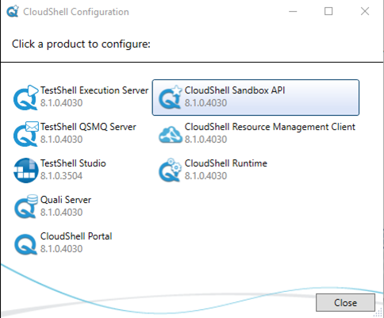

  

## Introduction

The **CloudShell Sandbox Jenkins Plugin** provides an easy way to
consume CloudShell sandboxes through Jenkins for a variety of use cases.
The plugin allows you to build jobs that create on-demand sandboxes in
CloudShell based on pre-defined blueprints. 

## Requirements

This plugin requires CloudShell 8.0 or later and Jenkins 2.0 or later.

***Note: If you are upgrading to a Certified version of the plugin, you
may experience some issues. Contact us for details.***

Depending on the plugin version, some features may require a specific
version of CloudShell. For more details, see the *Features* section
below.

## Installation

The **CloudShell Sandbox Jenkins Plugin** is available for download
directly from Jenkins **Plugin Manager** (Manage Jenkins \> Plugin
Manager) in the Jenkins UI. 

{height="250"}

## Architecture

The **CloudShell Sandbox Jenkins Plugin** leverages the CloudShell
Sandbox API to perform operations in CloudShell. The CloudShell Sandbox
API comes out of the box with the CloudShell Suite installation and
should be fully installed and configured for the plugin functionality. 

***Note: The Jenkins plugin only interacts with public blueprints.***

When configuring the CloudShell Sandbox API, you will need to set the
API port (82 by default). To see the port, open the **CloudShell
Configuration** application and click **CloudShell Sandbox API**.

  

 {height="400"}

  

The **Quali Configuration** web interface is displayed, showing the
Sandbox API configurations.

 {height="250"}

  

  

### Distributed architecture:

###  {height="400"}

  

## Configuration

After installing the plugin, perform the following steps:

1.  Navigate to the main Jenkins configuration page (**Manage Jenkins \>
    Configure System**) and configure the plugin according to your
    CloudShell installation.  
      
2.  Set the **CloudShell Sandbox API Host Address** to the machine where
    the CloudShell Sandbox API is installed.  
    ***Note: This may be a different machine than the Quali Server.***
3.  Specify the credentials (user, password, domain) of the CloudShell
    user you would like to use for CloudShell operations.  
      
    We recommend creating a new CloudShell admin user for Jenkins.  
      
4.  To verify your configurations, click the **Test Connection**.  
      
    Jenkins interacts with CloudShell to validate connectivity and
    credentials.  
      
    {height="250"} 
             

## Freestyle Steps

The plugin adds several new steps to Jenkins to streamline interactions
with CloudShell sandboxes.

**CloudShell Build Step** is a generic step that contains CloudShell
Actions you can execute. Each action contains several inputs. Currently,
the action **Start sandbox** is provided and we plan to support others
in the future.

  

The **Start Sandbox** action creates a new CloudShell sandbox based on
the selected public blueprint and restricts interaction with the sandbox
while it is running Setup. This ensures the sandbox Setup process
completes successfully without any outside interference. When the
sandbox is active, the sandbox’s Id and additional information become
available in $SANDBOX\_ID and $SANDBOX\_DETAILS, respectively. These
environment variables can be used in other steps in the build.

$SANDBOX\_DETAILS is a JSON format string containing the sandbox's
metadata like the sandbox name, start time, expected end time, state and
associated blueprint, as well as a list of all the sandbox components
with their name, type, address and more.

The **Sandbox duration in minutes** field specifies the maximum duration
of the sandbox. If the build does not end before the specified duration,
CloudShell will teardown the sandbox.

The **Timeout if sandbox unavailable **field indicates the number of
minutes to wait until the sandbox becomes available in case any of the
sandbox's resources are unavailable for the specified sandbox duration
(conflicts). If the timeout period is reached, the build will be
interrupted.

The **Blueprint parameters** field allows you to specify user inputs,
which can be used for resource selection (if the blueprint contains
abstract resource requirements), as additional information to drive the
provisioning, or as general information. For more information,
see [CloudShell Help](http://help.quali.com/).

The **Domain name **field allows you to define a domain in which to
create your sandbox in CloudShell. If this field is not populated, the
domain defined in the **Configuration** step is used.

The **Setup timeout **field indicates the number of minutes to wait
until the sandbox setup finishes running and the sandbox becomes active.
If the timeout period is reached, the build will be interrupted.

  

For more information about a field, click that field’s help icon on the
right.


  

**We recommend using the “Start Sandbox” action as a pre-run step to
ensure the sandbox is created before the actual build steps are
executed.**

** **

Here is an example of how to print the sandbox information for future
use:

 

  

To end the sandboxes that have been created in the build, use the **Stop
CloudShell sandboxes** post-build action. Since this is a post-build
action, it can be used only once per build and will end all sandboxes
created by that build. This step ensures that the sandbox Teardown
process completes successfully and checks the sandbox’s Activity Feed to
validate that there are no errors in the sandbox activity log.
The **Teardown timeout **field indicates the number of minutes to wait
until the sandbox teardown finishes running and the sandbox completes.
If the timeout period is reached, the build will be interrupted, but the
teardown will keep running in CloudShell.

  

 

  

## Pipeline Steps and Syntax

The plugin installation adds the following pipeline steps to the Jenkins
pipeline:

-   **startSandbox**– Initiates a new sandbox in CloudShell and waits
    for the sandbox to complete its Setup process. The method returns
    the sandbox Id.
-   **stopSandbox**– Stops an active sandbox, waits for the teardown
    process to end and checks the sandbox’s Activity Feed for errors.

To create a sandbox in CloudShell from a domain other than the one
defined in the **Configuration** step:

1.  To start the sandbox, add the following script in
    the **Pipeline** section, replacing \[domain name\] with the name of
    your domain:  
    {height="150"}
2.  Save and run the build. 
3.  To stop the sandbox, add the following script in
    the **Pipeline** section, replacing \[domain name\] with the name of
    your domain:  
    {width="1010"}  
4.  Save and run the build.

   

In case an error occurs in CloudShell during the sandbox start or during
the sandbox setup, you can catch an ExtendedSandboxApiException
exception in order to perform extra logic. For example, stop the sandbox
if an error occurs during setup:

  

``` syntaxhighlighter-pre
stage('Safely create cloudshell sandbox') {

    try {

        echo "Attempting sandbox reservation..."

        sandboxId = startSandbox duration: 10, name: 'Empty', params: '', sandboxDomain: '', sandboxName: '', setupTimeout: 300, timeout: 10

        echo "Sandbox started"

    } catch (com.quali.cloudshell.qsExceptions.ExtendedSandboxApiException err) {

            echo "err.sandboxId is: " + err.sandboxId

            stopSandbox err.sandboxId

        throw err

}
```

  

Here’s an example showing how to use the pipeline syntax to execute a
Python test that requires the use of a sandbox that is based on a
“Performance” blueprint:

1.  First, the Performance blueprint is reserved using the parameters
    passed from Jenkins.
2.  The sandbox runs the Setup process.
3.  When this process completes successfully, Jenkins runs the Python
    code (downloaded from the build VCS) with the sandbox Id.
4.  At the end of the test, the plugin initiates the sandbox’s Teardown
    process using the **stopSandbox**

``` syntaxhighlighter-pre
    stage ('Performance Testing'){
        Id = startSandbox duration: 13, name: 'Performance', params: 'os=Win; server=4'
        sh 'python .\Perf2.py --sandbox_id Id'
        stopSandbox  Id
    }
```

  

The **WithSandbox** step implements the same logic as
in **startSandbox** and **stopSandbox** but in a contextual syntax. This
step is recommended for demos but not suitable for production.

We recommend using the Jenkins pipeline’s **Snippet Generator** which
allows you to compose pipelines with an easy-to-use UI instead of
requiring you to write code. For example:


  

## Features

This table lists the plugin features that are supported per CloudShell
version:

|                                   |                        |
|-----------------------------------|------------------------|
| **Plugin feature**                | **CloudShell version** |
| Blueprint parameters              | 8.0 and up             |
| Activity Feed Teardown validation | 8.1 and up             |

## Contributing and issues

The plugin is an open-source project under the MIT License. We encourage
users to contribute, add pull requests and open issues.

  

  
