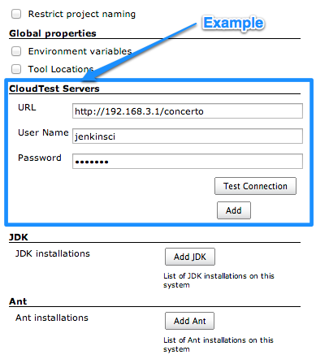

This plugin integrates [SOASTA
CloudTest](http://www.soasta.com/products/cloudtest/) and [SOASTA
TouchTest](http://www.soasta.com/products/touchtest/) features into
Jenkins.

| Plugin Information                                                                                     |
|--------------------------------------------------------------------------------------------------------|
| View SOASTA CloudTest [on the plugin site](https://plugins.jenkins.io/cloudtest) for more information. |

The current version of this plugin may not be safe to use. Please review
the following warnings before use:

-   [CSRF vulnerability and missing permission check allow
    SSRF](https://jenkins.io/security/advisory/2019-04-03/#SECURITY-1054)
-   [Credentials stored in plain
    text](https://jenkins.io/security/advisory/2019-10-16/#SECURITY-1439)

The CloudTest Jenkins plugin provides the ability to

-   Easily run the MakeAppTouchTestable utility on an iOS or Android
    project
-   Silently install an iOS app on a connected device
-   Play CloudTest compositions and include the output in the build's
    test results
-   Launch and tear down grids, results databases, and test
    environments.

## Prerequisites

The CloudTest plug-in requires Jenkins 1.580.1 or later.

## Global Configuration Options

Before using the plug-in, you will need to provide the CloudTest server
information, in the "Manage Jenkins" -\> "Configure System" page. This
includes the CloudTest URL and a set of credentials. *We recommend
creating a dedicated CloudTest account for Jenkins to use.*

The CloudTest password is encrypted before saving it to disk. It is also
masked (e.g. "\*\*\*\*") in all output generated during builds.

## Build Steps

The plug-in adds the following new build steps:

#### Make App TouchTestable

Adds the TouchTest Driver library to your app's source code. Typically
this build step is inserted right before the build step that compiles
the app's code (e.g. before the Xcode build step for iOS, or before the
"Invoke Ant" build step for Android).

#### Install iOS App on Device

Silently installs an IPA file on one or more attached iOS devices. This
ensures that your tests run against the latest version of your app.

**Note**: there is no Android version of this build step, because the
Android SDK already provides this functionality ("adb install").

#### Play Composition

Executes a CloudTest composition, and saves the output in the build's
test results. You can include this build step multiple times if there
are multiple compositions in your test suite.

#### Start Grid

Starts the grid with the specified CloudTest server, and name, and
ensures that the object reaches a ready status. In the event that the
grid fails to reach a ready status, it will be torn down and the build
step will fail.

#### Stop Grid

Terminates the grid, and ensures that the grid reaches a terminated
status. In the event that the grid fails to reach a terminated status,
the build step will fail.

#### Start RSDB

Starts the RSDB with the specified CloudTest server, and name, and
ensures that the RSDB reaches a ready status. In the event that the RSDB
fails to reach a ready status, it will be torn down and the build step
will fail.

#### Stop RSDB

Terminates the RSDB, and ensures that the RSDB reaches a terminated
status. In the event that the grid fails to reach a terminated status,
the build step will fail.

#### Test Environments

Note that for test environments you will need to set up a CloudTest
Server to point to CloudTest Manager
<https://cloudtestmanager.soasta.com/concerto/>.

#### Start Test Environment

Starts the test environment with the specified CloudTest server (Note
this MUST be CTM), and name, and ensures that the object reaches a ready
status. In the event that the test environment fails to reach a ready
status, it will be torn down and the build step will fail.

#### Stop Test Environment

Terminates the test environment, and ensures that the test environment
reaches a terminated status. In the event that the test environment
fails to reach a terminated status, the build step will fail.

#### Wake Up iOS Device

Wakes up one or more attached iOS devices, and opens Mobile Safari to
the most recently-viewed page (e.g. TouchTest Agent). This can
optionally be used at the beginning of a build, to "prep" the devices
for testing.

**Note:** There is no Android version of this build step, because the
Android SDK already provides this functionality.

#### Reboot iOS Device

Reboots one or more attached iOS devices. This can optionally be used at
the end of a build, to "reset" for the next one.

**Note**: There is no Android version of this build step, because the
Android SDK already provides this functionality ("adb reboot").

## Changelog

### Version 2.25 (Released June 13, 2016)

-   Added support for CloudTest API tokens. See [Section on creating api
    tokens](http://cloudlink.soasta.com/t5/CloudTest-Knowledge-Base/Single-Sign-On-SSO/ta-p/46186).

### Version 2.24 (Released June 2, 2016)

-   Fixed null pointer exception during HTTP client creation.

### Version 2.23 (Released May 25, 2016)

-   Added support for client side certificates to communicate with a
    cloud server.
-   Manage Jenkins -\> Configure System -\> CloudTest Servers -\>
    Advanced
-   Enter the full path of the keystore file (.jks)
-   If no password is required leave blank.

### Version 2.22 (Released February 26, 2016)

-   Grid management build, and post-build steps (Start, Stop)
-   Test environment management build, and post-build steps (Start,
    Stop)
-   Results database (RSDB) management build, and post-build steps
    (Start, Stop)
-   Fixed test connection not working with recent versions of Cloud Test
-   The CloudTest plugin will now respect the 'No Proxy Host' list
    (<https://issues.jenkins-ci.org/browse/JENKINS-30907>)
-   Fixed long timeout issue when checking for build number of a
    un-reachable CloudTest server

### Version 2.21 (Released September 21, 2015)

-   Update Jenkins version to 1.580.1

### Version 2.20 (released July 20, 2014)

-   "Play Composition(s)" build step now supports three new thresholds -
    "Min Duration”, "Max Duration” and "Average Duration".

### Version 2.19 (released July 18, 2014)

-   "Play Composition(s)" build step now includes the ability to
    generate CSV output.

### Version 2.18 (released July 9, 2014)

-   Results with no content no longer throw a NullPointerException.
    Instead, an appropriate error message will be displayed in Console
    and in Test Result.

### Version 2.17 (released July 7, 2014)

-   "Play Composition(s)" build step now has support for transaction
    thresholds.

### Version 2.16 (released June 11, 2014)

-   Display full clip path for validation messages (eg. A nested clip
    will have all clips on its path output, not just its clip name).
-   Blocks cross-site scripting in output of test results.

### **Version 2.15 (released May 13, 2014)**

-   "Play Composition(s)" build step no longer outputs duplicate
    validation clip names. Clip name formatting has changed to be on
    individual lines and validation messages belonging to the clip are
    now indented.

### Version 2.14 (released May 5, 2014)

-   Added clip name to "Play Composition(s)" build step's validation
    output.

### Version 2.13 (released April 7, 2014)

-   Dynamic Instrumentation support for "MakeAppTouchTestable" build
    step.
-   Additional JVM options support for "MakeAppTouchTestable" build
    step.

*NOTE: The "jump" in version numbers from 2.8 to 2.13 is due to
technical issues encountered while attempting to release the new version
of the plug-in.  There were no releases between 2.8 and 2.13.*

### Version 2.8 (released February 26, 2014)

-   Null Junit Results are now prevented from triggering bad HTML output
    in Jenkins.

### Version 2.7 (released December 19, 2013)

-   Fixed "403 Forbidden" errors when downloading files using CloudTest
    plugin.

### Version 2.6 (released November 22, 2013)

-   Fixed NullPointerException seen when additional options are not
    provided for the "Play Composition(s)" build step.

### Version 2.5 (released November 08, 2013)

-   Issue where CloudTest servers were not being detected correctly has
    been resolved.
-   New "Additional Options" input for the "Play Composition(s)" build
    step.  Any values entered here will be passed directly to SCommand.
-   Server configurations are now managed using a unique ID and friendly
    name, instead of being bound to the URL.  This means that you can
    use multiple CloudTest accounts with a single server (e.g. for
    concurrent builds), and can change the URL for a server
    configuration without affecting existing jobs.

### Version 2.4 (released June 25, 2013)

-   The "Run App in iOS Simulator" build step now works correctly when
    only a single CloudTest server has been configured.

### Version 2.3 (released June 4, 2013)

-   The "Play Composition" build step now works correctly on Windows
    ([JENKINS-17986](https://issues.jenkins-ci.org/browse/JENKINS-17986)).
-   Improved error message when the plug-in fails to determine the
    CloudTest server's build number.

### Version 2.2 (released May 14, 2013)

-   The "Run App in iOS Simulator" build step now automatically launches
    TouchTest Agent on the simulator.
-   Internal changes in preparation for next major CloudTest release.

### Version 2.1 (released April 8, 2013)

-   SCommand invocations now "inherit" the Jenkins proxy settings.
-   File and directory validations no longer show an error when the path
    includes a variable.

### Version 2.0 (released March 15, 2013)

-   Initial release.
