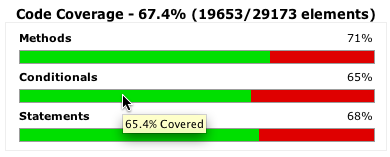
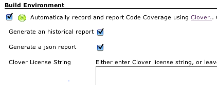
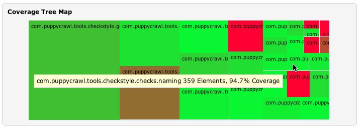

This plugin allows you to capture code coverage reports from
[OpenClover](http://openclover.org/) - a free and open source tool based
on source code of [Atlassian
Clover](https://atlassian.com/software/clover/). Jenkins will generate
and track code coverage across time. This plugin can be used without the
need to modify your
build.xml.[](http://twitter.com/cloverallover)

## Installation

1.  Install Jenkins Clover Plugin.
2.  Install [clover.jar in Ant's
    classpath](http://openclover.org/doc/manual/latest/ant--adding-to-ants-classpath.html)
    (since Jenkins Clover Plugin 4.10.0).

## Automatic integration for Ant builds

Clover can be integrated into Ant-based builds without the need to
modify the build.xml

. Simply check the *"Automatically record and report Code Coverage"*
checkbox in the Job configuration screen.



The Clover plugin will add an Ant build listener and appropriate
configuration parameters to allow Clover HTML, XML, JSON and Historical
reports to be generated for your Job.

These will automatically be linked to from the Job and Build pages.

  


It works for typical build configurations in which unit tests are
launched after compilation. In case you spawn processes, run
in-container tests, deploy application to another machine etc then the
automatic integration will not be sufficient and you'll have to set up
integration manually.



## Viewing the report

As soon as build is finished, click on the "Clover HTML report" link to
display the code coverage report.

Jenkins 1.641 introduced content security policy, which blocks any
active content in published artficats. As a result, when you click on
the link, it will display the "Loading dashboard.html..." message
instead of the report. In order to fix it, you must relax the policy to
allow JavaScript, CSS and images.
See <https://wiki.jenkins-ci.org/display/JENKINS/Configuring+Content+Security+Policy>
for more details.

## Clover documentation

We recommend reading the official [OpenClover
Documentation](http://openclover.org/documentation) home page - you will
find instructions how to integrate Clover with Ant, Maven, Grails and
other tools.

In case of trouble, you may have a look at the [Atlassian
Community](https://community.atlassian.com/) page (questions tagged
'clover').

## Manually configuring the Clover plugin

1.  Install the Clover plugin
2.  [Configure your project's build script](https://wiki.jenkins.io/htt)
    to generate Clover XML reports
3.  **Optional:** Configure your project's build script to generate
    clover HTML or PDF reports (this plugin prefers HTML reports to
    PDF).  The plugin will not extract any information from these
    reports, but will use them as a better formatted most recent
    coverage report when they are available.
4.  Enable the "Publish Clover Coverage Report" publisher
5.  Specify the directory where the clover.xml report is generated.
6.  **Optional:** Configure the coverage metric targets to reflect your
    goals.  
    

## Configuring with Jenkins Workflow/Pipeline jobs

As of version 4.6.0 (and later) of the plugin:

``` syntaxhighlighter-pre
node {
  git 'https://github.com/recena/maven-helloworld'
  sh "mvn clean clover:setup test clover:aggregate clover:clover"
  step([
    $class: 'CloverPublisher',
    cloverReportDir: 'target/site',
    cloverReportFileName: 'clover.xml',
    healthyTarget: [methodCoverage: 70, conditionalCoverage: 80, statementCoverage: 80], // optional, default is: method=70, conditional=80, statement=80
    unhealthyTarget: [methodCoverage: 50, conditionalCoverage: 50, statementCoverage: 50], // optional, default is none
    failingTarget: [methodCoverage: 0, conditionalCoverage: 0, statementCoverage: 0]     // optional, default is none
  ])
}
```

## Maven configuration with freestyle project

The clover-maven-plugin is one of the plugins that highlights an issue
with how Maven 2 handles aggregator goals.

Jenkins cannot handle maven aggregator goals with the **maven2 project
(alpha)** project type due to how this project type calls Maven. In
order to obtain multi-module clover reports, you must therefore use the
**free-style software project** project type. In any case, the Jenkins
Clover Plugin does not currently support the **maven2 project (alpha)**
project type. In order to ensure that the correct aggregated report is
generated, it is necessary to invoke maven multiple times.

*Short answer:*

-   Create the job as a "free-style software project".
-   Enable the "Invoke top-level Maven targets" Build.
-   Specify the following goals for Maven: (Note the use of the pipe
    character \| to invoke maven three times).

``` syntaxhighlighter-pre
install
-Dmaven.test.failure.ignore=true
|
clover:instrument
clover:aggregate
|
-N
clover:aggregate
clover:clover
```

-   Enable the "Publish Clover Coverage Report" publisher.
-   Depending on your Source Code Management, the clover report
    directory will either be "target/site/clover" or
    "*module-name*/target/site/clover"
-   Don't forget to configure the pom.xml to generate the clover.xml
    report

    ``` syntaxhighlighter-pre
    <project xsi:schemaLocation="http://maven.apache.org/POM/4.0.0 http://maven.apache.org/maven-v4_0_0.xsd">
      <build>
        <plugins>

          <plugin>
            <groupId>org.openclover</groupId>
            <artifactId>clover-maven-plugin</artifactId>
            <configuration>
                <generateHtml>true</generateHtml>
                <generateXml>true</generateXml>
            </configuration>
          </plugin>

     
        </plugins>
      </build>
    </project>
    ```

### Maven2, Clover and Multimodule with a \<packaging\>ear\</packaging\> child module

The maven2 ear packaging will break if you use the clover goal at any
time during the same invocation of maven if you invoke the **package**
or later phases (as it will see artefacts without a classifier and with
the clover classifier, get confused and give up)

To work around this, you should configure your root pom to include the
\<packaging\>ear\</packaging\> targets only when you are not using
clover... how to do this:

``` syntaxhighlighter-pre
<project>
  <profiles>
    <profile>
      <id>running-clover</id>
      <build>
        <pluginManagement>
          <plugins>
            <plugin>
              <groupId>org.openclover</groupId>
              <artifactId>clover-maven-plugin</artifactId>
              <configuration>
                <generateHtml>true</generateHtml>
                <generateXml>true</generateXml>
              </configuration>
            </plugin>
          </plugins>
        </pluginManagement>
      </build>
    </profile>
    <profile>
      <id>not-running-clover</id>
      <modules>
        <module>my-ear-artifact</module>
        <!-- list any other ear child modules here -->
      </modules>
    </profile>
    ...
  </profiles>
  ...
</project>
```

The above... hack... is why it is recommended to invoke maven three
times.  If you don't need this hack, you could simplify down to two
invocations, i.e.

install clover:instrument \| -N clover:aggregate clover:site

# Version history

**Version 4.11.1 (October 11, 2019)**

-   Upgrade to OpenClover 4.4.1 bug-fix release, see the [OpenClover
    4.4.1 release
    notes](http://openclover.org/doc/openclover-4.4.1-release-notes.html)
    for more details

  

********Version 4.11.0 (September 26, 2019)********

-   Upgrade to OpenClover 4.4.0, which primarily contains changes in
    Maven integration, see the [OpenClover 4.4.0 release
    notes](http://openclover.org/doc/openclover-4.4.0-release-notes.html)
    for more details

  

********Version 4.10.0 (September 22, 2018)********

-   Upgrade to OpenClover 4.3.1, which brings support for Java 9
-   **Upgrade notes:** you have to install clover.jar in Ant's classpath
    if you want to use automatic integration in Ant builds.
    See [OpenClover 4.3.0 release
    notes](http://openclover.org/doc/openclover-4.3.0-release-notes.html) for
    more details.

  

****Version 4.9.0 (March 6, 2018)****

-   Fixed bugs:
    -   [JENKINS-33610](https://issues.jenkins-ci.org/browse/JENKINS-33610) -
        fixed IOException when running Clover on remote agents (it was
        impossible to run Clover on them)
    -   [JENKINS-34439](https://issues.jenkins-ci.org/browse/JENKINS-34439) -
        solved various exceptions thrown when running Clover in
        pipieline builds
    -   [JENKINS-45981](https://issues.jenkins-ci.org/browse/JENKINS-45981) -
        removed empty 'Manage Clover' section in global config
    -   fixed automatic Clover integration not working on Windows on
        newer Jenkins versions (a change in how "cmd.exe /C ant.bat" is
        ran caused that Clover was not appending it's parameters to the
        command); also added additional logging
    -   automatic integration does not attempt to auto-integrate with
        non-Ant tasks in the project (checks for presence of "ant.bat"
        or "ant" in the command)
-   Refreshed look&feel of the 'OpenClover summary report' page
-   Minimum Jenkins version is **1.642.3** (upgraded dependency on
    Wokflow Plugin to 2.0 - aka Pipelines Plugin)

****  
****

****Version 4.8.0 (June 8, 2017)****

-   Plugin uses [OpenClover](http://openclover.org/) - a free and open
    source fork of Atlassian Clover (which is no longer developed by
    Atlassian, see [this blog
    post](https://www.atlassian.com/blog/announcements/atlassian-clover-open-source))
-   You no longer need a license key to run
    Clover 

  

**Version 4.7.1 (December 19, 2016)**

-   Fixed plugin crashes when saving configuration
    -   <https://issues.jenkins-ci.org/browse/JENKINS-38956>
    -   <https://issues.jenkins-ci.org/browse/JENKINS-39410> 

**Version 4.7.0 (October 11, 2016)**

-   Upgrade to Clover 4.1.2
-   New "Pass arguments' values to Ant in double quotes" checkbox. 

**Version 4.6.0 (March 4, 2016)**

-   Compatibility with the [Pipeline
    Plugin](http://localhost:8085/display/JENKINS/Pipeline+Plugin). 
-   Minimum Jenkins version is **1.580.3**

**Version 4.5.0** (December 9, 2015)

-   Upgrade to new major Clover version which is 4.1.1. This release
    brings bunch of bug fixes and renames Clover Maven plugin
    into `clover-maven-plugin`

**Version 4.4.0** (July 18, 2014)

-   Upgrade to new major Clover release which is 4.0.0. This release
    comes with a completely redesigned HTML report, following the ADG
    (Atlassian Design Guidelines).

**Version 4.3.0** (April 1, 2014)

-   Upgrade to new major Clover release which is 3.3.0. This release
    comes with a dedicated support for Spock framework JUnit4
    parameterized tests.

**Version 4.2.0** (October 23, 2013)

-   Upgrade to new major Clover release which is 3.2.0. This release
    supports instrumentation of Java 8 language. 

**Version 4.1.0** (August 13, 2012)

-   Upgrade to Clover 3.1.12.1
-   Minimum Jenkins version is **1.509.2**

**Version 4.0.6** (May 13, 2012)

-   Upgrade to Clover 3.1.5

**Version 4.0.5** (Jan 18, 2012)

-   Upgrade to Clover 3.1.3
    ([JENKINS-12448](https://issues.jenkins-ci.org/browse/JENKINS-12448)).

**Version 4.0.4** (Nov 8, 2011)

-   Upgrade to Clover 3.1.2
    ([JENKINS-11656](https://issues.jenkins-ci.org/browse/JENKINS-11656)).

**Version 4.0.2** (Jun 6, 2011)

-   Upgrade to Clover 3.1.0
    ([JENKINS-9830](https://issues.jenkins-ci.org/browse/JENKINS-9830)).
-   Minimum Jenkins version is **1.412**

**Version 4.0.1** (May 7, 2011)

-   Clover plugin uses HTML in display name
    ([JENKINS-9435](https://issues.jenkins-ci.org/browse/JENKINS-9435)).

**Version 4.0**

-   Minimum Jenkins version is **1.399**
-   Fixed the icon path on configuration pages
    ([JENKINS-7795](https://issues.jenkins-ci.org/browse/JENKINS-7795)).
-   Clover Coverage Trend Report Stop Displaying For Failed Build
    ([JENKINS-3918](https://issues.jenkins-ci.org/browse/JENKINS-3918)).
-   Ignore 0/0 Conditional in coverage graph
    ([JENKINS-8198](https://issues.jenkins-ci.org/browse/JENKINS-8198)).
-   i18n & i10n(ja)

**Version 3.0.2**

-   Fixed
    [NoStaplerConstructorException](http://issues.jenkins-ci.org/browse/JENKINS-6769)
    with recent Jenkins versions.
-   Update to Clover 3.0.2.

**Version 3.0.1**

-   Upgrade to Clover 3.0 which has Support for Groovy
-   View [Release
    Notes](http://confluence.atlassian.com/display/CLOVER/Clover+3.0+Release+Notes)
-   No other changes to the Hudson Clover plugin, apart from its
    dependency on Clover 3.0
-   Minimum Jenkins version is **1.348**
