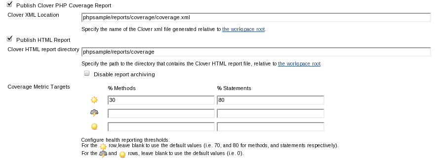
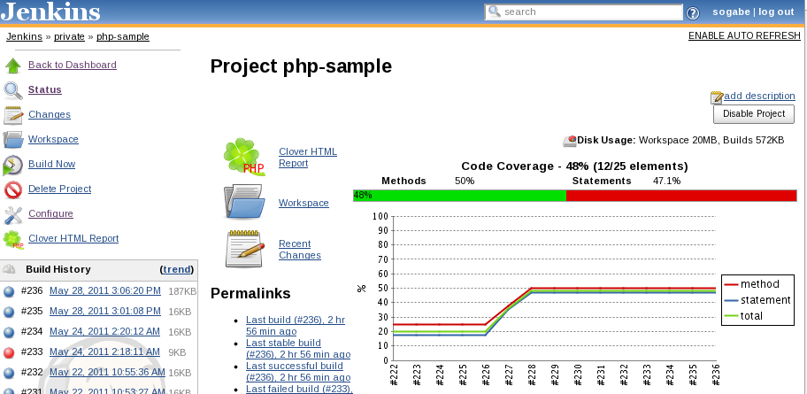
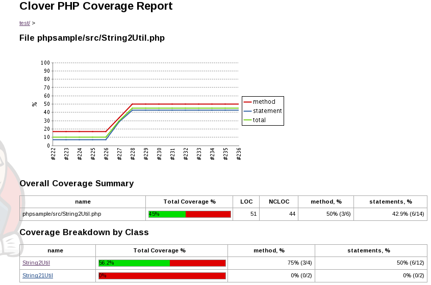

This plugin allows you to capture code coverage reports from
**PHPUnit**. For more information on how to set up PHP projects with
Jenkins have a look at the [Template for Jenkins Jobs for PHP
Projects](http://jenkins-php.org/).

## PHPUnit

You have to use **"--coverage-clover"** option to generate clover style
coverage report.  
The following setting is for Phing.

**build.xml**

``` syntaxhighlighter-pre
<exec dir="."
      command="phpunit --log-junit 'reports/unitreport.xml'
                       --coverage-html 'reports/coverage'
                       --coverage-clover 'reports/coverage/coverage.xml'
                       test/"
/>
```

Or use phpunit task with **clover** style formatter.

**build.xml with phpunit task**

``` syntaxhighlighter-pre
<phpunit codecoverage="true" haltonfailure="true" haltonerror="true">
  <formatter type="clover" usefile="false"/>
  <batchtest>
    <fileset dir="tests">
      <include name="**/*Test*.php"/>
    </fileset>
  </batchtest>
</phpunit>
```

## Project configuration

-   the location of clover xml(required).
-   the location of clover html report (optional).



## Project screen





## TODO

-   Make compatible with pipelines

## Changelog

#### 0.5 (20 Nov, 2015)

-   include namespaced classes
    ([JENKINS-26722](https://issues.jenkins-ci.org/browse/JENKINS-26722))

-   pay attention to target coverage
    ([JENKINS-20233](https://issues.jenkins-ci.org/browse/JENKINS-20233))
-   specifically publish the plugin under MIT license
    ([JENKINS-30215](https://issues.jenkins-ci.org/browse/JENKINS-30215))

#### 0.4 (6 Apr, 2015)

-   support variables for configuration.
-   option to generate clover report regardless of build
    ([JENKINS-21046](https://issues.jenkins-ci.org/browse/JENKINS-21046)).
-   The CloverPHP red/green coverage bar is too wide
    ([JENKINS-25717](https://issues.jenkins-ci.org/browse/JENKINS-25717)).

#### 0.3.3 (21 Mar, 2013)

-   added message if clover xml is incompatible with clover style
    ([JENKINS-17037](https://issues.jenkins-ci.org/browse/JENKINS-17037)).
-   Conflict with standard clover plugin
    ([JENKINS-15626](https://issues.jenkins-ci.org/browse/JENKINS-15626)).

#### 0.3.2 (21 Oct, 2011)

-   NPE when Clover HTML report directory is not defined
    ([JENKINS-11408](https://issues.jenkins-ci.org/browse/JENKINS-11408)).
-   Fixed breadcrumb.
-   Fixed IE6 rendering.

#### 0.3.1 (27 July, 2011)

-   roll back the dependency to Jenkins 1.409 for 1.409.x LTS
    releases.([Comment](https://github.com/jenkinsci/cloverphp-plugin/commit/c768bb5f1239db297965f457700f4668081af634#commitcomment-499465)).
-   Report page rendering performance boost ([pull
    request](https://github.com/jenkinsci/cloverphp-plugin/pull/1)).

#### 0.3 (3 Jun, 2011)

-   Support FreeStyle and Matrix projects only.
-   NPE in Clover PHP Plugin when XML config is empty
    ([JENKINS-9821](https://issues.jenkins-ci.org/browse/JENKINS-9821)).
-   save clover.xml and html report in builds/XX/cloverphp directory.

#### 0.2 (28 May, 2011)

-   Fixed a path when built on slave.
-   Added breadcrumb.
-   Added test classes.
-   fixed configuration page.

#### 0.1 (16 May, 2011)

-   First release
