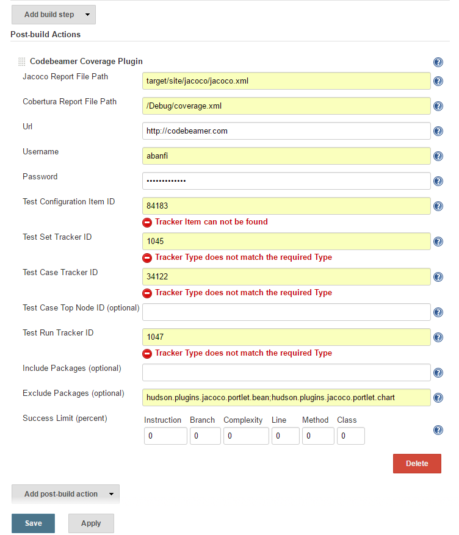

**About**

This plugin provides Source Code Coverage information - based on Jacoco,
Cobertura and Gcov - as Test-Cases and Test-Runs directly in [codeBeamer
ALM](https://intland.com/application-lifecycle-management/).

If you have questions or found a bug, please refer to the [Project
Page](https://codebeamer.com/cb/project/1025)

 

### Usage 

1.  Create a Jenkins job that generates Jacoco or Cobertura coverage
    report in XML format. 
2.  Add the "Codebeamer Source Code Coverage Publisher" step in the
    "Post-build Actions" section to the job.
3.  Customize the step’s attributes, set the report XML path. 
4.  Run the build.

### Parameters

-   **Jacoco Report File Path**: The path to the Jacoco report file in
    the workspace. Example: /target/site/jacoco/jacoco.xml
-   **Cobertura Report File Path**: The path to the Cobertura (or gcovr)
    report file in the workspace. Example: /report/cobertura.xml
-   **URL**: The codeBeamer Url. Example: <https://cb-host:8080/cb>
-   **Username**: The codeBeamer user name. 
-   **Password**: The codeBeamer password. 
-   **Test Configuration Item ID**: The ID of a tracker Item on a Test
    Configuration Tracker. 
-   **Test Set Tracker ID**: The ID of a tracker where the test set will
    be created. 
-   **Test Case Tracker ID**: The ID of a tracker where the test cases
    will be created.
-   **Test Case Top Node ID**: The ID of a tracker Item on a Test Case
    Tracker. If provided then the created Test Cases will have this
    node/folder as parent. Warning this setting will override Test Case
    Tracker ID.
-   **Test Run Tracker ID**: The ID of a tracker where the test runs
    will be created.
-   **Include Packages**: You can include one or multiple packages
    (separator ;) in the upload to codeBeamer. If not provided all
    packages are included by default. example:
    com.exaple;com.otherpackage
-   **Exclude Packages**: You can exclude one or multiple test packages
    (separator ;) from the upload to codeBeamer. example:
    com.exaple;com.otherpackage
-   **Success Limit**:The test run success percentage can be specified
    by coverage type in this section. If one of these thresholds are
    violated, the generated test result value will be failed, otherwise
    it will be successful. Specify 0 to disable status validation for
    this type of coverage.  

### Technical Support

If you have any questions or need assistance with setting up the plugin
and configuring the step’s properties, please contact the codeBeamer
Support Team
