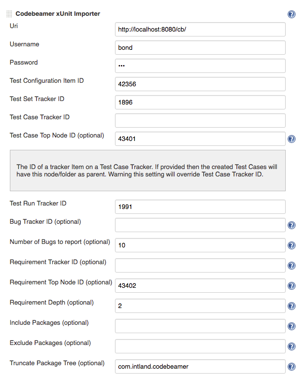

  

### **About**

An Intland Post-Build plugin for sending automated xUnit test results
into [codeBeamer
ALM](https://intland.com/application-lifecycle-management/) from
Jenkins. If you have questions or found a bug, please refer to
the [Project Page](https://codebeamer.com/cb/project/1025)

The plugin also creates test cases based on the tests package structure,
with configuring optional parameters it can also create requirements and
bug reports.

### Usage 

1.  Create a Jenkins job thats runs the automated test, we currently
    support Maven type jobs and Freestyle type jobs with "Publish JUnit
    test result report" step.
2.  Add the "Codebeamer xUnit Importer" step in the "Post-build Actions"
    section to the job.
3.  Customize the step’s attributes.
4.  Run the build.

example configuration:

### Optional Parameters

-   Test Case Top Node ID: The ID of a tracker Item on a Test Case
    Tracker. If provided then the created Test Cases will have this
    node/folder as parent. Warning this setting will override Test Case
    Tracker ID.
-   Bug Tracker ID: This is the Tracker where Bug reports will be
    submited.
-   Number of Bugs to report: If the Bug Tracker is also provided limits
    the number of bugs submitted to codeBeamer, default value 10.
-   Requirement Tracker ID: This is the Tracker where jenkins will
    submit Requirements.
-   Requirement Top Node ID: The ID of a tracker Item on a Requirement
    tracker. If provided then the created Requirements will have this
    node/folder as parent. Warning this setting will override
    Requirement Tracker ID.
-   Requirement Depth: If the Requirement Tracker ID is also provided
    limits the depth of the requirements created.
-   Include Packages: You can include one or multiple packages
    (separator ;) in the upload to codeBeamer. If not provided all
    packages are included by default. example:
    com.exaple;com.otherpackage
-   Exclude Packages: You can exclude one or multiple test packages
    (separator ;) from the upload to codeBeamer. example:
    com.exaple;com.otherpackage
-   Truncate Package Tree: If provided both the uploaded Tests into both
    the Test Cases and Requirements tracker will have a truncated tree.
     example: the test has a structure of com.example.package.mytests
    the provided value is com.example the test to upload will have a
    package of package.mytests.

### More Information

You can find information on using the plugin in the [codeBeamer
wiki](https://codebeamer.com/cb/wiki/1305184).

### Technical Support

If you have any questions or need assistance with setting up the plugin
and configuring the step’s properties, please [contact the codeBeamer
Support Team](http://intland.com/support)

### Version History

#### Version 1.0

-   Inititial Version
