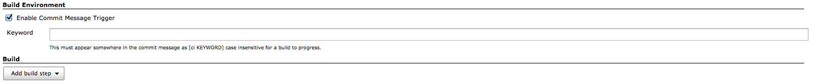

This plugin allows builds to be made only for certain text in the commit
message.

## Table of Contents

## Description

Commit Message Trigger Plugin

### Setup

This allows you when using a gitflow/hubflow to have Jenkins monitor
feature branches but only build/merge develop when a feature has been
completed by having the developer add \[ci build\] in the final
commit.   This skips the step of creating a pull request in the general
gitflow methodology.  You could also use \[ci deploy\] to cause a job
which deploys to a staging server to run.

A skipped build will be marked as NOT BUILT, not FAILED or SUCCESS.

Enable the plugin in your build environment:  

## Known issues

type

key

summary

assignee

reporter

priority

status

resolution

created

updated

due

Data cannot be retrieved due to an unexpected error.

[View these issues in
Jira](http://issues.jenkins-ci.org/secure/IssueNavigator.jspa?reset=true&jqlQuery=component%20=%20commit-message-trigger%20AND%20project%20=%20JENKINS%20AND%20resolution%20=%20Unresolved%20ORDER%20BY%20updated%20DESC&tempMax=1000&src=confmacro)

## Version history

### 0.1 (September 30, 2014)

-   First release.
