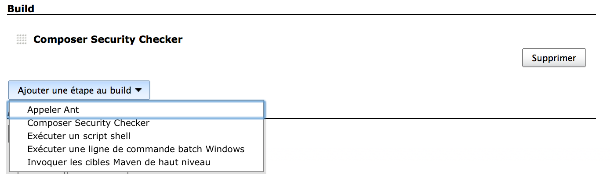
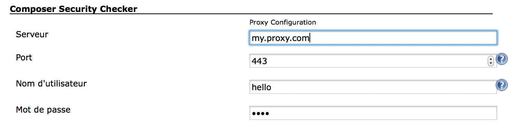

##### for setup proxy :

-\> [Administrer Jenkins](http://127.0.0.1:8080/manage)

-\> [Configurer le système](http://127.0.0.1:8080/configure) 

##### **console out :**

============================================================

Composer Security Check :

composer file: /var/lib/jenkins/jobs/test
Project/workspace/composer.lock  
Security Report  
===============

No known\* vulnerabilities detected.

-   Disclaimer: This checker can only detect vulnerabilities that are
    referenced  
    in the SensioLabs security advisories database.

============================================================
