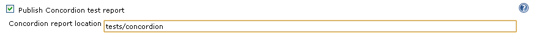
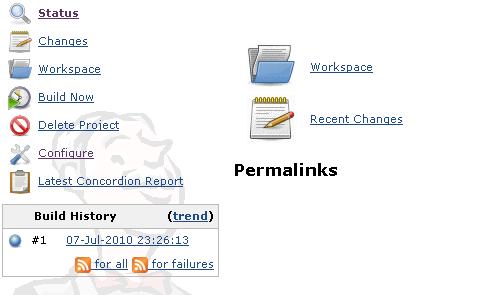
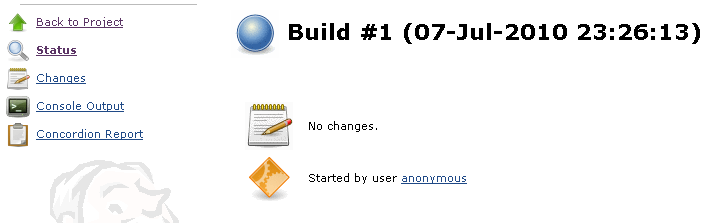

This plugin publishes [Concordion](http://www.concordion.org/) test
reports for each build, and is based somewhat on the [WebTest Presenter
Plugin](http://localhost:8085/display/JENKINS/WebTest+Presenter+Plugin).

# Usage

Configuration:

Project page:

Build page:

# TODO

-   Option to create index page for test reports
-   Junit-esque integration (pass/fail graph, failed tests link to
    specifications)

# Version History

#### Version 0.7 (2011-08-13)

-   Reworked archiving code and added some diagnostics
-   Updated for Jenkins

#### Version 0.6 (2010-07-06)

-   Initial release (after a few mix-ups with publishing releases and
    group ids)
