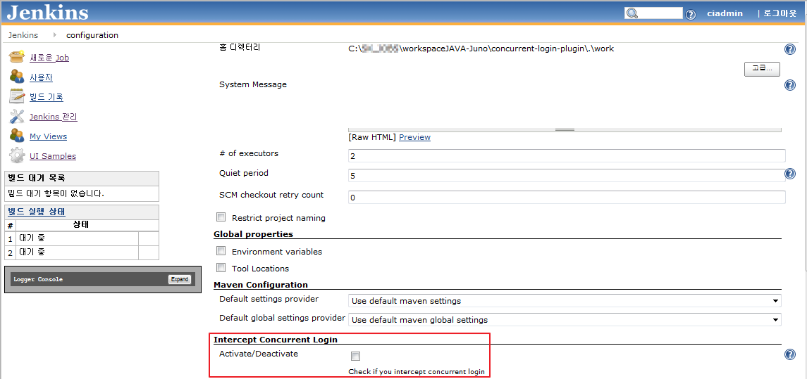
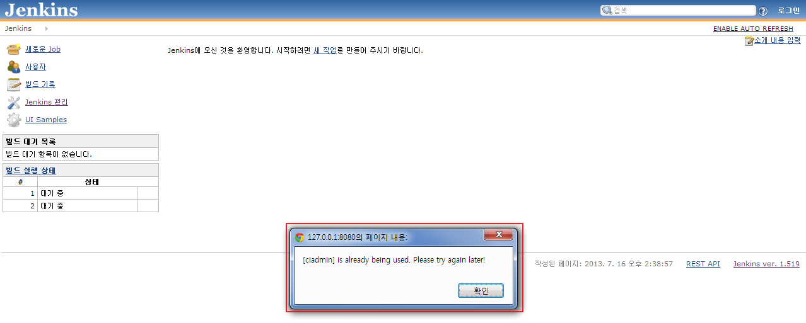

This plugin intercept a concurrent login to Jenkins.  
You can apply if you use Jenkins's authenticate.

If you use Jenkins authentication, it does not support concurrent login.
  
For security reasons, the plugin is useful when concurrent access should
not be allowed  
If you install the plugin and configure, you can only connection by one
account.  
session timeout settings: settings in the WAS or supports itself(1 min).

  
 

## **Features**

-   Checked "Jenkins \> Configure Global Security \> Enabled security"
-   Application Jenkins session

## **Setup**

At Manage Jenkins \> Configure System \> Intercept Concurrent Login, you
could configure

## See also 

## Version History

### **Version 0.5 (15 July, 2013)**

-   Official Version
