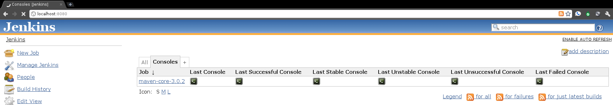

# Console Column Plugin

Minimum Version

Because of a JDK issue, requiredCore was made to be 1.420. However, we
have reports that this plugin will happily work on 1.409 LTS releases.

**This plugin is up for adoption.** Want to help improve this plugin?
[Click here to learn
more](http://localhost:8085/display/JENKINS/Adopt+a+Plugin "Adopt a Plugin")!

  

Provide a fast-path console link available for views.

  

| Views                                                                                                                       |
|-----------------------------------------------------------------------------------------------------------------------------|
|  |

  

------------------------------------------------------------------------

  

### Changelog

#### 1.5 (released 2011-10-15)

-   Fix issue @11358, do not show console links for jobs with builds of
    that type unavailable (e.g. no lastFailed console link if no failed
    builds)

#### 1.4 (released 2011-10-12)

-   Added German I18N, thank you Christoph Kutzinski

#### 1.3 (released 2011-10-06)

-   fix issue @11180 and make console columns not shown by default

#### 1.1 (released 2011-02-11)

-   fix 404 for images on non-default view view
-   fix hard coded 16x16 image size

#### 1.0 (released 2011-02-03)

-   fully I18N
-   initial implementation
