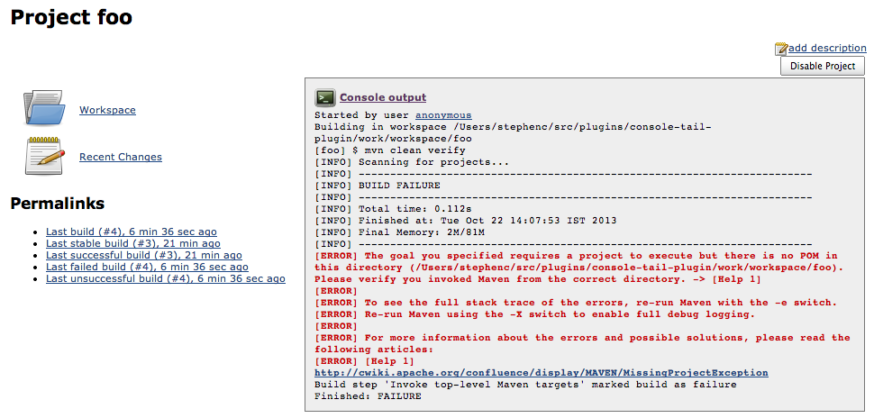

# Console Tail Plugin

This plugin adds a floating box to all projects when the last build
failed. The floating box is only shown if the last build failed.

## Version History

### Version 1.1 (Oct 22, 2013)

-   Fix some layout issues

### Version 1.0 (Oct 22, 2013)

-   Initial release
