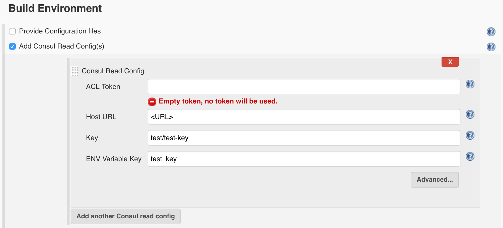
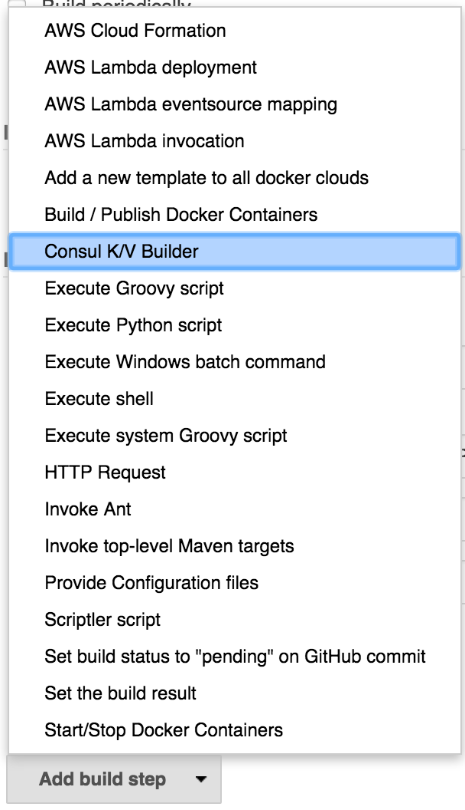
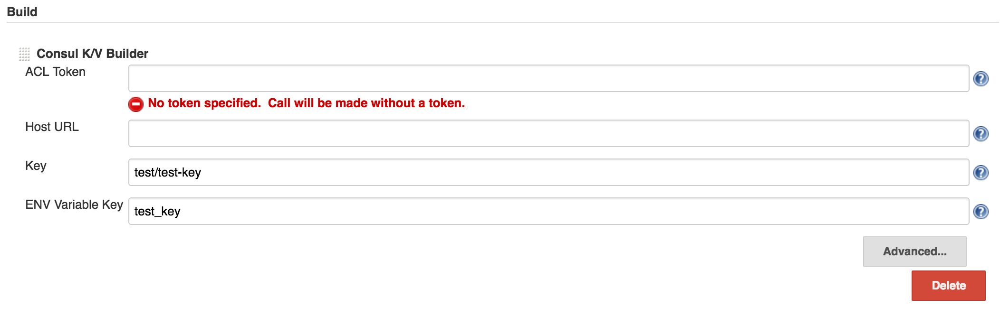
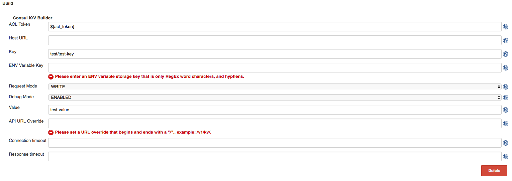
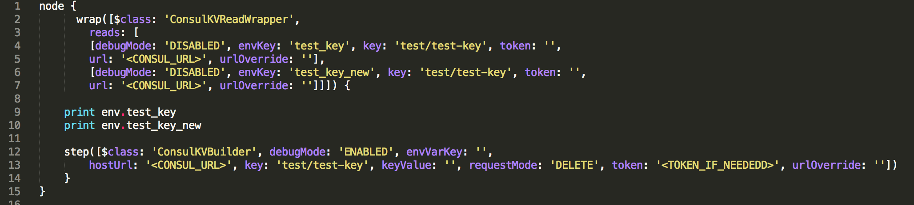
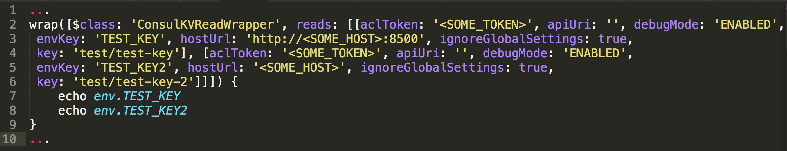
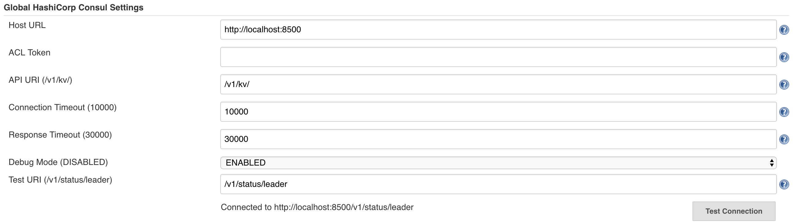

   
This plugin adds a new build step and build wrapper that are used to
read/write/delete Key/Value data from/to specified
HashiCorp [Consul](https://www.consul.io/) servers. or clusters.

# Use Case

\* You have a build that needs to read data from Consul Key/Value store
and use those data later in the build or even in downstream
parameterized builds.

\* You have a build that needs to deploy, and part of that deployment is
to configure Consul Key/Value settings.

# Build Wrapper Usage

The Consul K/V Builder Plugin can be used as a Build Wrapper, so it is
added to the project configuration by selecting under the "Build
Environment" checkboxes. As a build wrapper, it can be added multiple
times to read multiple Key/Value pairs.

{width="800"}

# Build Step Usage

The Consul K/V Builder Plugin can also be used as a Build Step, so it is
added to the project configuration via the “Add Build Step” button
towards the bottom of the project configuration window. As a build step,
it can be added multiple times to read/write/delete multiple Key/Value
pairs.

{width="200"}

### To read data from Consul, you configure the build step with the following settings:

| Field name       | Description                                                            |
|------------------|------------------------------------------------------------------------|
| ACL Token        | optional, supplies the Consul ACL entry ID that is used to access data |
| Host URL         | URL of the Consul server/cluster                                       |
| Key              | Key used to store and lookup data in Consul                            |
| ENV Variable Key | Key used to store the data into a Jenkins build environment variable   |

  
{width="800"}

### To write Consul data, you must expose the "Advanced" settings.

| Field name         | Description                                                                                    |
|--------------------|------------------------------------------------------------------------------------------------|
| Request Mode       | Set to write                                                                                   |
| Debug Mode         | Optionally enable debug mode for additional logging                                            |
| Value              | Value to write to Consul with the specified key from above                                     |
| API URL Override   | optional, used to specify the non-default URI for the Consul server RESTful HTTP API endpoints |
| Connection timeout | optional, used to specify connection timeout, default is 10 seconds                            |
| Response timeout   | optional, used to specify response timeout, default is 30 seconds                              |

  
{width="800"}

Handy Hint

This example shows the use of a build parameter *acl\_token*

### To delete Consul data, you must expose the "Advanced" settings, and choose delete.

| Field name         | Description                                                                                    |
|--------------------|------------------------------------------------------------------------------------------------|
| Request Mode       | Set to delete                                                                                  |
| Debug Mode         | Optionally enable debug mode for additional logging                                            |
| Value              | N/A                                                                                            |
| API URL Override   | optional, used to specify the non-default URI for the Consul server RESTful HTTP API endpoints |
| Connection timeout | optional, used to specify connection timeout, default is 10 seconds                            |
| Response timeout   | optional, used to specify response timeout, default is 30 seconds                              |

  
{width="800"}

# Pipeline Usage

This plugin can be used in Jenkins Pipeline scripts with "wrap" and
"step" constructs:

{width="800"}

{height="150"}

# Features

 

### Build Wrapper

\* Read Key/Value data from Consul server/cluster, write to ENV variable

### Build Step

\* Read Key/Value data from Consul server/cluster, write to ENV
variable  
\* Write Key/Value data to Consul server/cluster  
\* Delete Key/Value data from Consul server/cluster  
\* Optional debug mode for additional logging  
\* Supports Consul ACL ids, including using build parameters for ACL
ids  
\* Optional override Consul RESTful HTTP API URI  
\* Optional override connection timeout  
\* Optional override response timeout

### Global Settings

\* Set global settings that can be leveraged in jobs

{width="800"}

# Changelog

### Version 1.0.6 (May 11 2016)

\* Initial release

### Version 2.0.4 (June 3 2016)

\* Added Build Wrapper and Jenkins Pipeline compatibility

### Version 2.0.7 (September 20 2016)

\* Added build/run failure model settings  
\* Added listener error settings

### Version 2.0.12 (October 3 2016)

\* Added global Consul settings that can used/ignored at the job-config
level

### Version 2.0.13 (November 2 2016)

\* Attempted to Fix issue:
<https://github.com/jenkinsci/consul-kv-builder-plugin/issues/5>.
Pipeline Steps implementing the SimpleBuildStep interface cannot write
data to run-level environment variables.

The workaround may be to write a single-value custom step that returns a
string, or use the wrapper to set a local var in the node.

**Pipeline Wrapper Workarounds**

``` syntaxhighlighter-pre
node('master') {
    TEST_KEY = ''

    wrap([$class: 'ConsulKVReadWrapper', reads: [[aclToken: '', apiUri: '', debugMode: 'ENABLED', envKey: 'test_key', hostUrl: '', key: 'test/test-key']]]) {
        echo env.test_key
        TEST_KEY = env.test_key
    }

    echo TEST_KEY
}

//or for a global var:

import groovy.transform.Field
@Field String TEST_KEY

node('master') {

    wrap([$class: 'ConsulKVReadWrapper', reads: [[aclToken: '', apiUri: '', debugMode: 'ENABLED', envKey: 'test_key', hostUrl: '', key: 'test/test-key']]]) {
        echo env.test_key
        TEST_KEY = env.test_key
    }

    echo TEST_KEY
}

node ('master') {
    echo TEST_KEY
}

//Use Wrapper to get multiple key/values

node ('master') {
    wrap([$class: 'ConsulKVReadWrapper', reads: [[aclToken: '', apiUri: '', debugMode: 'ENABLED', envKey: 'test_key', hostUrl: '', key: 'test/test-key'], [aclToken: '', apiUri: '', debugMode: 'ENABLED', envKey: 'test_key2', hostUrl: '', key: 'test/test-key'], [aclToken: '', apiUri: '', debugMode: 'ENABLED', envKey: 'test_key3', hostUrl: '', key: 'test/test-key']]]) {
        echo env.test_key
        echo env.test_key2
        echo env.test_key3
    }
}
```
