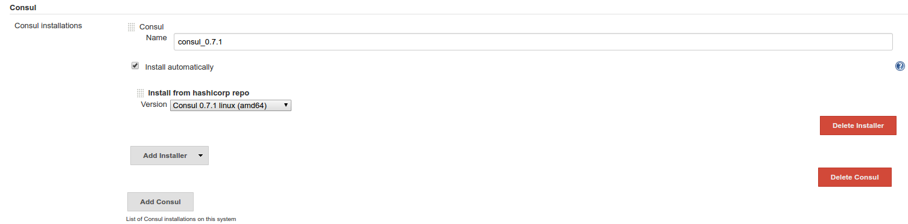
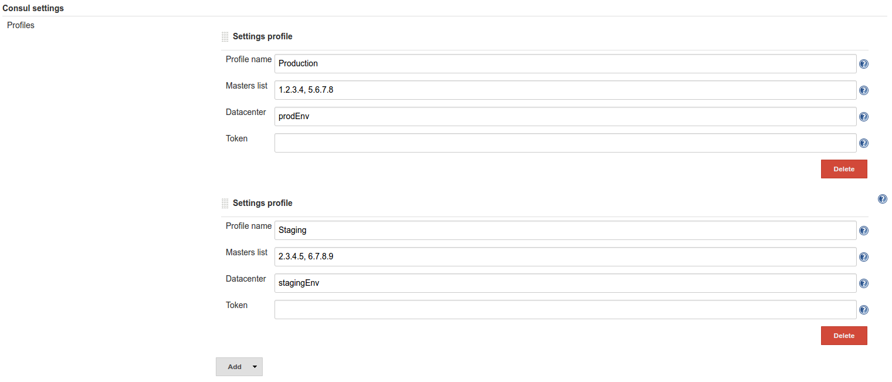
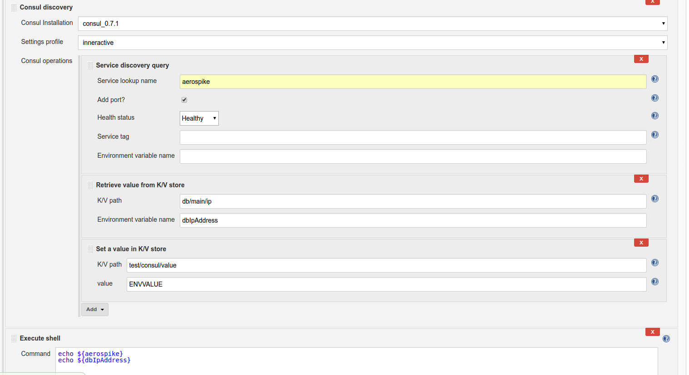
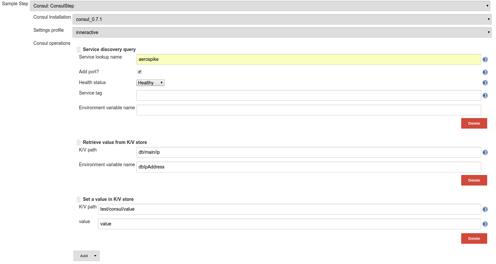

**Consul plugin for reading services using consul service discovery and
K/V store.**

**The plugin installs an agent, joins to the consul network, reads the
necessary data and then leaves the network.**

# Features

-   Retrieve consul service's ip / port
-   Retrieve values from consul K/V store
-   Set values to consul K/V store
-   Install & join consul gossip network
-   Filtering for service discovery (Healthy / Unhealthy / tagging)
-   Using multiple consul networks within the same job

# Settings

## Consul installation

-   Choose your installation name & version.  
    The executable will be auto downloaded & installed from hashicorp's
    repository.



## Global configurations

Global settings configured using profiles for each environment / consul
network.

**Profile name -** Name of the profile, will be used in the job
configuration.

**Masters list -** Comma separated list of consul masters.

**Datacenter -** Consul datacenter to join (default is 'dc1' if not
configured in consul installation).

**Token -** ACL token to join gossip network (leave empty if not
needed).



 

### Job configurations

**Consul installation -** Choose consul version (list of installations
configured in jenkins global configurations).

**Settings profile -** Choose which consul settings profile you would
like to use.

**Consul operations**

**  Retrieve value from K/V store**

**    K/V path -** Consul path for value retrieval.

**    Environment variable name -** Env var to populate the value with.

**  Service discovery query**

**    Service lookup name -** Name of the service to lookup in consul.

**    Add Port? -** Adding the port after each ip in the response.

**    Health status -** Healthy / Unhealthy / All - filtering for
service lookup.

**    Service tag -** Tagging filtering for service lookup.

**    Environment variable name -** Env var to populate the CSV list of
extracted ip addresses.

  **Set a value in K/V store**

**    K/V path - **Path in consul to set the value.

    **value - **Environment variable name that holds the value or any
other static value to set in consul.

 



Consul build step can be added multiple times within the same job. Each
step can use different consul settings profile.

This gives the ability to query multiple consul clusters & query them in
a single run.

 

### Pipeline

Since version 2.0 the plugin supports pipeline.

Consul pipeline step will return JSON value with the required data.

Use the pipeline syntax tool
([https://your-jenkins-master-url/pipeline-syntax/](https://jenkins-prod.inner-active.mobi/pipeline-syntax/))
to generate the code.

 



**Pipeline job example**

``` syntaxhighlighter-pre
node {
    def consulJson = Consul consulSettingsProfileName: 'inneractive', installationName: 'consul_0.7.1', operationList: [[$class: 'ConsulServiceDiscoveryOperation', addPort: true, healthStatus: 'Healthy', serviceName: 'aerospike', serviceTag: ''], [$class: 'ConsulGetKV', valuePath: 'db/main/ip'], [$class: 'ConsulSetKV', value: 'value', valuePath: 'test/consul/value']]
    echo consulJson
}
```

**Pipeline response example:**

``` syntaxhighlighter-pre
{"ServiceDiscovery":{"aerospike":["XXX.XXX.XXX.XXX:3000","XXX.XXX.XXX.XXX:3000","XXX.XXX.XXX.XXX:3000"]},"KeyValueStore":{"db/main/ip":"XXX.XXX.XXX.XXX"}}
```

 

## ToDo

type

key

summary

assignee

reporter

priority

status

resolution

created

updated

due

Data cannot be retrieved due to an unexpected error.

[View these issues in
Jira](https://issues.jenkins-ci.org/secure/IssueNavigator.jspa?reset=true&jqlQuery=component=consul-plugin%20and%20status%20not%20in%20%28Closed,%20Done,%20Resolved%29%20order%20by%20priority%20&src=confmacro)

## Changelog

#### Version 2.1 (July 26, 2017)

-   Added feature for setting consul K/V store
    - [JENKINS-43330](https://issues.jenkins-ci.org/browse/JENKINS-43330)

#### Version 2.0 (June 5, 2017)

-   Global consul settings changed from single to multiple profiles
-   Added pipeline support

#### Version 1.0 (April 4, 2017)

-   Initial release
