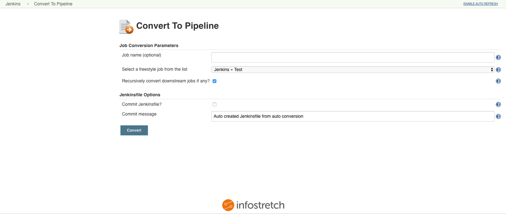

# 

# About the plugin

This plugin converts Freestyle jobs to scripted Pipeline job.

# Target problem

-   An organisation may have several applications which in turn will
    have several Freestyle jobs in Jenkins. The jobs may be "chained"
    together to perform builds in series based on certain conditions.
    This makes management of several jobs difficult over time. The
    concept of configuration as a code comes in to solve this and
    pipeline jobs are the recommended way.
-   In order to convert several Freestyle jobs to pipeline, the DevOps
    engineers will have to manually drill down to each of the 100s or
    1000s of Freestyle jobs, understand the tools, configurations, URLs,
    parameters etc. and re-write them in pipeline syntax. The task will
    not only involve converting individual job logic but also ensuring
    the "chain" is converted to a single pipeline. Keeping a base-rule
    of 1 chain = 1 pipeline.
-   This plugin helps to solve this as it drastically reduces the effort
    of the engineer to only perform a refinement of business logic of
    the auto-generated pipeline script rather than the manual task of
    conversion.
-   The plugin can be further customised to enforce each organisation's
    standards as well as industry standards which all applications will
    have to follow. This makes it easier to enforce at Jenkins level.
-   The auto-generated scripts can be pre-configured to use custom
    libraries which make it easy to separate complex business logics and
    standard declaration from execution flow declaration. This will also
    make maintenance tasks easier in the future.
-   The plugin will also make the transition process of any new set of
    applications being on-boarded to pipeline much faster and
    systematic.

 

# Interface

The plugin provides a link on the left menu at 3 locations:

[TABLE]

 

Click on the link at any given level and a UI similar to below will
appear:

# Usage

1.  Click on a link at Root level or Folder level or Job level.
2.  Select the job from the drop-down list that is the beginning point
    of the "chain". If job level link is clicked, this drop down list
    will not be visible.
3.  Provide the new pipeline job name. If this is not specified, the
    plugin will attempt to create a new pipeline job with the naming
    convention of "oldname-pipeline".
4.  Check "Recursively convert downstream jobs if any?" if you wish to
    have all the downstream jobs converted into this new pipeline. The
    plugin will write all the logic of current and downstream jobs into
    a single pipeline.
5.  Check "Commit Jenkinsfile?" if you would like the plugin to create a
    Jenkinsfile and commit it back to the SCM. The plugin will commit
    the Jenkinsfile at the root of the SCM repository it finds in the
    first job (selected in step 1 above). It will attempt to commit to
    this repo using the credentials it finds in the first job.
    1.  Do note that the plugin will checkout the repo in to a temporary
        workspace on the master
        (JENKINS\_HOME/plugins/convert-to-pipeline/ws). Once the
        conversion is complete and Jenkinsfile is committed back to the
        repo, the workspace will be deleted.
6.  Click "Convert" to convert the Freestyle job configurations in to a
    single scripted pipeline job. Once the conversion is complete and
    the new job is created, you will be redirected to the newly created
    pipeline job.

# Contact / Support

Please contact Infostretch through <labs_support@infostretch.com> for
any issues or support required.
