**Convertigo-mobile-platform plugin** is able to integrate [Convertigo
Mobility Platform](http://www.convertigo.com/) projects in a Continuous
Integration process. The plugin can build, deploy and test Convertigo
projects and generate JUnit format XML test reports to be handled by
Jenkins.

## Using the Plugin

See documentation bellow:

##### Configure SCM

First you will have to pull out from SCM the Convertigo Projects you
want to build and test. To to this Configure in the SCM section the
right SCM provider (SVN , GIT etc ..) and the correct repository URL.
The url must point to a Valid Convertigo Project directory containing
the \<project-name\>.xml file. You can also point to a directory
containing several valid Convertigo projects. In this case all these
projects will be build and deployed to the Convertigo Server.

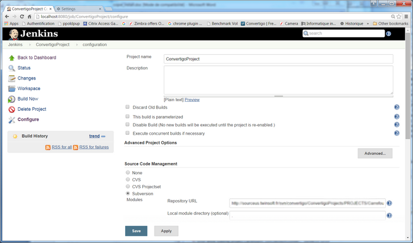

##### Link to Convertigo Q&A Server

Then when you add a build step, you will find the Convertigo Plugin in
the step list. Select it and configure the step. 

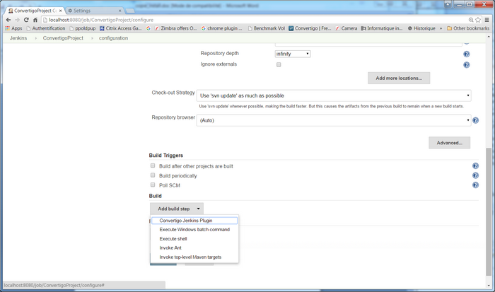

The first part is to link the Plugin to a Convertigo Q&A server. This
can be any Convertigo Standard Edition Server, installed and up and
running. Give in this section the server’s URL and admin console
credentials. (Usually admin/admin).

  
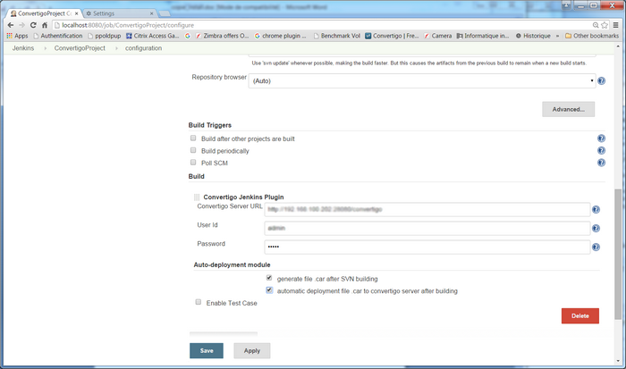  

##### Configure Build options

You can check the Build and Deploy option to have the Plugin to build
the .CAR files and to have deployed automatically on the target
Convertigo Server.

##### Using Test Cases

Once the .CARs are built and deployed on the server, you can now enable
tests by checking the check box.

When the “Enable test” option is checked you will have the opportunity
to select the project you want to test in the drop down list (Warning,
this box can take some time to fillup…)

  
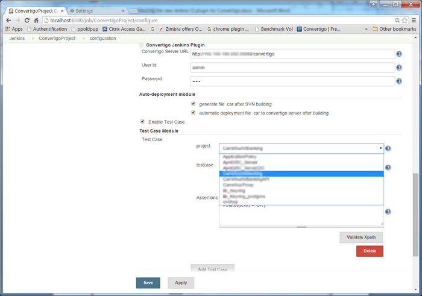  

**When you select a project, the second drop down will list all the
Convertigo Test Cases in this form :**  

-   (S)project.sequences.testcase for sequence testcases or
-   (T)project.connector.transaction.testcase for transactions 

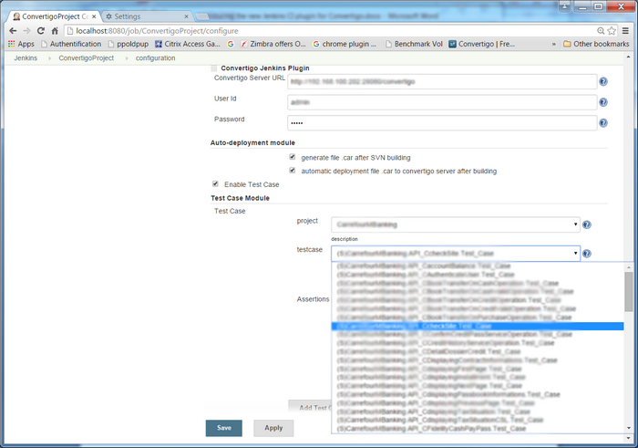

**Select the test case you want and then click the “Execute test case”.
The Convertigo XML out pout will be displayed below the testcase :**

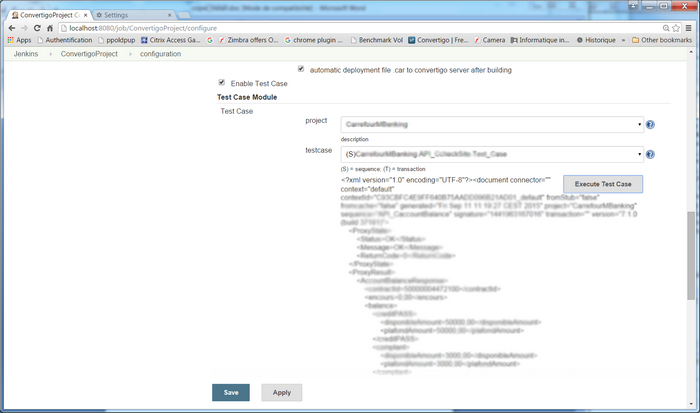  
**Now in the Assert window you will be able to write your assertions
this way:**

``` syntaxhighlighter-pre
&lt;My Xpath ok 1&gt;

&lt;My Xpath ok 2&gt;

...

&lt;My Xpath ok 3&gt;

Assert nok

&lt;My Xpath not ok 1&gt;

&lt;My Xpath not ok 2&gt;

&lt;My Xpath not ok 3&gt;
```

To have this test case to be a success:  

-   you must have all the \<my Xpath ok\> to match
-   and none of the \<xpath not ok\> to match.

**You can use the “Test XPATH” button to see if the assertions you wrote
are valid for this test case.**

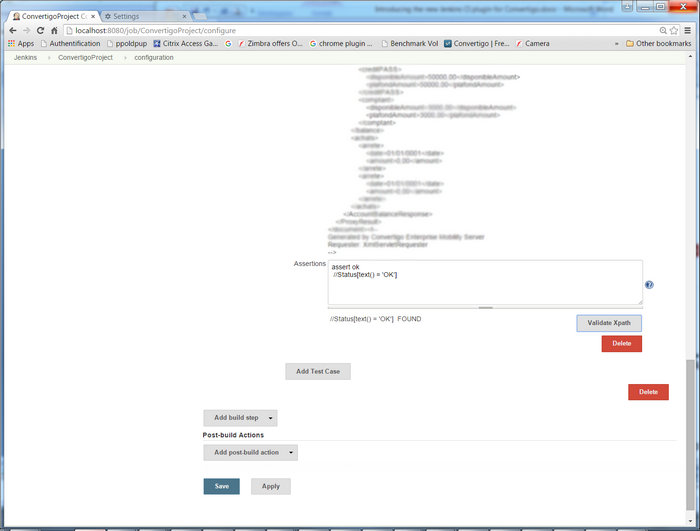  

You can add as many test cases from any project for this Jenkins step
you want. By clicking on “Add test case”.

##### Using test results

Convertigo Jenkins Plugin will generate a .xml file in the /TestReports
directory. This is a standard Junit XML test format that can be read by
any other Jenkins Plugin.

For example configure in the Post build step the Result reader:

  
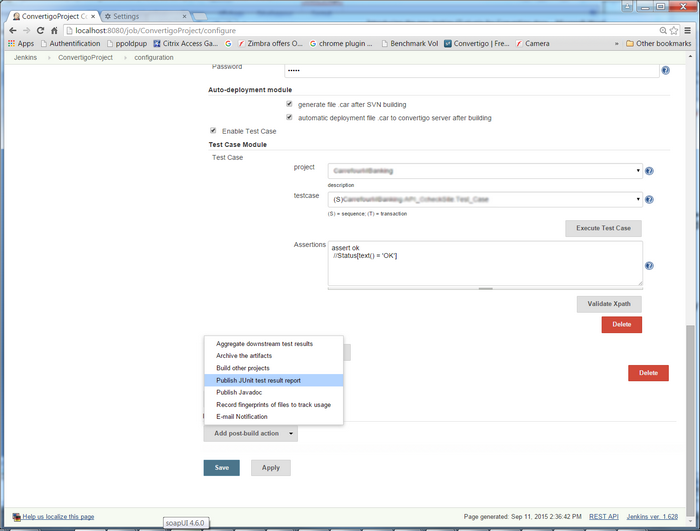  
  
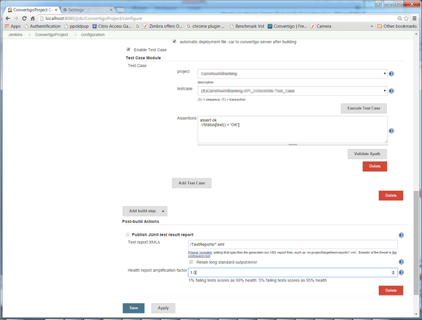  

When you run a Jenkins Build you can see in the Console the plugin
execution:

  
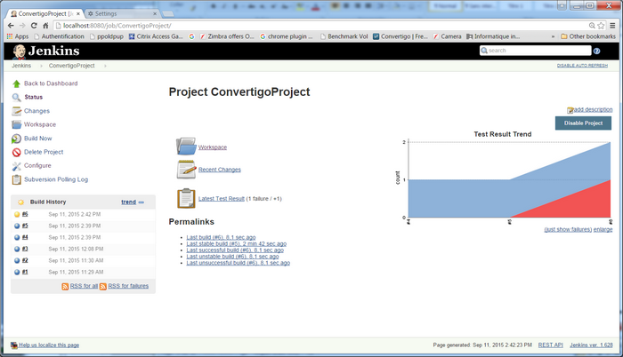  

And the test results:

  
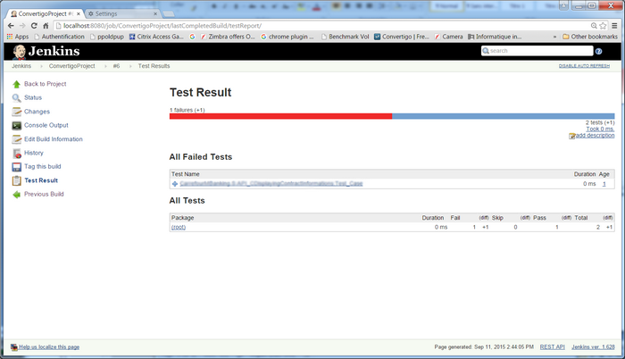  

And the console output:

  
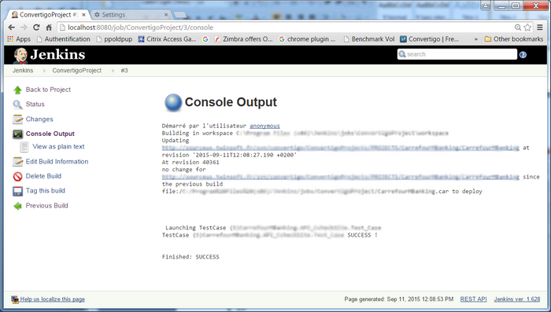  

### Convertigo as Industrialized mobile build platform

With Convertigo Jenkins CI plugin, Developers can now use one of the
best Continuous Integration platform to build and test Enterprise Mobile
Applications connected to valuable Enterprise Data.
