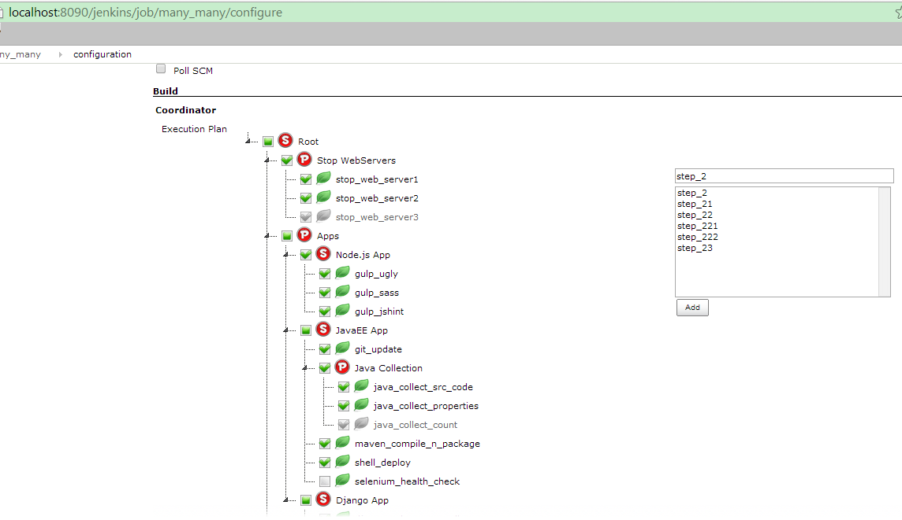
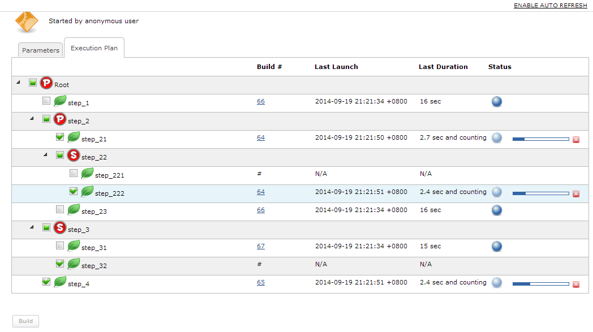

This plugin acts like a coordinator that makes other jobs to build in a
particular sequence as pre-defined.

There are **serial** and **parallel** building patterns, which should
have already covered most scenarios.

# Why?

I've seen different organizations spending their own effort to customize
their CI tools, especially for job running dependency definitions. 

Say first run **Job A**, then **Job B** & **Job C** in parallel, then
**Job D**, then others, etc.

This plugin is meant to make this by drag & drop, and clicks. It would
be easy to trace the building histories including the person who
triggers the job,

build number, launch time, duration & status in each atomic job.

In a word, it's more like a dash board to keep all relevant information
in a page view.

# Demo

### Live Demo

For a running Jenkins instance with Coordinator plugin installed, go to
jenkins.unendedquest.com

### Configure Page

|                                                                                                                             |
|-----------------------------------------------------------------------------------------------------------------------------|
|  |

### Trigger Page

[TABLE]

### Building Page

|                                                                                                                      |
|----------------------------------------------------------------------------------------------------------------------|
|  |

# Change Log

### Version 1.0.0 (Nov 1, 2014)

-   basics
