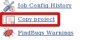

  

This plugin adds the "Copy project" link into left side panel in the
main project page to facilitate copying of job configuration.

# Changelog

##### Release 1.4 (2015-05-13)

-   Fix
    [JENKINS-13517](https://issues.jenkins-ci.org/browse/JENKINS-13517):
    CopyProjectLink plugin: does not work with jobs using 'display name'
    feature

##### Release 1.3 (2015-05-12)

-   Fix
    [JENKINS-22363](https://issues.jenkins-ci.org/browse/JENKINS-22363):
    Do not report ClassNotFoundException when used without Folders
    plugin.

##### Release 1.2 (2013-11-08)

-   Copy of folders (from [Cloudbees Folders
    plugin](https://wiki.jenkins-ci.org/display/JENKINS/CloudBees+Folders+Plugin))
    is now supported
-   Fix
    [JENKINS-18910](https://issues.jenkins-ci.org/browse/JENKINS-18910)
    CopyProjectLink plugin: does not work with non-root url

##### Release 1.1 (2013-04-09)

-   Fix to work correctly within folders + several other improvements
    ([pull
    \#1](https://github.com/jenkinsci/copy-project-link-plugin/pull/1))

##### Release 1.0 (2011-02-10)

-   Initial release

  
