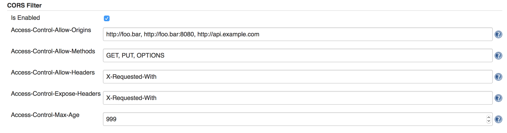

# **CORS Filter Plugin**

This plugin supports
[cross-site](http://en.wikipedia.org/wiki/Cross-origin_resource_sharing)
http requests to Jenkins. 



**Simple GET Request/response**

``` syntaxhighlighter-pre
GET /api HTTP/1.1
Origin: http://foo.example
Host: bar.other

HTTP/1.1 200 OK
Date: Mon, 01 Jan 2015 00:23:53 GMT
Server: Apache/2.0.61
Access-Control-Allow-Origin: http://foo.example

[some data]
```

**Non-GET (or POST,PUT etc...) methods**

``` syntaxhighlighter-pre
OPTIONS /api/json HTTP/1.1
Host: bar.other
Origin: http://foo.example
Access-Control-Request-Method: POST
Access-Control-Request-Headers: X-PINGOTHER

HTTP/1.1 200 OK
Access-Control-Allow-Origin: http://foo.example
Access-Control-Allow-Methods: POST, GET, OPTIONS
Access-Control-Allow-Headers: X-PINGOTHER
Access-Control-Max-Age: 1728000

POST /api/json HTTP/1.1
Host: bar.other
X-PINGOTHER: pingpong
Content-Type: text/json; charset=UTF-8
Referer: http://foo.example/getJobs.html
Origin: http://foo.example

[some data here]

HTTP/1.1 200 OK
Access-Control-Allow-Origin: http://foo.example
Content-Type: text/json

{some json data here}
```
