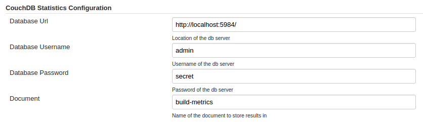

Older versions of this plugin may not be safe to use. Please review the
following warnings before using an older version:

-   [Password stored in plain
    text](https://www.jenkins.io/security/advisory/2020-10-08/#SECURITY-2065)

CouchDB Statistics plugin allows the publishing of all build statistics
to CouchDB/Cloudant.

## Installation Instructions

The plugin configuration is done under `Manage Jenkins` \>
`Configure System`.

## Change Log

##### Version 0.2.1 (4th December 2015)

-   Converted password field to a 'password' box.

##### Version 0.2 (3rd December 2015)

-   Initial Release
    -   Supports basic parameters, e.g. jobName, duration, buildNumber,
        timestamp, status
